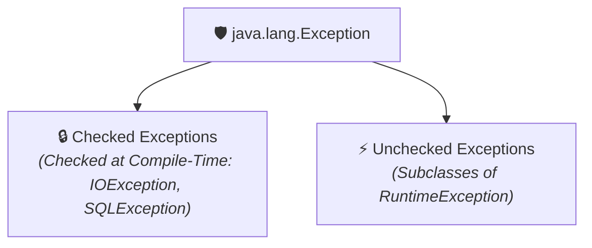
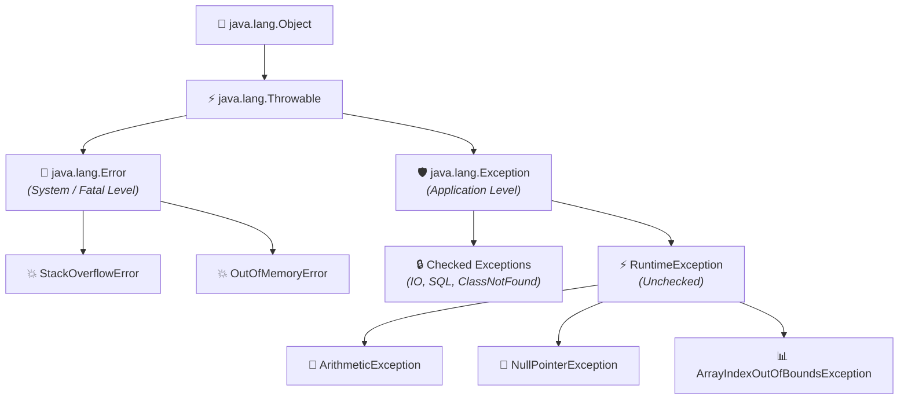

# 🛡️ Exception in Java

---

## 📖 Introduction

An **Exception** is an **unwanted event** that occurs during the execution of a program and **disrupts the normal flow of instructions**.

- Exceptions usually happen due to **problems in the program logic** (such as invalid user input, dividing by zero, missing files, or network glitches).
- Unlike **Errors**, exceptions are **within the control of the programmer** and can be handled in code.

---

### 💻 Key Examples of Exceptions:

#### 1️⃣ `IOException`
- **Occurs when:** An input/output operation fails (e.g., file not found or unreadable).
- **Syntax / Code:**
```java
FileReader fr = new FileReader("file.txt"); // May throw IOException
```

#### 2️⃣ `ArithmeticException`
- **Occurs when:** Dividing a number by zero or performing an illegal arithmetic calculation.
- **Syntax / Code:**
```java
int result = 10 / 0; // Throws ArithmeticException
```

#### 3️⃣ `NullPointerException`
- **Occurs when:** Calling a method, accessing a field, or getting length on a `null` object.
- **Syntax / Code:**
```java
String str = null;
System.out.println(str.length()); // Throws NullPointerException
```

> 💡 **Key Takeaway:** Unlike Errors, exceptions are **within the control of the programmer** and can be handled in code.

---

## 🏷️ Types of Exceptions in Java

There are **two types of Exceptions** in Java:



---

### 1️⃣ Checked Exceptions

**Checked Exceptions** are those which are **checked at compile time**.

- The Java compiler checks these at compile time.
- The program **won't compile** unless they are handled with `try-catch` or declared using `throws`.

#### 📝 Examples:
1. **`IOException`**: Input/output operation fails (e.g., file not found).
```java
FileReader fr = new FileReader("abc.txt"); // May throw IOException
```
2. **`SQLException`**: Error in database access.
```java
Connection con = DriverManager.getConnection(url, user, pass); // May throw SQLException
```

---

### 2️⃣ Unchecked Exceptions

**Unchecked Exceptions** are those which **occur during runtime**, not checked by compiler.

- The compiler does not enforce handling at compile time.
- Usually caused by **programming mistakes** like invalid index, null access, or divide by zero.
- They are all direct or indirect subclasses of `java.lang.RuntimeException`.

#### 📝 Examples:
1. **`ArithmeticException`**: Divide by zero error.
```java
int result = 10 / 0; // Throws ArithmeticException
```
2. **`ArrayIndexOutOfBoundsException`**: Accessing array index outside valid range.
```java
int[] arr = {10, 20, 30};
System.out.println(arr[5]); // Throws ArrayIndexOutOfBoundsException
```

---

## 🌲 Exception Class Hierarchy

**Exception** is the pre-defined class in Java which inherits the **`Throwable`** class.

Below is the hierarchy of Exception class in Java:



### 📌 Points to Remember:
1. **`Object` class** is the parent class of all the classes in Java.
2. **`Throwable` class** is the parent class of `Exception` class in Java.
3. **`Exception` class itself is a checked exception**, because it is not a subclass of `RuntimeException`.

---

## ⚙️ What is Exception Handling?

**Exception Handling** is the mechanism to handle the exceptions (or runtime errors) so that the **normal flow of the program is not disrupted**.

---

### 🎯 Need for Exception Handling:
- **Prevents program crashes.**
- **Provides meaningful error messages.**
- **Separates normal logic from error-handling logic.**
- **Makes applications more robust and user-friendly.**

---

### 🔑 Keywords Used in Exception Handling:

Java provides **5 primary keywords** for managing exceptions:

- **`try`** → Block of code that may throw an exception.
- **`catch`** → Block to handle the exception.
- **`finally`** → Block that always executes (used for cleanup code).
- **`throw`** → Used to explicitly throw an exception.
- **`throws`** → Declares exceptions that a method can throw.

| Keyword | Description | Syntax Example |
| :--- | :--- | :--- |
| **`try`** | Block of code that may throw an exception. | `try { int a = 10 / 0; }` |
| **`catch`** | Block to handle the exception. | `catch (ArithmeticException e) { ... }` |
| **`finally`** | Block that always executes (used for cleanup code). | `finally { fr.close(); }` |
| **`throw`** | Used to explicitly throw an exception. | `throw new ArithmeticException("Divide by zero");` |
| **`throws`** | Declares exceptions that a method can throw. | `public void readFile() throws IOException { ... }` |

---

### 📌 Points to Remember:
1. **Technically, the `catch` keyword is used to handle exceptions in Java.** Other keywords (`try`, `finally`, `throw`, `throws`) have different functionalities and do not directly handle exceptions.
2. **It is compulsory to handle Checked Exceptions in Java.**
3. **It is not compulsory to handle Unchecked Exceptions**, but it is a **best practice to handle both (Checked and Unchecked)** for making applications more stable and user-friendly.

---

## ⚖️ Difference between Error and Exception in Java

| Feature | ⚠️ Error | 🛡️ Exception |
| :--- | :--- | :--- |
| **Meaning / Nature** | Represents **serious problems in the JVM** that cannot be handled by the program. | Represents **conditions that can be caught and handled** by the program. |
| **Origin** | System-level failure (Memory exhaustion, JVM crash). | Application logic issue (bad input, missing file, illegal division). |
| **Control** | Beyond the control of the programmer. | Within the control of the programmer. |
| **Classification** | Always **Unchecked** (subclasses of `java.lang.Error`). | Divided into **Checked** (compile-time) and **Unchecked** (runtime). |
| **Examples** | `StackOverflowError`, `OutOfMemoryError` | `IOException`, `SQLException`, `ArithmeticException`, `NullPointerException` |

---

## 💻 Full Code Demonstration: Unhandled vs Handled Execution

### 🔴 Unhandled Exception (Program Crashes):

```java
public class UnhandledDemo {
    public static void main(String[] args) {
        System.out.println("Step 1: Program starts.");
        
        int result = 10 / 0; // ArithmeticException occurs here!

        // These statements are NEVER reached!
        System.out.println("Step 2: Result is: " + result);
        System.out.println("Step 3: Program completes normally.");
    }
}
```

#### 🖥️ Output:
```text
Step 1: Program starts.
Exception in thread "main" java.lang.ArithmeticException: / by zero
	at UnhandledDemo.main(UnhandledDemo.java:5)
```

---

### 🟢 Handled Exception (Normal Flow Continues):

```java
public class HandledDemo {
    public static void main(String[] args) {
        System.out.println("Step 1: Program starts.");
        
        try {
            int result = 10 / 0; // Exception occurs here
            System.out.println("Step 2: Result is: " + result);
        } catch (ArithmeticException e) {
            System.out.println("⚠️ Handled: Cannot divide by zero -> " + e.getMessage());
        } finally {
            System.out.println("🧹 Finally: Cleanup block always runs!");
        }

        // Program recovers and finishes smoothly!
        System.out.println("Step 3: Program completes normally.");
    }
}
```

#### 🖥️ Output:
```text
Step 1: Program starts.
⚠️ Handled: Cannot divide by zero -> / by zero
🧹 Finally: Cleanup block always runs!
Step 3: Program completes normally.
```
