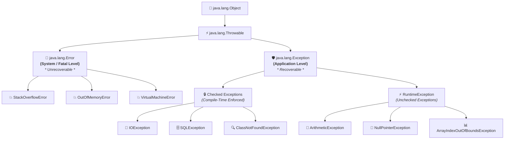

# ⚖️ Difference Between Error and Exception in Java

---

## 📌 Exception vs Error

### ⚠️ Error:
An **[Error](https://smartprogramming.in/tutorials/java/error-in-java.php)** in Java is a **serious runtime problem** that usually occurs due to **system-level issues** such as memory shortage or a JVM crash.
- **[Errors](https://smartprogramming.in/tutorials/java/error-in-java.php)** cannot be handled in our code because they are caused by system failures, not by mistakes in the program’s logic.
- 👉 **[Click Here](https://smartprogramming.in/tutorials/java/error-in-java.php)** to read about Errors more deeply.

---

### 🛡️ Exception:
An **[Exception](https://smartprogramming.in/tutorials/java/exception-in-java.php)** in Java is an **unwanted event** that occurs during the execution of a program and **disrupts the normal flow of instructions**.
- **[Exceptions](https://smartprogramming.in/tutorials/java/exception-in-java.php)** usually happen due to problems in the program’s logic or invalid user input, and they **can be handled in our code**.
- 👉 **[Click Here](https://smartprogramming.in/tutorials/java/exception-in-java.php)** to read about Exception more deeply.

---

## 📊 Below are some differences between Error and Exception:

| Aspect | ⚠️ Error | 🛡️ Exception |
| :--- | :--- | :--- |
| **Definition** | A serious runtime issue that the application typically **cannot recover from** (e.g., memory or system failures). | An abnormal, **often recoverable event** that disrupts program flow, caused by logic or environmental issues. |
| **Cause / Origin** | Caused by **system-level or JVM issues** (e.g., memory exhaustion, VM crash). | Caused by **Application-level problems** such as invalid input, faulty logic, or resource access errors. |
| **Recoverability** | **We cannot recover the error**, the program should log it and terminate. | **We can recover the exception** using `try-catch` blocks or throwing exceptions back to the caller. |
| **Types / Categories** | **System-related only**; not divided further in the Exception hierarchy. | **Two categories:**<br>• **Checked Exceptions** (must be handled or declared)<br>• **Unchecked Exceptions** (runtime exceptions) |
| **Examples** | `OutOfMemoryError`, `StackOverflowError`, `VirtualMachineError` | **Checked:** `IOException`, `SQLException`<br>**Unchecked:** `NullPointerException`, `ArithmeticException`, `ArrayIndexOutOfBoundsException` |
| **When They Occur** | Can occur both at **compile time and runtime**. | Primarily occur at **runtime**, though checked exceptions can be detected at compile time. |
| **Predictability** | **Unpredictable** and often outside the control of the application. | **Can be expected and handled** through proper coding practices. |

---

## 🌲 Visual Throwable Inheritance Tree

Both `Error` and `Exception` inherit directly from **`java.lang.Throwable`**:



---

## 💻 Code Demonstration: Exception Recovery vs Error Crash

### 🟢 1. Handling an Exception (Graceful Recovery):
```java
public class ExceptionRecoveryDemo {
    public static void main(String[] args) {
        System.out.println("Step 1: Program starts.");

        try {
            int a = 10;
            int b = 0;
            int result = a / b; // Throws ArithmeticException
            System.out.println("Result: " + result);
        } catch (ArithmeticException e) {
            System.out.println("⚠️ Step 2: Caught Exception safely: Cannot divide by zero!");
        }

        // Program continues executing smoothly!
        System.out.println("Step 3: Program completes successfully without crashing.");
    }
}
```

#### 🖥️ Output:
```text
Step 1: Program starts.
⚠️ Step 2: Caught Exception safely: Cannot divide by zero!
Step 3: Program completes successfully without crashing.
```

---

### 🔴 2. Unrecoverable Error (Fatal System Failure):
```java
public class FatalErrorDemo {
    // Infinite recursion causes StackOverflowError
    public static void recursiveMethod() {
        recursiveMethod(); // Fills JVM thread stack memory
    }

    public static void main(String[] args) {
        System.out.println("Step 1: Program starts.");
        
        // This exhausts the thread call stack (-Xss)
        recursiveMethod(); 

        // NEVER reached! The JVM terminates the process.
        System.out.println("Step 2: Program finished.");
    }
}
```

#### 🖥️ Output (JVM Crash):
```text
Step 1: Program starts.
Exception in thread "main" java.lang.StackOverflowError
	at FatalErrorDemo.recursiveMethod(FatalErrorDemo.java:4)
	at FatalErrorDemo.recursiveMethod(FatalErrorDemo.java:4)
    ...
```
