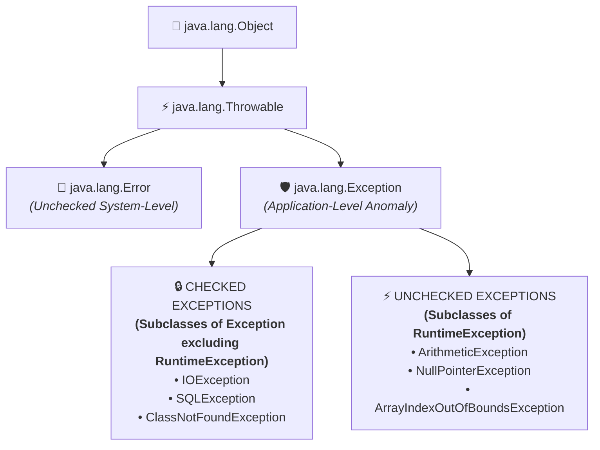

# Checked & Unchecked Exception in Java

---

## 📖 Introduction

### 📌 Definition:

#### 1️⃣ Checked Exception:
- Exceptions that are **checked at compile-time by the compiler** are known as **Checked Exception**.
- If checked exceptions are not handled (using `try-catch` or `throws`), the **code will not compile**.

#### 2️⃣ Unchecked Exception:
- Exceptions that are **ignored by compiler and not checked at compile-time but occur at runtime** are known as **Unchecked Exception**.
- Compiler **does not force to handle the unchecked exceptions**, but the **program may crash if not handled**.

---

## 🌟 Real-World Analogy:

#### 🚄 Checked Exception:
- **For Example :** A scheduled train delay notice $\rightarrow$ we are informed in advance, and we must plan accordingly.

#### 🚗 Unchecked Exception:
- **For Example :** A sudden tire burst while driving $\rightarrow$ happens unexpectedly, no prior warning.

---

## 🌲 Hierarchy:

#### 1️⃣ Checked Exception:
- **Checked Exceptions are subclasses of `Exception` class excluding `RuntimeException`.**

#### 2️⃣ Unchecked Exception:
- **Unchecked Exceptions are subclasses of `RuntimeException` and all `Error` classes.**



---

## 📊 Checked and Unchecked Exception in Java

Below are some differences between Error and Exception:

| Aspect | Checked Exception | Unchecked Exception |
| :--- | :--- | :--- |
| **Also Called** | Compile-Time Exceptions | Runtime Exceptions |
| **Definition** | Checked Exceptions are those which are checked at compile-time by compiler | Unchecked Exceptions are those which are ignored by compiler and checked at runtime by JVM |
| **Hierarchy** | Comes under the Exception class, (excluding RuntimeException) | Comes under the RuntimeException class |
| **Examples** | IOException, SQLException | NullPointerException, ArithmeticException |
| **Handling** | Must handled by try-catch or declared using throws keyword | Optional to handle (but recommended) |
| **When occur** | External factors (eg. I/O and DB connection) | Code mistakes (eg. null, index, /0) |
| **Impact** | Safe but lengthy | Flexible but risky |
| **Analogy** | Train delay notice | Tire burst |
| **Best Practice** | Always handle or declare checked exceptions properly | Avoid mistakes in code or Check data before use |

---

## 💻 Java Program Demonstration

### 1️⃣ Checked Exception Example (Compile-Time Enforcement):

```java
import java.io.FileReader;
import java.io.IOException;

public class CheckedDemo {
    public static void main(String[] args) {
        // Without try-catch or throws, javac gives compile error!
        try {
            FileReader file = new FileReader("myFile.txt");
            System.out.println("File opened successfully.");
        } catch (IOException e) {
            System.out.println("⚠️ Checked Exception caught: File cannot be read -> " + e.getMessage());
        }
    }
}
```

#### 🖥️ Output:
```text
⚠️ Checked Exception caught: File cannot be read -> myFile.txt (The system cannot find the file specified)
```

---

### 2️⃣ Unchecked Exception Example (Runtime Occurrence):

```java
public class UncheckedDemo {
    public static void main(String[] args) {
        // Compiles cleanly without warnings, but triggers at runtime!
        int[] numbers = { 10, 20, 30 };

        try {
            System.out.println(numbers[5]); // Invalid index: 5
        } catch (ArrayIndexOutOfBoundsException e) {
            System.out.println("⚠️ Unchecked Exception caught: Invalid array index -> " + e.getMessage());
        }
    }
}
```

#### 🖥️ Output:
```text
⚠️ Unchecked Exception caught: Invalid array index -> Index 5 out of bounds for length 3
```
