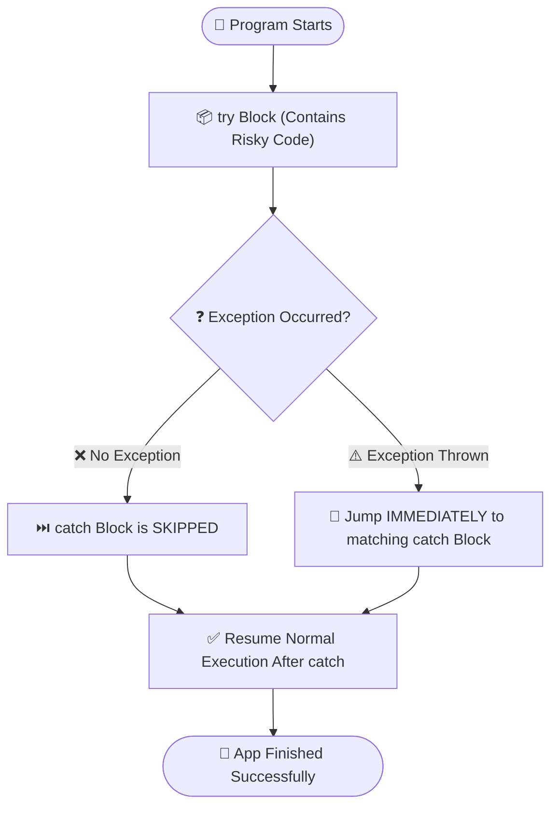
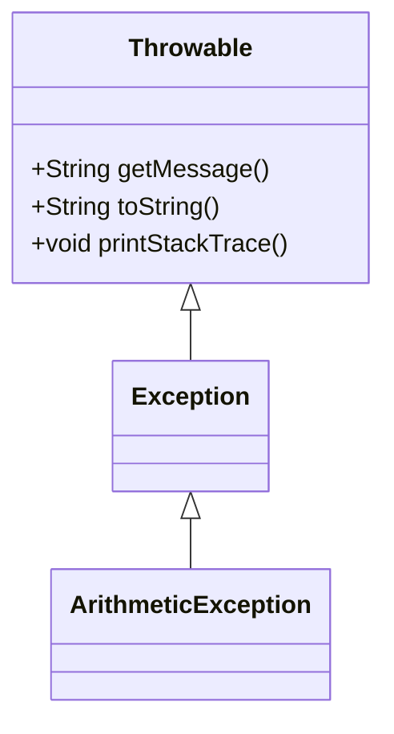
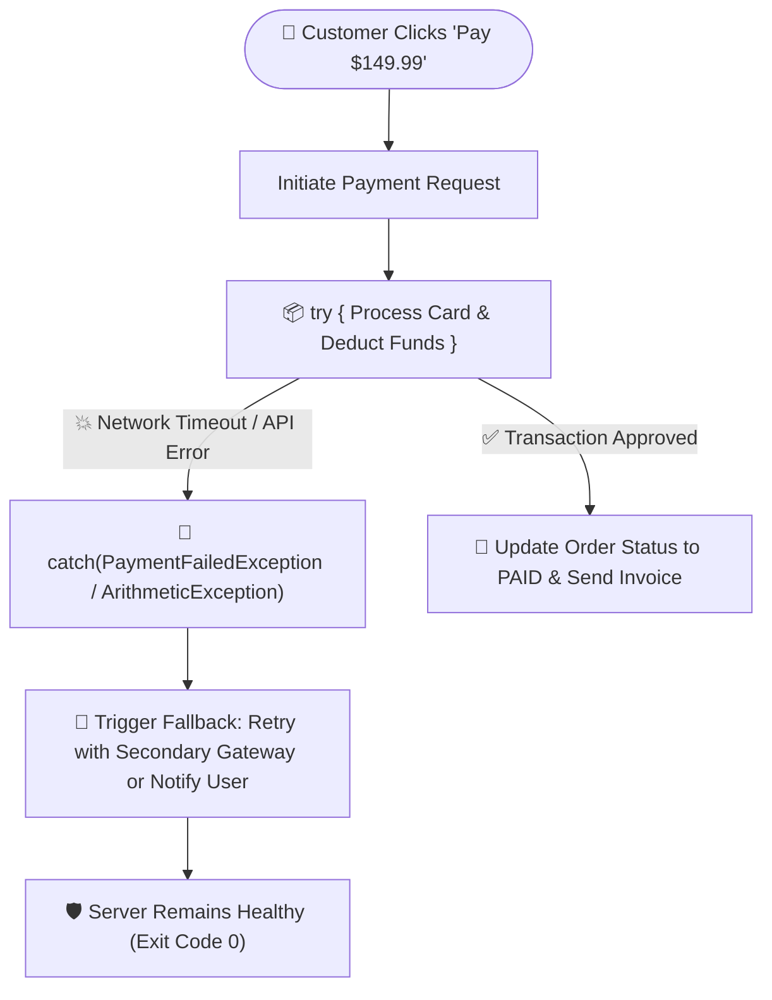

# 🛡️ try-catch Block in Java

---

## 📖 1. Introduction

In Java, **`try`** and **`catch`** are dedicated keywords used together as structured blocks for **exception handling**.

They allow developers to handle runtime exceptions gracefully and ensure the program continues its normal execution without crashing abruptly.



---

## 🧱 2. Definitions & Syntax

### 📦 The `try` Block
- The **`try`** block contains the code that may throw an exception.
- In simple words: **It contains the risky code that can cause an exception at runtime.**

#### 📝 `try` Syntax:
```java
try
{
    // Risky code that may throw an exception
}
```

---

### 🦺 The `catch` Block
- The **`catch`** block is used to handle the exception thrown by the `try` block.
- In simple words: **It contains the handling code that will execute if an exception occurs in the `try` block.**

#### 📝 `catch` Syntax:
```java
catch(ExceptionClassType ref_variable)
{
    // Code to handle exception
}
```

---

## 💻 3. Step-by-Step Code Example: Two-Number Division

Let us take an example where we take two integers (`no1` and `no2`) as input from the user and divide them (`no1 / no2`).

---

### ❌ Step A: Program WITHOUT using `try-catch` Block

```java
import java.util.Scanner;

public class MainApp1
{
    public static void main(String[] args)
    {
        System.out.println("----- App Started -----");
        Scanner sc = new Scanner(System.in);

        System.out.println("Enter no 1");
        int no1 = sc.nextInt();

        System.out.println("Enter no 2");
        int no2 = sc.nextInt();

        int res = no1 / no2;
        System.out.println("Result : " + res);

        System.out.println("----- App Finished Successfully -----");
    }
}
```

#### 🖥️ Output 1 (Normal Input: `no1 = 100`, `no2 = 4`):
```text
----- App Started -----
Enter no 1
100
Enter no 2
4
Result : 25
----- App Finished Successfully -----
```

#### 💥 Output 2 (If user provides `no2 = 0`):
```text
----- App Started -----
Enter no 1
100
Enter no 2
0
Exception in thread "main" java.lang.ArithmeticException: / by zero
	at MainApp1.main(MainApp1.java:17)
```

> [!CAUTION]
> **Why did the program crash?**  
> If the user enters `0` as the second number, the JVM attempts `100 / 0`, which throws an `ArithmeticException`. Because there is **no `try-catch` block** to handle it, the JVM invokes the default exception handler and **terminates the program abnormally**.  
> Notice that `----- App Finished Successfully -----` is **never printed**!

---

### 🛡️ Step B: Modifying the Program WITH `try-catch` Block

Now we wrap the risky code inside a `try` block and handle the `ArithmeticException` in the `catch` block.

```java
import java.util.Scanner;

public class MainApp1
{
    public static void main(String[] args)
    {
        System.out.println("----- App Started -----");
        Scanner sc = new Scanner(System.in);

        try
        {
            System.out.println("Enter no 1");
            int no1 = sc.nextInt();

            System.out.println("Enter no 2");
            int no2 = sc.nextInt();

            int res = no1 / no2;
            System.out.println("Result : " + res);
        }
        catch(ArithmeticException ae)
        {
            System.out.println("Exception Occured : " + ae);
        }

        System.out.println("----- App Finished Successfully -----");
    }
}
```

#### 🖥️ Output 1 (Normal Input: `no1 = 100`, `no2 = 4`):
```text
----- App Started -----
Enter no 1
100
Enter no 2
4
Result : 25
----- App Finished Successfully -----
```

#### 🛡️ Output 2 (If user provides `no2 = 0`):
```text
----- App Started -----
Enter no 1
100
Enter no 2
0
Exception Occured : java.lang.ArithmeticException: / by zero
----- App Finished Successfully -----
```

> [!TIP]
> **Key Observation:**  
> Here, we wrapped the risky code inside the `try` block and handled the `ArithmeticException` in the `catch` block.  
> When the user enters `0`, `ArithmeticException` is thrown, but instead of terminating abnormally, control **instantly jumps to the `catch` block**, prints the exception message, and then proceeds to print `----- App Finished Successfully -----`!

---

## 🎬 4. Interactive Animation & How the Animation Works

The interactive visualizer above demonstrates the complete runtime flow of `try-catch` under the hood:

```mermaid
sequenceDiagram
    autonumber
    actor User
    participant Main as main() Thread
    participant Try as try Block (Risky)
    participant JVM as JVM Execution Engine
    participant Catch as catch(ArithmeticException ae)
    participant End as Post-Catch Statements

    User->>Main: Provide Inputs (no1=100, no2=0)
    Main->>Try: Enter try block
    Try->>JVM: Execute 100 / 0
    JVM-->>Try: ⚡ ArithmeticException Thrown!
    Note over Try,Catch: Remaining lines in try are SKIPPED!
    JVM->>Catch: Transfer control to matching catch block
    Catch->>Catch: Print "Exception Occured : " + ae
    Catch->>End: Continue execution normally
    End->>User: Print "----- App Finished Successfully -----" (Exit Code 0)
```

### 🔍 Step-by-Step Animation Breakdown:

1. **🚀 Thread Start & Input Reading**:
   - The `main()` thread begins execution and displays `"----- App Started -----"`.
   - The user inputs numerator `no1 = 100` and denominator `no2 = 0`.
2. **📦 Entering the `try` Block**:
   - The thread crosses into the protective `try` block zone.
3. **⚡ Exception Invariant (Division by Zero)**:
   - On the line `int res = no1 / no2;`, integer division by zero occurs.
   - The JVM instantiates a `java.lang.ArithmeticException` object on the Heap.
   - **Crucial Rule**: The remaining line in the `try` block (`System.out.println("Result : " + res);`) is **immediately skipped**!
4. **🦺 Jump to `catch` Block**:
   - The JVM intercepts the exception object and binds it to the reference variable `ae` in `catch(ArithmeticException ae)`.
   - The catch block executes its handler statement: `"Exception Occured : java.lang.ArithmeticException: / by zero"`.
5. **🏁 Normal Post-Catch Continuation**:
   - Once the catch block finishes, normal sequential execution resumes.
   - The final statement `"----- App Finished Successfully -----"` is printed, and the program exits safely with **Exit Code 0**.

---

## 📌 5. Points to Remember for `try-catch` Block

1. **`try` cannot be used alone**:
   - A `try` block **must** be followed by at least one `catch` block or a `finally` block.
   - Valid syntax structures:
     ```java
     // 1. try-catch
     try {
         // Risky code
     } catch(ExceptionClassType ref_variable) {
         // Handling code
     }
     ```
     ```java
     // 2. try-catch-finally
     try {
         // Risky code
     } catch(ExceptionClassType ref_variable) {
         // Handling code
     } finally {
         // Code that will ALWAYS execute
     }
     ```
     ```java
     // 3. try-finally
     try {
         // Risky code
     } finally {
         // Cleanup code
     }
     ```

2. **The Exception Object Anatomy**:
   - The reference variable in the catch block (e.g., `ae` or `e`) holds a reference to the exception object instantiated on the Heap.
   - This object contains three key pieces of information:
     - 🏷️ **Exception Class Name** (e.g., `java.lang.ArithmeticException`)
     - 💬 **Error Message / Description** (e.g., `/ by zero`)
     - 📍 **Stack Trace** (class name, method name, line number where the exception occurred)

3. **Execution Condition**:
   - If an exception occurs in the `try` block, **only then** does the program jump to the `catch` block.
   - If **no exception** occurs in the `try` block, the `catch` block is **completely skipped and never executed**.

---

## 🔍 6. Different Ways to Print the Exception Object

When handling an exception, Java provides three primary methods to inspect the exception object:



---

### 1️⃣ Using `getMessage()`
Prints **only** the description / error message without the exception class name or stack hierarchy.

```java
catch (Exception e)
{
    System.out.println(e.getMessage());
}
```
#### 🖥️ Output:
```text
/ by zero
```

---

### 2️⃣ Using `toString()`
Prints the **fully qualified exception class name** along with the error description message.

```java
catch (Exception e)
{
    System.out.println(e.toString());
    // Note: System.out.println(e); also internally calls e.toString()
}
```
#### 🖥️ Output:
```text
java.lang.ArithmeticException: / by zero
```

---

### 3️⃣ Using `printStackTrace()`
Prints the **full stack trace**, including the exception class name, error message, and the exact method call hierarchy with **file names and line numbers**.

```java
catch (Exception e)
{
    e.printStackTrace();
}
```
#### 🖥️ Output:
```text
java.lang.ArithmeticException: / by zero
	at MainApp1.main(MainApp1.java:17)
```

---

### 💡 Pro-Tip: When to use which method?

| Method | Output Detail | Recommended Use Case |
| :--- | :--- | :--- |
| **`printStackTrace()`** | Full call hierarchy & line numbers | **Debugging & Development** (identifies the exact line of failure). |
| **`getMessage()`** | Only error description | **User-Facing UI / Alerts** (clean, concise, hides internal code structure). |
| **`toString()`** | Exception name + description | **Application Loggers / Monitoring** (provides error classification). |

---

## 🏢 7. Enterprise Real-World Example: E-Commerce Payment Gateway

In modern e-commerce architectures (like Amazon or Shopify), when a customer places an order, the system contacts external third-party payment gateways (like Stripe, Razorpay, or PayPal). Network blips, invalid card details, or insufficient funds can cause runtime exceptions. Without `try-catch`, the entire checkout server would crash!



### 💻 Production-Grade Java Implementation:

```java
import java.util.Scanner;

public class PaymentGatewayService
{
    // Simulates an enterprise payment processing function
    public static void processPayment(String orderId, double amount, int paymentServerStatus)
    {
        System.out.println("💳 [Gateway] Initiating transaction for Order #" + orderId);
        System.out.println("💳 [Gateway] Processing charge of $" + amount + "...");

        try
        {
            // Simulating a calculation or network divisor check
            // If paymentServerStatus is 0, a division error / network crash occurs
            int serverNode = 100 / paymentServerStatus; 
            
            System.out.println("✅ [Gateway] Routed via Payment Node #" + serverNode);
            System.out.println("🎉 [Success] Payment of $" + amount + " charged successfully!");
            System.out.println("📦 [Order] Status updated to: 'CONFIRMED & READY FOR DISPATCH'");
        }
        catch (ArithmeticException e)
        {
            // Graceful degradation: Log error and notify fallback subsystem
            System.err.println("⚠️ [Alert] Primary Payment Gateway is DOWN (Error: " + e.getMessage() + ")");
            System.out.println("🔄 [Recovery] Routing request to Secondary Backup Payment Gateway (PayPal API)...");
            System.out.println("📱 [User Notification] 'Primary gateway unavailable. Switching to backup server, please wait...'");
        }

        System.out.println("🔒 [Audit] Audit log committed. Service ready for next customer.\n");
    }

    public static void main(String[] args)
    {
        System.out.println("==================================================");
        System.out.println("  🛍️ THREADSPEAK E-COMMERCE CHECKOUT SUBSYSTEM    ");
        System.out.println("==================================================\n");

        // Scenario 1: Normal successful payment (Primary gateway active)
        System.out.println(">>> Scenario 1: Processing Order with Healthy Gateway");
        processPayment("ORD-8921", 149.99, 4);

        // Scenario 2: Gateway server outage (paymentServerStatus = 0)
        System.out.println(">>> Scenario 2: Processing Order with Failed Gateway Node");
        processPayment("ORD-8922", 299.50, 0);

        System.out.println("🏁 All checkout requests processed without server crashes!");
    }
}
```

#### 🖥️ Console Output:
```text
==================================================
  🛍️ THREADSPEAK E-COMMERCE CHECKOUT SUBSYSTEM    
==================================================

>>> Scenario 1: Processing Order with Healthy Gateway
💳 [Gateway] Initiating transaction for Order #ORD-8921
💳 [Gateway] Processing charge of $149.99...
✅ [Gateway] Routed via Payment Node #25
🎉 [Success] Payment of $149.99 charged successfully!
📦 [Order] Status updated to: 'CONFIRMED & READY FOR DISPATCH'
🔒 [Audit] Audit log committed. Service ready for next customer.

>>> Scenario 2: Processing Order with Failed Gateway Node
💳 [Gateway] Initiating transaction for Order #ORD-8922
💳 [Gateway] Processing charge of $299.5...
⚠️ [Alert] Primary Payment Gateway is DOWN (Error: / by zero)
🔄 [Recovery] Routing request to Secondary Backup Payment Gateway (PayPal API)...
📱 [User Notification] 'Primary gateway unavailable. Switching to backup server, please wait...'
🔒 [Audit] Audit log committed. Service ready for next customer.

🏁 All checkout requests processed without server crashes!
```

---

## ⚙️ 8. Deep-Dive JVM Mechanics: The Bytecode Exception Table

Under the hood, how does the JVM know where the `catch` block begins when an instruction throws an exception?

1. **No Performance Penalty on the Happy Path**: When no exception is thrown, the JVM executes code at normal speed with **zero runtime overhead**.
2. **The `Exception table` in Bytecode**: When the Java compiler (`javac`) compiles a `try-catch` block, it writes an **Exception Table** into the compiled `.class` file metadata.

```text
Exception table:
   from    to  target type
      12    24      35   Class java/lang/ArithmeticException
```

- **`from` / `to`**: Bytecode instruction index range protected by the `try` block.
- **`target`**: Bytecode offset of the first instruction in the `catch` block handler.
- **`type`**: The exception class to match against the thrown object.

When an exception occurs at instruction `18`, the JVM looks up the Exception Table:
- Checks if instruction `18` is between `12` and `24`.
- Checks if the thrown object `instanceof java.lang.ArithmeticException`.
- If matched, the JVM updates the Program Counter (PC) to jump straight to instruction `35` (`catch` block)!

---

## 📊 9. Summary Comparison

| Aspect | Without `try-catch` | With `try-catch` |
| :--- | :--- | :--- |
| **Exception Occurrence** | Handled by Default Exception Handler | Handled by user-defined `catch` block |
| **Program Termination** | 💥 **Abnormal Termination** (Crashes) | 🛡️ **Normal Termination** (Recovers) |
| **Lines after Exception** | ❌ Never executed | ✅ Executed smoothly after `catch` |
| **User Experience** | Raw stack trace dumped to console | Friendly custom message displayed |
| **Exit Code** | Non-zero (Error) | `0` (Success) |

