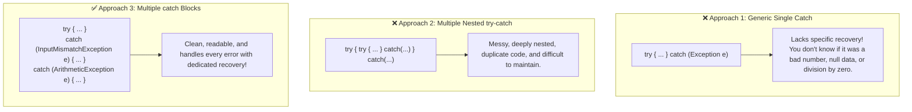

# 🛡️ Multiple catch Block in Java


## 📖 1. Introduction & Real-Life Analogy

In previous topics, we learned that a **`try-catch`** block is used to prevent our Java programs from crashing when an error happens. We also learned that a basic catch block handles only one specific type of exception.

**But what happens when a single block of code can fail in multiple different ways?**

### 🏥 Real-Life Analogy: The Multi-Specialty Hospital
Imagine you visit a hospital emergency department:
- If a patient has a **bone fracture** $\rightarrow$ they are sent to the **Orthopedic Specialist** (`catch (BoneFractureException e)`).
- If a patient has **eye irritation** $\rightarrow$ they are sent to the **Ophthalmologist** (`catch (EyeProblemException e)`).
- If a patient has a **general unknown illness** $\rightarrow$ they are sent to the **General Physician** (`catch (Exception e)`).

You would never treat a broken bone with eye drops!  
Similarly, in Java, **different errors require different recovery actions**. We cannot treat an invalid user input the same way we treat a mathematical division by zero.

> [!NOTE]
> ### 💡 Definition
> A **multiple catch block** in Java is a structure where a single `try` block is followed by two or more `catch` blocks, each designed to handle a different type of exception.  
> This allows a program to respond differently and intelligently depending on the exact problem that occurs.

---

## 🤔 2. Why Do We Need Multiple catch Blocks?

Why not just write a single catch block or multiple `try-catch` blocks? Let us compare the three approaches:



---

## 📝 3. Syntax of Multiple catch Block

```java
try {
    // Risky code that may throw different types of exceptions
} catch (ExceptionType1 ref1) {
    // Handling code specifically for ExceptionType1
} catch (ExceptionType2 ref2) {
    // Handling code specifically for ExceptionType2
} catch (ExceptionType3 ref3) {
    // Handling code specifically for ExceptionType3
}
// You can add more catch blocks as needed...
```

---

## 💻 4. Complete Practical Working Example

Let us write a complete, beginner-friendly program where user input can trigger two different errors:
1. `InputMismatchException`: Triggered if the user enters a non-numeric string (like `"abc"` or `"hello"`).
2. `ArithmeticException`: Triggered if the user enters `0` as the second number (`100 / 0`).

```java
import java.util.Scanner;
import java.util.InputMismatchException;

public class MainApp {
    public static void main(String[] args) {
        System.out.println("----- App Started -----");
        Scanner sc = new Scanner(System.in);
        try {
            System.out.println("Enter no 1");
            int no1 = sc.nextInt();

            System.out.println("Enter no 2");
            int no2 = sc.nextInt();

            int res = no1 / no2;
            System.out.println("Result : " + res);
        } catch (InputMismatchException ime) {
            // First catch block handles non-integer input
            System.out.println("Input Mismatch Exception Occured : " + ime);
        } catch (ArithmeticException ae) {
            // Second catch block handles division by zero
            System.out.println("Arithmetic Exception Occured : " + ae);
        }
        System.out.println("----- App Finished Successfully -----");
    }
}
```

---

## 🔄 5. How Multiple catch Block Executes (3 Output Scenarios)

Let us trace how the Java Virtual Machine (JVM) executes the code under different user inputs:

### 🟢 Case 1: Normal Execution (User inputs `100` and `5`)
- `no1 = 100`, `no2 = 5`
- `res = 100 / 5 = 20`
- **Output:**
  ```text
  ----- App Started -----
  Enter no 1
  100
  Enter no 2
  5
  Result : 20
  ----- App Finished Successfully -----
  ```
- **What happened:** No error occurred $\rightarrow$ **Both catch blocks were skipped completely!**

---

### 🟡 Case 2: Input Mismatch Error (User inputs `"abc"` for `no1`)
- User inputs string `"abc"`
- `sc.nextInt()` fails and throws `InputMismatchException`
- **Output:**
  ```text
  ----- App Started -----
  Enter no 1
  abc
  Input Mismatch Exception Occured : java.util.InputMismatchException
  ----- App Finished Successfully -----
  ```
- **What happened:** The 1st catch block matched and executed. **The 2nd catch block (`ArithmeticException`) was completely skipped!**

---

### 🔴 Case 3: Division by Zero Error (User inputs `100` and `0`)
- `no1 = 100`, `no2 = 0`
- `res = 100 / 0` throws `ArithmeticException`
- **Output:**
  ```text
  ----- App Started -----
  Enter no 1
  100
  Enter no 2
  0
  Arithmetic Exception Occured : java.lang.ArithmeticException: / by zero
  ----- App Finished Successfully -----
  ```
- **What happened:** JVM checked Catch 1 (`InputMismatchException` $\rightarrow$ No Match), then moved to Catch 2 (`ArithmeticException` $\rightarrow$ Match!) and executed it.

---

## 📌 6. Crucial Points to Remember

1. **Each catch block handles only one specific exception type**:
   - Catch block 1 handles `InputMismatchException`.
   - Catch block 2 handles `ArithmeticException`.

2. **Only the first matching catch block executes**:
   - Once a matching catch block is executed, **all remaining catch blocks are ignored**.
   - Two catch blocks will **never** execute for the same try block during a single execution.

3. **Execution stops on the very first exception in the try block**:
   - If line 10 in the `try` block throws an exception, Java immediately jumps to the catch block. Lines 11, 12, and 13 inside the `try` block are **never executed**.

4. **Catch blocks must be ordered from Subclass (Child) to Superclass (Parent)**:
   - If a parent class like `Exception` is placed first, it will catch everything, making the child catch blocks unreachable.

---

## ⚠️ 7. The Golden Rule: Child First, Parent Later

In Java, all exceptions form an inheritance hierarchy:
$$\text{Throwable} \longrightarrow \text{Exception} \longrightarrow \text{RuntimeException} \longrightarrow \text{ArithmeticException}$$

Because `ArithmeticException` **is a child of** `Exception`:

### ❌ Incorrect Order (Causes Compile-Time Error):

```java
try {
    int num = 10 / 0;
} 
// 🛑 Parent Class Catch placed FIRST:
catch (Exception e) {
    System.out.println("Exception caught: " + e);
} 
// ❌ COMPILE-TIME ERROR:
catch (ArithmeticException ae) { 
    System.out.println("Arithmetic Exception caught");
}
```

> [!CAUTION]
> ### 🚨 Why does this fail compilation?
> Because `Exception` is the parent class of `ArithmeticException`, the first catch block will catch **every possible exception**.  
> The second catch block can **never be reached under any circumstances**.  
> Java rejects this at compile-time with:  
> `error: exception ArithmeticException has already been caught`

---

### ✅ Correct Order (Subclass First, Parent Later):

```java
try {
    int num = 10 / 0;
} 
// ✅ 1. Specific Child Class Catch FIRST:
catch (ArithmeticException ae) { 
    System.out.println("Handled division by zero");
} 
// ✅ 2. General Parent Class Catch LAST (as a fallback safety net):
catch (Exception e) { 
    System.out.println("Handled other unexpected errors");
}
```

---

## ❓ 8. Frequently Asked Questions (FAQ) in Plain English

### Q1: Can two catch blocks execute together for one try block?
**No.** When an exception happens in a `try` block, execution immediately jumps to the first matching `catch` block. Once that catch block finishes, control exits the entire `try-catch` structure.

### Q2: What if an exception occurs that none of our catch blocks match?
If no catch block matches the thrown exception (and there is no general `catch (Exception e)` at the bottom), the exception remains unhandled and the JVM crashes with an **abnormal termination**.

### Q3: Can we write code between a `try` block and a `catch` block?
**No.** You cannot place any statements between `}` of `try` and `{` of `catch`, or between consecutive `catch` blocks. They must form an unbroken chain.

```java
// ❌ COMPILE ERROR:
try {
    int x = 10 / 2;
}
System.out.println("Hello"); // 🚨 Error: 'catch' without 'try'
catch (ArithmeticException e) {
    // ...
}
```

### Q4: Can we write duplicate catch blocks for the exact same exception?
**No.** Having two `catch (ArithmeticException e)` blocks for the same `try` block will cause a compile-time error (`exception ArithmeticException has already been caught`).

---

## 📊 9. Quick Summary Matrix

| Question / Feature | Behavior in Java |
| :--- | :--- |
| **How many `try` blocks?** | Exactly **one** `try` block |
| **How many `catch` blocks?** | Two or more consecutive `catch` blocks |
| **How are they evaluated?** | Strictly **from top to bottom** in order of appearance |
| **How many catch blocks execute?** | **At most ONE** matching catch block |
| **Inheritance Hierarchy Rule** | **Child (Subclass)** MUST come before **Parent (Superclass)** |
| **What if no error happens?** | **All** catch blocks are completely skipped |
| **Unreachable catch blocks?** | Strictly rejected with a **Compile-Time Error** |
