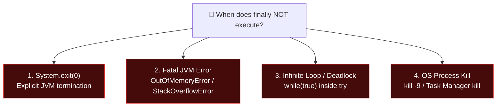

# 🧹 finally Block in Java Exception Handling

---

## 📖 1. Introduction & Real-Life Analogy

In previous topics, we learned how the **`try`** block isolates risky code and the **`catch`** block handles errors if they occur.

**However, what about critical cleanup operations that MUST run under all circumstances?**

### 🔥 Real-Life Analogy: Turning Off the Kitchen Gas Stove
Imagine you are cooking dinner in the kitchen:
- **Case 1 (Success):** Your meal cooks to perfection $\rightarrow$ You turn off the gas stove before leaving.
- **Case 2 (Failure):** You accidentally burn the food $\rightarrow$ You **still** turn off the gas stove before leaving!
- **Case 3 (Emergency):** You get an urgent phone call $\rightarrow$ You **still** turn off the gas stove before rushing out!

No matter what happens during cooking, **turning off the stove is mandatory to prevent disaster**.  
In Java, the **`finally` block** is your safety switch — it guarantees that critical cleanup code (closing files, releasing database connections, freeing memory) **always executes**.

> [!NOTE]
> ### 💡 Definition
> In Java, the **`finally` block** is a block of code that is **always executed** after the execution of a `try` block, **regardless of whether an exception occurs, is caught, or remains unhandled**.

---

## 🎯 2. Why Do We Use the finally Block? (4 Core Purposes)

1. **Release Resources Safely**:
   - Close opened files, database connections, sockets, and hardware streams to prevent **resource leaks** and connection pool exhaustion.
2. **Perform Mandatory Cleanup Tasks**:
   - Reset shared flags, unlock thread mutexes, or flush temporary memory buffers.
3. **Maintain Program Reliability**:
   - Guarantees that system state remains consistent and healthy even when catastrophic runtime errors occur.
4. **Guarantee Execution**:
   - Acts as a bulletproof safety mechanism that cannot be accidentally bypassed by normal control flow (including `return`, `break`, or `continue`).

---

## 📝 3. Syntax of the finally Block

In Java, a `finally` block cannot stand alone. It must follow a `try` block in one of two standard forms:

### Form A: `try-catch-finally` (Standard Error Handling + Cleanup)
```java
try {
    // Risky code that may throw an exception
} catch (ExceptionClassType e) {
    // Exception handling code
} finally {
    // Cleanup code (ALWAYS executes)
}
```

### Form B: `try-finally` (Cleanup + Exception Ducking)
```java
try {
    // Risky code (Exceptions will propagate to the caller)
} finally {
    // Cleanup code (ALWAYS executes before propagating exception)
}
```

---

## 💻 4. Practical Working Examples & Output Tracing

---

### 🟢 Example 1: Normal Execution (No Exception Occurs)

```java
public class FinallyDemo1 {
    public static void main(String[] args) {
        try {
            System.out.println("Inside try block");
            int data = 10 / 2; // No exception (10 / 2 = 5)
            System.out.println("Result: " + data);
        } catch (ArithmeticException e) {
            System.out.println("Exception caught: " + e);
        } finally {
            System.out.println("Finally block always executes");
        }

        System.out.println("Rest of the code...");
    }
}
```

#### 🖥️ Output:
```text
Inside try block
Result: 5
Finally block always executes
Rest of the code...
```
**🔍 Explanation:**
1. Code inside `try` runs successfully.
2. `catch` block is **skipped**.
3. `finally` block **executes**.
4. Program continues to normal statements.

---

### 🟡 Example 2: Exception Occurs and is Handled by catch

```java
public class FinallyDemo2 {
    public static void main(String[] args) {
        try {
            System.out.println("Inside try block");
            int data = 10 / 0; // 💥 Throws ArithmeticException
            System.out.println("Result: " + data);
        } catch (ArithmeticException e) {
            System.out.println("Exception caught: " + e);
        } finally {
            System.out.println("Finally block always executes");
        }

        System.out.println("Rest of the code...");
    }
}
```

#### 🖥️ Output:
```text
Inside try block
Exception caught: java.lang.ArithmeticException: / by zero
Finally block always executes
Rest of the code...
```
**🔍 Explanation:**
1. `10 / 0` throws `ArithmeticException` inside `try`.
2. JVM jumps to `catch (ArithmeticException e)` and handles it.
3. `finally` block **executes immediately after `catch`**.
4. Program continues normally.

---

### 🔴 Example 3: Exception Occurs and is NOT Caught

```java
public class FinallyDemoUnhandled {
    public static void main(String[] args) {
        try {
            System.out.println("Inside try block");
            int data = 10 / 0; // 💥 Throws ArithmeticException
        } catch (NullPointerException e) {
            // ❌ Catch block only handles NullPointerException!
            System.out.println("Caught NullPointerException");
        } finally {
            System.out.println("Finally block STILL executes before crash!");
        }

        System.out.println("This line will NEVER run.");
    }
}
```

#### 🖥️ Output:
```text
Inside try block
Finally block STILL executes before crash!
Exception in thread "main" java.lang.ArithmeticException: / by zero
	at FinallyDemoUnhandled.main(FinallyDemoUnhandled.java:6)
```
**🔍 Key Invariant:**
Even when there is **NO matching catch block**, the JVM executes the `finally` block **first**, and only *then* prints the stack trace and terminates abnormally.

---

### ↩️ Example 4: `finally` Block with a `return` Statement

A very common interview question: **Does `finally` execute if there is a `return` statement inside `try` or `catch`?**

```java
public class FinallyDemo3 {
    public static void main(String[] args) {
        System.out.println(m1());
    }

    static String m1() {
        try {
            System.out.println("Inside try");
            return "Returning from try";
        } catch (Exception e) {
            return "Returning from catch";
        } finally {
            System.out.println("Finally block executed before return");
        }
    }
}
```

#### 🖥️ Output:
```text
Inside try
Finally block executed before return
Returning from try
```

**🔍 Execution Flow:**
1. Method `m1()` enters `try` and evaluates the return expression (`"Returning from try"`).
2. The JVM **holds the return value** in a temporary register on the call stack.
3. Control transfers to the `finally` block $\rightarrow$ prints `"Finally block executed before return"`.
4. Control returns to the caller with the original return value `"Returning from try"`.

---

## 🛑 5. The ONLY Cases Where the finally Block Does NOT Execute

Is `finally` 100% guaranteed under every possible event in the universe? **No.** There are exactly 4 specific edge cases where `finally` will not run:



1. **`System.exit(0)` is Called**:
   - Calling `System.exit(0)` instructs the operating system to immediately terminate the JVM process. No further bytecode instructions are executed.
2. **Fatal JVM Crash / Hardware Failure**:
   - If the computer loses power or the JVM crashes due to an unrecoverable `OutOfMemoryError` in core native memory, `finally` cannot run.
3. **Infinite Loop or Deadlock in `try`**:
   - If the code inside `try` gets stuck in `while(true) {}` or a thread deadlock, it never exits the `try` block, so `finally` is never reached.
4. **OS Level Process Termination**:
   - If the OS kills the process (`kill -9 <PID>` on Linux or "End Task" in Windows Task Manager).

---

## ⚠️ 6. Common Interview Pitfalls & Anti-Patterns

### 🪤 Trap 1: The "Silent Return Override" Anti-Pattern
What happens if the `finally` block itself contains a `return` statement?

```java
public static int getNumber() {
    try {
        return 10;
    } finally {
        return 20; // ⚠️ Overrides the return value of try!
    }
}
```
**Answer:** `getNumber()` returns **`20`**!  
A `return` inside `finally` **silently discards** any pending `return` or unhandled exception from the `try` block.  
> [!CAUTION]
> **Never put a `return` statement inside a `finally` block in production code!** It suppresses exceptions and leads to subtle, hard-to-find bugs.

---

### 🪤 Trap 2: Throwing an Exception inside `finally`
If an exception is thrown inside `finally`, it masks and swallows any exception that was originally thrown inside the `try` block.

---

## 🏢 7. Enterprise Real-World Case Study: Database Connection Pooling (JDBC)

In production enterprise backend services (such as Spring Boot with HikariCP), failing to close database connections leads to connection pool starvation and full server outages:

```java
public class UserService {
    public User findUserById(int userId) {
        Connection conn = null;
        PreparedStatement stmt = null;
        ResultSet rs = null;

        try {
            conn = DatabasePool.getConnection(); // 1. Acquire DB Connection
            stmt = conn.prepareStatement("SELECT * FROM users WHERE id = ?");
            stmt.setInt(1, userId);
            rs = stmt.executeQuery();            // 2. Risky SQL Execution

            if (rs.next()) {
                return new User(rs.getInt("id"), rs.getString("name"));
            }
            return null;
        } catch (SQLException e) {
            System.err.println("Database query failed: " + e.getMessage());
            return null;
        } finally {
            // 3. GUARANTEED CLEANUP: Always return connection back to the pool!
            try { if (rs != null) rs.close(); } catch (SQLException e) { /* log */ }
            try { if (stmt != null) stmt.close(); } catch (SQLException e) { /* log */ }
            try { if (conn != null) conn.close(); } catch (SQLException e) { /* log */ }
            System.out.println("✅ Database connection safely returned to pool.");
        }
    }
}
```

---

## ❓ 8. Frequently Asked Questions (FAQ)

### Q1: Can we write a `try` block with only `finally` (no `catch`)?
**Yes!** A `try-finally` block is completely valid. It is used when you want cleanup to happen locally, but want the exception to propagate to the calling method.

### Q2: Which runs first: the `return` in `try` or the `finally` block?
The expression in `return` is evaluated first, but the method **pauses**, executes the entire `finally` block, and only then completes the return to the caller.

### Q3: Can there be multiple `finally` blocks for a single `try`?
**No.** A `try` block can have multiple `catch` blocks, but **only ONE `finally` block**.

---

## 📊 9. Summary Comparison Matrix

| Feature | `try` Block | `catch` Block | `finally` Block |
| :--- | :--- | :--- | :--- |
| **Purpose** | Enclose risky code | Handle specific errors | Guarantee resource cleanup |
| **Can it stand alone?** | No (needs catch or finally) | No (must follow try) | No (must follow try/catch) |
| **How many allowed?** | Exactly 1 | 0 or more | 0 or 1 |
| **Execution frequency** | Always attempted | Only on matching error | **Always executes** (except System.exit) |
| **Bypassed by `return`?** | N/A | N/A | **Never** |
