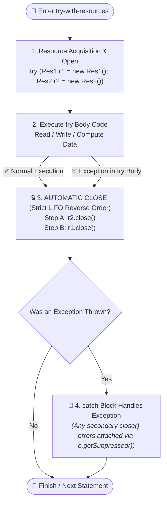
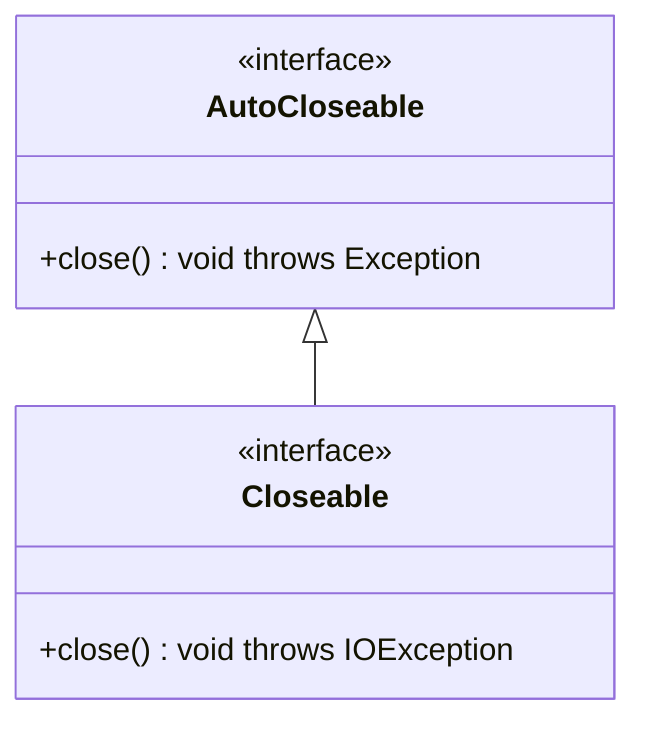

# 📦 Try-With-Resources in Java (Automatic Resource Management - ARM)

---

## 📖 1. Introduction

In previous topics, we learned about the **`finally` block**, which is used to execute cleanup code and release external system resources like **files, database connections, sockets, or network streams**.

However, managing resources manually using `finally` blocks has several serious drawbacks:
1. **Error-Prone & Resource Leaks**: It is easy to forget to close a stream, or close them in the incorrect sequence, leading to file handle exhaustion, memory leaks, and database connection pool starvation.
2. **Massive Boilerplate Code**: Developers had to write nested `try-catch` blocks inside `finally` just to safely null-check and call `.close()`, cluttering business logic.
3. **Exception Masking**: If an exception occurred inside the `try` block and *another* exception occurred inside `close()` in `finally`, the closing exception would **mask (destroy/overwrite)** the original business exception, making root-cause debugging nearly impossible!

```java
// ❌ Legacy Java 6 Approach: 20+ lines of messy, nested boilerplate to close just 1 stream!
FileInputStream fis = null;
try {
    fis = new FileInputStream("data.bin");
    fis.read();
} catch (IOException e) {
    logger.error("Read error", e);
} finally {
    if (fis != null) {
        try {
            fis.close(); // 💥 If this throws IOException, it masks the read error above!
        } catch (IOException e) {
            logger.error("Close error", e);
        }
    }
}
```

To eliminate these problems, **Java 7 introduced Try-With-Resources** (also known as **Automatic Resource Management - ARM**).

---

## 🎯 2. Definition & Core Concepts

> [!IMPORTANT]
> **Definition**: **Try-With-Resources** is a feature introduced in **Java 7** that allows you to declare resources directly inside the `try(...)` statement header.  
> These resources are **automatically closed at the end of the `try` block**, completely eliminating the need for an explicit `finally` block for cleanup.

### ❓ What is a "Resource"?
A **resource** is any object that must be closed after the program is finished with it (e.g., file streams, database connections, scanner inputs).

In Java, an object qualifies as a resource for try-with-resources **if and only if its class implements the `java.lang.AutoCloseable` or `java.io.Closeable` interface**.

Common built-in AutoCloseable resources include:
- `FileInputStream`, `FileOutputStream`
- `BufferedReader`, `BufferedWriter`, `FileReader`, `FileWriter`
- `Scanner`
- `java.sql.Connection`, `java.sql.PreparedStatement`, `java.sql.ResultSet`
- `Socket`, `ServerSocket`
- `ZipFile`, `JarFile`

---

## 🌟 3. Key Uses & Benefits

- **Prevents Resource Leaks**: Automatically closes resources when execution leaves the `try` block, even if an unhandled exception or return statement occurs.
- **Reduces Boilerplate Code**: Eliminates manual null-checking and verbose nested `try-catch` structures inside `finally`.
- **Cleaner, Safer, & More Readable**: Keeps resource acquisition, usage, and error handling succinct and co-located.
- **Guaranteed Exception Safety & Suppressed Exception Preservation**: Ensures exceptions thrown during auto-closing do not erase the primary exception thrown by the `try` body.

---

## 📜 4. Syntax

### A. Single Resource Syntax
```java
try (ResourceType resource = new ResourceType()) {
    // use the resource
} catch (ExceptionClassType e) {
    // handle exception (optional)
}
```

### B. Multiple Resources Syntax (Semicolon `;` Separated)
Multiple resources can be declared inside the `try(...)` header separated by a semicolon `;`:

```java
try (
    ResourceType1 res1 = new ResourceType1();
    ResourceType2 res2 = new ResourceType2()
) {
    // use resources res1 and res2
} catch (ExceptionClassType e) {
    // handle exception
}
```

> [!NOTE]
> The trailing semicolon `;` after the last resource is optional.

---

## 💻 5. Complete Code Example

```java
import java.io.BufferedReader;
import java.io.FileReader;
import java.io.IOException;

public class TryWithResourcesDemo {
    public static void main(String[] args) {
        System.out.println("----- App Started -----");

        // try-with-resources automatically closes BufferedReader
        try (BufferedReader br = new BufferedReader(new FileReader("test.txt"))) {
            String line;
            while ((line = br.readLine()) != null) {
                System.out.println(line);
            }
        } catch (IOException e) {
            System.out.println("IOException occurred: " + e);
        }

        System.out.println("----- App Finished Successfully -----");
    }
}
```

### 🖥️ Expected Output:
```text
----- App Started -----
Line 1 from test.txt
Line 2 from test.txt
...
----- App Finished Successfully -----
```

---

## 🎬 6. Interactive Animation & Architecture Breakdown

To help you build an intuitive mental model, our interactive visualizer simulates how the JVM executes a try-with-resources statement under the hood.



### 🔍 Explanation of the Animation & Lifecycle Steps:

1. **Step 1: Resource Acquisition (Left-to-Right)**:  
   The JVM executes constructor expressions inside the `try(...)` header from left to right (`res1` allocated first, then `res2`).
2. **Step 2: Try Block Execution**:  
   The program executes the business statements inside the try body `{ ... }`.
3. **Step 3: Guaranteed Reverse Order Auto-Closing (LIFO)**:  
   Upon exiting the try block (whether normally or due to an exception/return), the JVM automatically invokes `.close()` on all declared resources in **strict reverse order of their declaration** (`res2.close()` runs *first*, then `res1.close()`).
4. **Step 4: Auto-Closing Happens BEFORE Catch/Finally**:  
   Resources are guaranteed to be closed **before** control enters any associated `catch` or `finally` blocks.
5. **Step 5: Suppressed Exceptions Chaining**:  
   If an exception is thrown in the try block AND another exception is thrown during `.close()`, the close exception is attached to the primary exception as a **Suppressed Exception** instead of discarding either.

---

## 📌 7. Points to Remember for Try-With-Resources

1. **No Need for Explicit `finally` Block**: The JVM automatically inserts resource cleanup code at compile-time.
2. **`AutoCloseable` or `Closeable` Contract**: Any object declared in `try(...)` **MUST** implement either `java.lang.AutoCloseable` or `java.io.Closeable`.
3. **Multiple Resources Support**: Multiple resources can be managed in a single `try` header using semicolon `;` separators.
4. **Strict Reverse (LIFO) Closing Order**: Resources are closed in the exact opposite order in which they were declared.
5. **Suppressed Exceptions Support**: Exceptions thrown during resource closure are automatically preserved and can be retrieved using `Throwable.getSuppressed()`.
6. **Variables are Implicitly Final**: The resource variables declared in `try(...)` are implicitly `final`. You cannot reassign them inside the try block (e.g., `res = null;` will cause a compilation error).
7. **`catch` and `finally` are Optional**: A try-with-resources statement can exist without any `catch` or `finally` block (as long as declared checked exceptions are handled or declared with `throws`).

---

## 🧠 8. Deep-Dive: `AutoCloseable` vs `Closeable`



| Feature | `java.lang.AutoCloseable` | `java.io.Closeable` |
| :--- | :--- | :--- |
| **Introduced In** | Java 7 | Java 5 |
| **Package** | `java.lang` (No import needed) | `java.io` |
| **Method Signature** | `void close() throws Exception;` | `void close() throws IOException;` |
| **Intended Scope** | Generic base for **any** closable resource (DB, Sockets, Custom) | Specialized for **I/O Streams & byte channels** |
| **Idempotency** | Recommended (not strictly enforced by compiler) | **Strictly required** (calling close multiple times must be safe) |

---

## 🔗 9. Suppressed Exceptions Deep-Dive (`e.getSuppressed()`)

When an exception occurs inside the try block and *another* exception is thrown while the JVM calls `.close()`, Java preserves the **try block exception as the primary exception** and attaches the close exception as a **suppressed exception**.

```java
class FaultyResource implements AutoCloseable {
    public void doWork() throws Exception {
        throw new Exception("💥 Primary Error: Business calculation failed!");
    }
    @Override
    public void close() throws Exception {
        throw new Exception("⚠️ Secondary Error: Failed to close hardware port!");
    }
}

public class SuppressedDemo {
    public static void main(String[] args) {
        try (FaultyResource res = new FaultyResource()) {
            res.doWork();
        } catch (Exception e) {
            System.out.println("Primary Exception: " + e.getMessage());

            // Retrieve suppressed exceptions:
            Throwable[] suppressed = e.getSuppressed();
            for (Throwable s : suppressed) {
                System.out.println("  ↳ Suppressed Exception: " + s.getMessage());
            }
        }
    }
}
```

### 🖥️ Output:
```text
Primary Exception: 💥 Primary Error: Business calculation failed!
  ↳ Suppressed Exception: ⚠️ Secondary Error: Failed to close hardware port!
```

---

## 💎 10. Java 9 Enhancement: Effectively Final Variables

In **Java 7**, resources had to be newly declared inside the `try(...)` header.  
In **Java 9+**, you can pass **already existing `final` or effectively final reference variables** directly into `try(...)`:

```java
// ✅ Java 9+: Pass pre-declared effectively final variables
final BufferedReader reader1 = new BufferedReader(new FileReader("file1.txt"));
BufferedReader reader2 = new BufferedReader(new FileReader("file2.txt")); // Effectively final

try (reader1; reader2) {
    System.out.println(reader1.readLine());
    System.out.println(reader2.readLine());
} // Both reader2 and reader1 automatically closed here in reverse order!
```

---

## 🏢 11. Enterprise Real-World Example: JDBC Triple Resource Management

In production backend applications, executing SQL queries safely requires managing three independent database resources:
1. `Connection`
2. `PreparedStatement`
3. `ResultSet`

With Try-With-Resources, all three are closed in reverse order (`ResultSet` &rarr; `PreparedStatement` &rarr; `Connection`):

```java
import java.sql.Connection;
import java.sql.DriverManager;
import java.sql.PreparedStatement;
import java.sql.ResultSet;
import java.sql.SQLException;

public class JdbcTryWithResourcesDemo {
    public static void fetchActiveUsers(String dbUrl) {
        String sql = "SELECT user_id, email FROM users WHERE status = ?";

        // All 3 resources automatically closed in reverse order: rs -> ps -> con
        try (
            Connection con = DriverManager.getConnection(dbUrl, "admin", "secret123");
            PreparedStatement ps = con.prepareStatement(sql);
        ) {
            ps.setString(1, "ACTIVE");
            
            try (ResultSet rs = ps.executeQuery()) {
                while (rs.next()) {
                    System.out.println("User: " + rs.getLong("user_id") + " - " + rs.getString("email"));
                }
            }
        } catch (SQLException e) {
            System.err.println("Database error: " + e.getMessage());
        }
    }
}
```

---

## 📊 12. Summary Comparison Matrix

| Feature | Legacy `try-finally` (Java 6) | Try-With-Resources (Java 7+) |
| :--- | :--- | :--- |
| **Boilerplate Code** | High (20+ lines per resource) | Minimal (1 clean declaration per resource) |
| **Null-Checking Needed?** | Yes (`if (res != null)`) | Automatic by JVM |
| **Masked Exceptions** | Yes (`finally` can overwrite `try` error) | No (**Suppressed Exceptions** preserve all details) |
| **Closing Sequence** | Manual code order | **Guaranteed Reverse (LIFO) Order** |
| **Interface Requirement** | None | Must implement `AutoCloseable` or `Closeable` |
| **Catch/Finally Requirement** | Requires catch or finally | Optional (try-with-resources can stand alone) |
