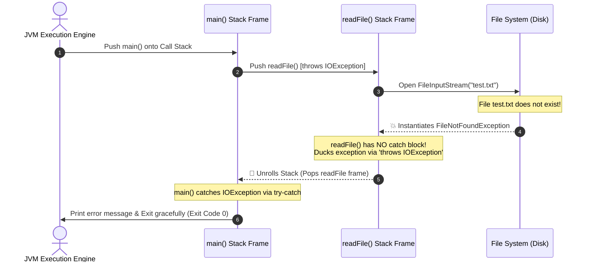
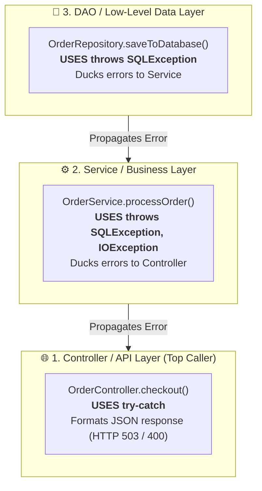
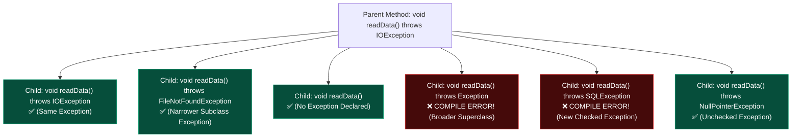

# 📢 "throws" Keyword in Java

---

## 📖 1. Introduction

The **`throws` keyword** is used in Java to specify the types of exceptions that a method might throw during its execution.

It serves as a formal **API contract** that informs the **caller** of the method that this method may result in an exception, and the caller is obligated to handle or propagate it.

```mermaid
flowchart LR
    Caller["Caller: main()<br><i>Obligated to Handle or Duck</i>"] -->|Calls obj.readFile()| Target["Target: readFile() throws IOException<br><i>Declares Potential Checked Error</i>"]
    Target -.->|Ducks / Propagates Error| Caller
```

---

## 🎯 2. Use of "throws" Keyword

- **Declares Checked Exceptions**: It is used to declare checked exceptions (such as `IOException`, `SQLException`, `ClassNotFoundException`, etc.) to satisfy the Java compiler.
- **Informs Caller Methods**: It alerts the caller method about possible failure conditions before calling the method.
- **Ducking (Delegation of Responsibility)**: It is used to avoid handling exceptions inside the method itself, cleanly passing the responsibility up the call stack to the caller.

---

## 📝 3. Syntax

```java
return_type methodName(parameters) throws ExceptionType1, ExceptionType2, ...
{
    // method body
}
```

> **Syntax Breakdown:**  
> Here, `ExceptionType1`, `ExceptionType2`, `...` are the class names of the exceptions that the method declares it might throw during runtime execution.

---

## 💻 4. Code Example: Reading File with "throws" & try-with-resources

```java
import java.io.FileInputStream;
import java.io.IOException;

public class ThrowsDemo
{
    // Method declares that it may throw IOException
    void readFile() throws IOException
    {
        // Using try-with-resources ensures FileInputStream is closed automatically
        try (FileInputStream fis = new FileInputStream("test.txt"))
        {
            // Read first byte from the file
            int data = fis.read();
            System.out.println("First byte of the file: " + data);
        }
    }

    public static void main(String[] args)
    {
        try
        {
            ThrowsDemo obj = new ThrowsDemo();

            // Caller method handles the IOException thrown by readFile()
            obj.readFile();
        }
        catch (IOException e)
        {
            // Exception is caught and handled here
            System.out.println("Exception handled: " + e);
        }
    }
}
```

### 🖥️ Output:
```text
Exception handled: java.io.FileNotFoundException: test.txt (The system cannot find the file specified)
```

### 🔍 Detailed Explanation:
1. **Method Declaration**: The `readFile()` method declares `throws IOException`. This tells the compiler that `readFile()` might encounter an `IOException` while opening or reading the file, and that it does not contain a local `catch` block for it.
2. **Resource Management**: Inside `readFile()`, `try (FileInputStream fis = new FileInputStream("test.txt"))` leverages Java's **try-with-resources** statement to guarantee that the file stream is closed automatically.
3. **Caller Responsibility**: In the `main()` method, we call `obj.readFile()` inside a `try-catch` block.
4. **Runtime Behavior**:
   - If the file `test.txt` is **not found** on disk, `new FileInputStream("test.txt")` instantiates and throws a `FileNotFoundException` (which is a direct subclass of `IOException`).
   - Because `readFile()` declares `throws IOException`, the exception is **ducked** and propagated up the call stack to `main()`.
   - The `catch (IOException e)` in `main()` catches the exception polymorphically and prints `Exception handled: java.io.FileNotFoundException...`.
   - If the file exists, the first byte is read and printed, and no exception is thrown.

---

## 📌 5. Points to Remember for "throws" Keyword

- 🏷️ **Method & Constructor Signature Only**: The `throws` keyword is used in a method or constructor declaration to declare the exceptions that might be thrown. It **cannot** be used inside a block of code or method body.
- 콤 **Multiple Exceptions Separated by Commas**: A method can declare one or multiple exceptions:
  ```java
  void myMethod() throws IOException, SQLException, ClassNotFoundException { }
  ```
- 🛡️ **Primary Focus on Checked Exceptions**: It is mainly used for **checked exceptions** (checked at compile-time by `javac`), but can also declare unchecked exceptions (though declaring unchecked exceptions is optional and unnecessary).
- 📢 **Informs Rather Than Throws**: Using `throws` does **NOT** throw an exception by itself; it only informs the caller about possible exceptions.
- ⚖️ **The Caller's Dilemma**: If a method calls another method that declares checked exceptions, it must **either** handle the exception using `try-catch` **or** declare it in its own signature using `throws`.

---

## 🎬 6. Interactive Animation & Visualizer Breakdown

The accompanying **Interactive "throws" Keyword Visualizer & Propagation Theater** provides a step-by-step simulation of how Java unrolls the call stack:



### 🕹️ What the Animation Demonstrates:
1. **Call Stack Construction**: Watch stack frames push onto the JVM stack (`main` $\rightarrow$ `readFile`).
2. **Exception Trigger & Stack Unwinding**: See how the runtime immediately halts execution in `readFile()` and unwinds the stack to find the nearest matching `catch` block in the caller.
3. **State Inspectors**: Track the state of the `FileInputStream`, disk status, variable values, and standard output terminal in real-time.
4. **Multi-Scenario Exploration**: Switch between scenarios including:
   - *Missing File (Propagated)*
   - *Existing File (Clean Success)*
   - *3-Tier Enterprise Stack Propagation (DAO $\rightarrow$ Service $\rightarrow$ Controller)*
   - *Multiple Checked Exceptions*
   - *Unhandled `main()` Crash (JVM Default Exception Handler)*

---

## 🏛️ 7. Architectural Deep-Dive: Ducking vs Handling (3-Tier Layering)

In real-world enterprise architectures, methods are split into decoupled layers:



### 📊 Strategy Comparison:
| Strategy | Mechanism | When to Choose | Architectural Benefit |
| :--- | :--- | :--- | :--- |
| **`try-catch` (Handling)** | Catches and resolves error locally | In UI or Controller layers that have user context to display an alert, return HTTP JSON, or execute a fallback. | Prevents system crashes, encapsulates recovery logic. |
| **`throws` (Ducking / Propagating)** | Forwards error to caller | In low-level utility, DAO, or library methods that do not know how the high-level application wants to handle failures. | Keeps low-level code clean, gives callers flexibility. |

---

## ⚠️ 8. Method Overriding Rules with "throws" (Critical Interview Topic)

When a subclass overrides a parent class method, Java enforces strict rules on the `throws` clause to protect polymorphism (Liskov Substitution Principle):



### 📋 The 3 Golden Rules:
1. **Rule 1 (Parent throws NO checked exception)**: The child method **CANNOT** declare any checked exception.
2. **Rule 2 (Parent throws a checked exception)**: The child method can declare:
   - The **same** checked exception.
   - A **narrower subclass** of the checked exception (e.g., `FileNotFoundException` when parent declares `IOException`).
   - **No exception** at all.
   - **NEVER** a broader superclass (e.g., `Exception`) or a new unrelated checked exception (e.g., `SQLException`).
3. **Rule 3 (Unchecked Exceptions)**: An overriding method can declare any unchecked exception (`RuntimeException` subclasses) without restriction.

---

## ⚔️ 9. "throw" vs "throws" Comparison Matrix

| Aspect | `throw` Keyword | `throws` Keyword |
| :--- | :--- | :--- |
| **Primary Purpose** | Used to explicitly instantiate and throw an exception object. | Used to declare the checked exceptions a method might throw. |
| **Location** | Inside method bodies or code blocks. | In method and constructor signatures only. |
| **Followed By** | An exception **instance** (`throw new IOException();`). | Exception **class name(s)** (`throws IOException, SQLException`). |
| **Quantity** | Can throw only **one** exception instance per statement. | Can declare **multiple** exception classes separated by commas. |
| **Scope** | Transfers execution control immediately. | Acts as a contract for callers. |

---

## 🏗️ 10. "throws" with Constructors

Constructors can also declare exceptions using `throws`.

```java
class SuperClass {
    SuperClass() throws IOException {
        System.out.println("Super constructor");
    }
}

class SubClass extends SuperClass {
    // Child constructor MUST declare IOException because super() throws it!
    SubClass() throws IOException {
        super();
    }
}
```

> [!IMPORTANT]
> Because `super()` is automatically called as the first line of a subclass constructor, if the parent constructor declares a checked exception, the **subclass constructor MUST declare that checked exception or its superclass**. It **cannot** catch it with `try-catch` around `super()`.

---

## 💡 11. Best Practices & Anti-Patterns

### ❌ Anti-Pattern 1: The "Lazy throws Exception" Anti-Pattern
```java
// ❌ BAD: Forces callers to catch generic Exception, hiding true failure modes
void processUser() throws Exception { ... }

// ✅ GOOD: Explicit, granular checked exceptions
void processUser() throws UserNotFoundException, DatabaseConnectionException { ... }
```

### ❌ Anti-Pattern 2: Ducking in `main()` in Production
```java
// ❌ BAD in production: If an exception occurs, JVM terminates abruptly with a stack trace
public static void main(String[] args) throws IOException {
    new App().run();
}

// ✅ GOOD: Handle top-level exceptions and exit cleanly
public static void main(String[] args) {
    try {
        new App().run();
    } catch (Exception e) {
        logger.error("Application crashed: " + e.getMessage());
        System.exit(1);
    }
}
```

---

## ❓ 12. Frequently Asked Interview Questions

<details>
<summary><b>Q1: Can we use 'throws' for unchecked exceptions (like NullPointerException)?</b></summary>
Yes, the syntax allows it, but it is completely optional and considered redundant because the compiler never forces callers to handle unchecked exceptions (RuntimeException).
</details>

<details>
<summary><b>Q2: What happens if a method calls a method declaring 'throws IOException' but neither catches nor declares it?</b></summary>
The Java compiler will raise a compilation error: <code>unreported exception java.io.IOException; must be caught or declared to be thrown</code>.
</details>

<details>
<summary><b>Q3: Why can an overriding method throw a narrower exception but not a broader one?</b></summary>
Because of Polymorphism. A caller holding a parent class reference (<code>Parent p = new Child();</code>) only anticipates catching <code>IOException</code>. If the child threw <code>Exception</code>, the caller's catch block would fail to handle it, breaking the program.
</details>
