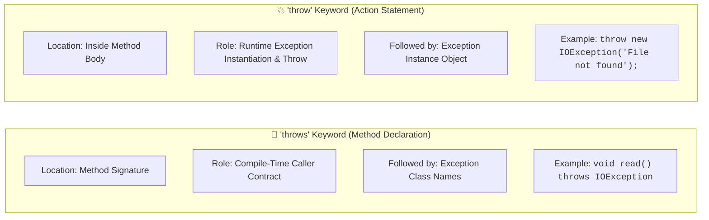
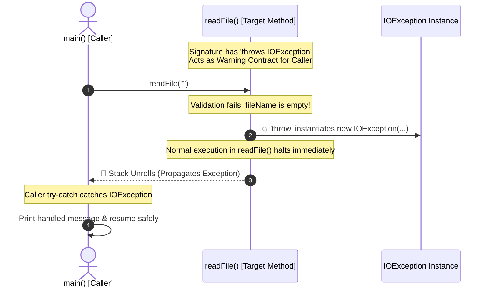

# ⚖️ "throw" vs "throws" in Java

---

## 📖 1. Introduction

Although **`throw`** and **`throws`** sound similar, they perform completely different roles in Java Exception Handling:
- **`throw`** is an **executable action statement** used to trigger an exception at runtime.
- **`throws`** is a **declarative signature keyword** used to specify potential checked exceptions to callers.



---

## 💥 2. The "throw" Keyword

- **Definition**: The `throw` keyword is used to **actually throw an exception object** from a method or block of code.
- **Single Exception Object**: It can throw **only one exception object** at a time per statement.
- **Checked & Unchecked Applicability**: Mostly used for unchecked exceptions (`IllegalArgumentException`, `NullPointerException`, etc.), but can also throw checked exceptions (which requires local handling or a `throws` declaration).
- **Syntax Example**:
  ```java
  throw new IOException("File not found");
  ```

---

## 📢 3. The "throws" Keyword

- **Definition**: The `throws` keyword is used in a **method declaration** to declare the exceptions that a method might throw during its execution.
- **Multiple Exceptions**: We can declare **one or multiple exceptions**, separated by commas.
- **Checked & Unchecked Applicability**: Mainly used for **checked exceptions** (like `IOException`, `SQLException`), but can also declare unchecked exceptions (though declaring unchecked exceptions is optional and unnecessary).
- **Syntax Example**:
  ```java
  void readFile() throws IOException, SQLException { }
  ```

---

## 📊 4. Comparison Table: "throw" vs "throws"

| Aspect | `throw` Keyword | `throws` Keyword |
| :--- | :--- | :--- |
| **Definition** | Used to **actually throw an exception object** from a method or block of code. | Used in **method declaration** to declare the exceptions that a method might throw. |
| **Usage Location** | **Inside a method** or a block of code (executable statement). | In **method or constructor declaration only** (method signature). |
| **Number of Exceptions** | Can throw **only one exception object** at a time. | Can declare **multiple exceptions separated by commas**. |
| **Checked / Unchecked** | Can throw **both checked and unchecked** exceptions. | Mainly for **checked exceptions**; can declare unchecked exceptions (not necessary). |
| **Effect on Caller** | **Immediately transfers** the exception to the caller or enclosing catch block. | **Informs the caller** that it should handle the declared exceptions. |
| **Syntax Example** | `throw new IOException("File not found");` | `void readFile() throws IOException, SQLException { }` |
| **Requirement** | Checked exceptions thrown must be handled using `try-catch` or declared with `throws`. | Caller must handle checked exceptions declared with `throws` (or declare them too). |
| **Followed By** | Followed by an **instance / object** of an exception class. | Followed by **class name(s)** of exception types. |
| **Execution Phase** | Evaluated at **Runtime**. | Enforced at **Compile-Time** by `javac`. |

---

## 💻 5. Complete Code Example: Synergistic Collaboration

Here is how `throw` and `throws` work together in a production-style Java class:

```java
import java.io.FileInputStream;
import java.io.IOException;

public class ThrowVsThrowsDemo
{
    // 'throws' declares the checked exception in the method header (Contract for caller)
    public void readFile(String fileName) throws IOException
    {
        if (fileName == null || fileName.trim().isEmpty())
        {
            // 'throw' explicitly instantiates and triggers the exception object
            throw new IOException("Invalid File Name: File path cannot be empty or null!");
        }

        System.out.println("📂 Attempting to open file: " + fileName);
        
        try (FileInputStream fis = new FileInputStream(fileName))
        {
            int firstByte = fis.read();
            System.out.println("✅ First byte read: " + firstByte);
        }
    }

    public static void main(String[] args)
    {
        ThrowVsThrowsDemo demo = new ThrowVsThrowsDemo();

        // 1. Caller handles the exception declared by 'throws'
        try
        {
            System.out.println("--- Test 1: Empty file name ---");
            demo.readFile("");
        }
        catch (IOException e)
        {
            System.out.println("🦺 Caught in main caller: " + e.getMessage());
        }

        // 2. Caller runs valid invocation
        try
        {
            System.out.println("\n--- Test 2: Valid file name ---");
            demo.readFile("config.txt");
        }
        catch (IOException e)
        {
            System.out.println("🦺 Caught in main caller: " + e.getMessage());
        }
    }
}
```

### 🖥️ Console Output:
```text
--- Test 1: Empty file name ---
🦺 Caught in main caller: Invalid File Name: File path cannot be empty or null!

--- Test 2: Valid file name ---
📂 Attempting to open file: config.txt
🦺 Caught in main caller: config.txt (The system cannot find the file specified)
```

---

## 🎬 6. Interactive Animation & Visualizer Breakdown

The accompanying **Interactive "throw" vs "throws" Visualizer & Comparison Theater** brings these concepts to life through real-time simulation:



### 🕹️ What the Animation Demonstrates:
1. **The Firing Action of `throw`**: Watch how `throw` creates a concrete exception instance in heap memory and instantly halts the normal execution sequence.
2. **The Contract of `throws`**: See how `throws` acts like a warning badge in the method header that requires callers to wrap calls in `try-catch`.
3. **Single vs Multiple Multiplicity**: Experience how a method signature can declare multiple exceptions (`throws IOException, SQLException`), while a `throw` statement can only dispatch one concrete instance at a time.
4. **Compiler Rule Sandbox**: Toggle between Checked vs Unchecked exceptions, add/remove `throws`, and add/remove caller `try-catch` to inspect compiler diagnostics in real time.
5. **Interactive Interview Traps & Quiz**: Test your mastery with instant validation and detailed explanations.

---

## 🏛️ 7. The Architectural Synergy Between "throw" and "throws"

In enterprise software (such as Spring Boot REST microservices):
- **Low-Level Code (DAO / Sockets)** uses **`throw`** when a specific condition fails (e.g. `throw new SQLException("Connection Timeout")`).
- The same low-level method uses **`throws`** in its header (`void query() throws SQLException`) to propagate the failure up to the service layer.
- The **Top-Level Controller** wraps the call in `try-catch` to return an HTTP JSON response (`HTTP 503 Service Unavailable`), preventing any service downtime.

---

## 🚫 8. Common Traps, Compiler Errors & Anti-Patterns

### 🪤 Trap 1: Unreachable Code Error After `throw`
Because `throw` transfers execution immediately, any statement placed directly after an unconditional `throw` is **unreachable** and causes a compilation error:

```java
void check() {
    throw new RuntimeException("Error");
    System.out.println("Hello"); // ❌ COMPILE ERROR: unreachable statement
}
```

### 🪤 Trap 2: Throwing `null`
```java
RuntimeException ex = null;
throw ex; // 💥 At runtime, throws NullPointerException, NOT RuntimeException!
```

### 🪤 Trap 3: Throwing a Checked Exception Without Declaring/Catching
```java
void load() {
    // ❌ COMPILE ERROR: unreported exception IOException; must be caught or declared to be thrown
    throw new IOException("Failed");
}
```

---

## ❓ 9. Frequently Asked FAANG Interview Questions

<details>
<summary><b>Q1: Can we use 'throw' without 'throws'?</b></summary>
<b>Yes.</b> When throwing an <b>unchecked exception</b> (subclass of <code>RuntimeException</code>), no <code>throws</code> clause is required. Also, if a checked exception is thrown inside a <code>try</code> block and caught immediately by an enclosing <code>catch</code> block inside the same method, <code>throws</code> is not required.
</details>

<details>
<summary><b>Q2: Can we use 'throws' without 'throw'?</b></summary>
<b>Yes.</b> A method can declare <code>throws IOException</code> even if it does not contain a literal <code>throw</code> statement. This occurs when calling other library methods that declare checked exceptions, or to reserve future implementation options in an interface.
</details>

<details>
<summary><b>Q3: Can we throw multiple exception objects in one 'throw' statement?</b></summary>
<b>No.</b> A <code>throw</code> statement can only throw exactly one exception instance at a time (e.g. <code>throw new IOException();</code>).
</details>

<details>
<summary><b>Q4: What is the difference in operand between 'throw' and 'throws'?</b></summary>
<code>throw</code> is followed by an <b>exception instance / object</b> (<code>throw new MyException();</code>), whereas <code>throws</code> is followed by <b>class name(s)</b> (<code>throws IOException, SQLException</code>).
</details>
