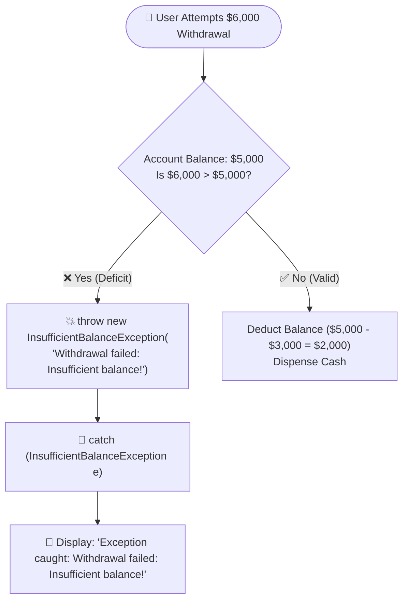
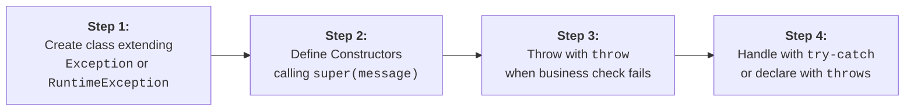
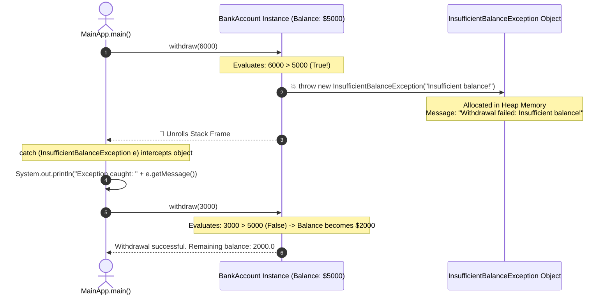

# 🛠️ User-Defined Custom Exceptions in Java

---

## 📖 1. Introduction

Till now we have seen built-in exceptions in Java like `IOException`, `NullPointerException`, `ArithmeticException`, etc., and how to handle them using `try`, `catch`, `finally`, `throw`, and `throws`.

However, in real-world applications, we frequently encounter business situations where built-in exceptions are not sufficient to describe specific error conditions.

### 🏦 The Banking Example:
Consider a banking application:
- You want to throw an exception when a customer tries to withdraw more money than their available account balance.
- Java does **not** provide a built-in `InsufficientBalanceException`.
- For such application-specific business logic, **user-defined exceptions (also called custom exceptions)** are introduced.



---

## 🎯 2. Definition & Uses

### 📌 Definition:
> A **user-defined exception** in Java is an exception class created by the programmer to represent a specific domain error scenario not covered by Java’s built-in exceptions.
> - It extends the **`Exception`** class (for **Checked Exceptions**).
> - It extends the **`RuntimeException`** class (for **Unchecked Exceptions**).
> - It can include custom error messages, constructors, and typed domain metadata.

### 💡 Core Uses:
1. **Represent Domain-Specific Errors**: Clearly distinguishes business rule failures (e.g. `InsufficientBalanceException`, `InvalidCouponException`) from low-level technical bugs (`NullPointerException`).
2. **Enhance Code Readability & Maintainability**: Makes caller `catch` blocks explicit, readable, and self-documenting.
3. **Enforce Business Invariants**: Enforces core domain constraints (e.g., minimum age requirements, account overdraft limits, inventory thresholds).
4. **Simplify Debugging**: Carries structured, strongly-typed error messages and contextual fields rather than unstructured string messages.

---

## 🪜 3. Steps to Create a User-Defined Exception

Creating a user-defined custom exception follows a simple **4-step lifecycle**:



1. **Step 1**: Create a new class that extends **`Exception`** (for checked exceptions) or **`RuntimeException`** (for unchecked exceptions).
2. **Step 2**: Define constructors in your class (usually one default constructor and one constructor accepting a custom error message that calls `super(message)`).
3. **Step 3**: Use the **`throw`** keyword to instantiate and throw the custom exception object in your business method when an invalid condition occurs.
4. **Step 4**: Handle the exception in the caller method using **`try-catch`** or propagate it up the call stack using **`throws`**.

---

## 💻 4. Complete Code Example: Banking System

```java
// Step 1: Create a user-defined exception
class InsufficientBalanceException extends Exception
{
    // Constructor with custom message
    public InsufficientBalanceException(String message)
    {
        super(message); // Passes message to java.lang.Throwable
    }
}

// Step 2: Use the custom exception in application
class BankAccount
{
    private double balance;

    public BankAccount(double balance)
    {
        this.balance = balance;
    }

    // Withdraw method which may throw the user-defined exception
    public void withdraw(double amount) throws InsufficientBalanceException
    {
        if (amount > balance)
        {
            // Step 3: Throw the custom exception
            throw new InsufficientBalanceException("Withdrawal failed: Insufficient balance!");
        }
        else
        {
            balance -= amount;
            System.out.println("Withdrawal successful. Remaining balance: " + balance);
        }
    }
}

public class MainApp
{
    public static void main(String[] args)
    {
        BankAccount account = new BankAccount(5000);

        // Test 1: Invalid withdrawal (amount > balance)
        try
        {
            account.withdraw(6000); // Trying to withdraw more than balance
        }
        catch (InsufficientBalanceException e)
        {
            // Step 4: Handle the custom exception
            System.out.println("Exception caught: " + e.getMessage());
        }

        // Test 2: Valid withdrawal (amount <= balance)
        try
        {
            account.withdraw(3000); // Valid withdrawal
        }
        catch (InsufficientBalanceException e)
        {
            System.out.println("Exception caught: " + e.getMessage());
        }
    }
}
```

### 🖥️ Output:
```text
Exception caught: Withdrawal failed: Insufficient balance!
Withdrawal successful. Remaining balance: 2000.0
```

### 🔍 Detailed Explanation:
1. **Custom Exception Class**: `InsufficientBalanceException` is our user-defined exception. It extends `Exception`, making it a **Checked Exception**.
2. **Passing the Message**: `super(message)` passes the string description to `java.lang.Throwable`, allowing `e.getMessage()` and `e.printStackTrace()` to work automatically.
3. **Triggering Condition**: In `withdraw()`, if `amount > balance` ($6,000 > $5,000), `throw new InsufficientBalanceException(...)` is executed. The account balance remains unchanged at $5,000.
4. **Caller Interception**: In `main()`, the `catch (InsufficientBalanceException e)` block catches the exception and displays the error message safely.
5. **Subsequent Invocations**: In the second call (`account.withdraw(3000)`), the condition is false, the balance decreases to $2,000.0, and the success message is printed.

---

## 🎬 5. Interactive Animation & Visualizer Breakdown

The accompanying **[JavaCustomExceptionVisualizer.jsx](file:///d:/ThreadSpeak/frontend/src/components/visualizers/JavaCustomExceptionVisualizer.jsx)** allows you to explore custom exception mechanics interactively:



### 🕹️ What the Animation Demonstrates:
1. **Live Bank Account State**: Watch the account balance persist safely when an exception occurs ($5,000) and update only upon a successful withdrawal ($2,000).
2. **Heap Memory Object Inspector**: Inspect the live custom exception object, including its inheritance chain (`Object` $\rightarrow$ `Throwable` $\rightarrow$ `Exception` $\rightarrow$ `InsufficientBalanceException`), message string, and metadata.
3. **Custom Exception Code Generator Sandbox**: Build custom exceptions with typed fields (`errorCode`, `shortfall`, `timestamp`) and export clean, production-ready Java code.
4. **Interactive Interview Mastery Quiz**: Test your mastery with immediate grading and deep conceptual explanations.

---

## 🏗️ 6. The Industry-Standard 4-Constructor Pattern

In production enterprise systems, custom exception classes should implement the standard **4 constructors** to support constructor chaining, logging, and root-cause wrapping:

```java
public class InsufficientFundsException extends RuntimeException
{
    private static final long serialVersionUID = 1L;

    // 1. Default No-Arg Constructor
    public InsufficientFundsException()
    {
        super("Insufficient funds available for transaction.");
    }

    // 2. Custom Message Constructor
    public InsufficientFundsException(String message)
    {
        super(message);
    }

    // 3. Root-Cause Chaining Constructor (Wraps underlying exception)
    public InsufficientFundsException(Throwable cause)
    {
        super(cause);
    }

    // 4. Message + Root-Cause Constructor
    public InsufficientFundsException(String message, Throwable cause)
    {
        super(message, cause);
    }
}
```

> [!NOTE]
> **Why `serialVersionUID`?**  
> `Throwable` implements `java.io.Serializable`. If custom exception objects are transmitted across network sockets (e.g., RMI, Spring Cloud Microservices, Kafka), defining `serialVersionUID` guarantees version compatibility during deserialization.

---

## ⚖️ 7. Checked vs Unchecked Custom Exceptions

| Criteria | Checked Custom Exception (`extends Exception`) | Unchecked Custom Exception (`extends RuntimeException`) |
| :--- | :--- | :--- |
| **Compiler Check** | **Mandatory:** Compiler requires `try-catch` or `throws`. | **Optional:** Compiler does not enforce handling. |
| **Architectural Use** | When the caller application can **realistically recover** (e.g. prompt user to retry credentials). | **Recommended for 90%+ of modern business rules** (invalid states, overdrafts, authentication errors). |
| **Code Cleanliness** | May cause method signature clutter (`throws ...`). | Keeps clean interfaces and eliminates signature pollution. |
| **Spring Boot Fit** | Requires manual boilerplate mapping in controllers. | Handled cleanly by global `@RestControllerAdvice` exception handlers. |

---

## 📦 8. Attaching Rich Domain Metadata Payloads

Instead of formatting complex string messages, professional custom exceptions store **strongly-typed fields**:

```java
public class InsufficientBalanceException extends RuntimeException
{
    private final String accountId;
    private final double currentBalance;
    private final double attemptedAmount;

    public InsufficientBalanceException(String accountId, double currentBalance, double attemptedAmount)
    {
        super(String.format("Account %s has balance $%.2f, cannot withdraw $%.2f", accountId, currentBalance, attemptedAmount));
        this.accountId = accountId;
        this.currentBalance = currentBalance;
        this.attemptedAmount = attemptedAmount;
    }

    public double getShortfall() { return attemptedAmount - currentBalance; }
    public String getAccountId() { return accountId; }
    public double getCurrentBalance() { return currentBalance; }
}
```

### 💡 Benefit in Catch Blocks:
```java
try {
    account.withdraw(800);
} catch (InsufficientBalanceException e) {
    // Strongly typed access without string parsing!
    System.out.printf("Alert: You are missing $%.2f to complete this transaction.\n", e.getShortfall());
}
```

---

## 🎯 9. Best Practices Checklist

1. ✅ **Suffix Class Name with `Exception`**: Always name classes `InsufficientFundsException` or `ResourceNotFoundException` (never `FundsError`).
2. ✅ **Default to `RuntimeException` for Business Logic**: Prevents checked exception pollution across interface layers.
3. ✅ **Always Invoke `super(message)`**: Ensures `getMessage()` and stack traces display meaningful descriptions.
4. ✅ **Provide Constructor Chaining with `Throwable cause`**: Prevents losing underlying database or network stack traces when wrapping errors.
5. ✅ **Add `serialVersionUID`**: Ensures serialization safety across microservice boundaries.

---

## ❓ 10. Frequently Asked FAANG Interview Questions

<details>
<summary><b>Q1: Can a custom exception extend Throwable directly?</b></summary>
Technically yes in Java syntax, but it is considered a severe anti-pattern. You should always extend either <code>Exception</code> (for checked) or <code>RuntimeException</code> (for unchecked).
</details>

<details>
<summary><b>Q2: What happens if you don't call super(message) in a custom exception constructor?</b></summary>
The default constructor of <code>Exception</code> will be called, resulting in <code>e.getMessage()</code> returning <code>null</code> when the exception is caught.
</details>

<details>
<summary><b>Q3: How do modern frameworks like Spring Boot handle custom business exceptions?</b></summary>
Spring Boot uses <code>@RestControllerAdvice</code> and <code>@ExceptionHandler(InsufficientBalanceException.class)</code> to catch custom exceptions globally and convert their typed fields into standardized JSON HTTP responses (e.g. HTTP 422 Unprocessable Entity).
</details>
