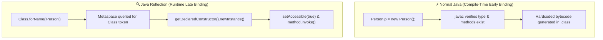

# 🔍 Reflection API in Java

## 📖 What is Reflection?
**Reflection** is a feature in Java that allows a program to **inspect and manipulate classes, methods, fields, and constructors at runtime**.
- It enables you to analyze or modify the behavior of classes dynamically, even if you **don’t know their names at compile time**.
- Reflection is part of the **`java.lang.reflect`** package in Java.
- It provides a way to interact with objects, methods, and fields dynamically, which is **not possible using normal Java code**.
- Reflection is powerful but should be used carefully due to **performance and security considerations**.

---

## 🎯 Uses of Reflection in Java
- **Inspect Class Information**: Find class name, superclass, implemented interfaces.
- **Access Fields Dynamically**: Read or modify fields at runtime, including private fields.
- **Invoke Methods Dynamically**: Call methods without knowing them at compile time.
- **Create Objects Dynamically**: Instantiate objects using constructors at runtime.
- **Framework Development**: Used in frameworks like Spring, Hibernate, JUnit for dependency injection, ORM, and testing.
- **Serialization / Logging**: Access object data for serialization or debugging without explicit getters/setters.
- **Dynamic Proxies**: Used for implementing interfaces and enhancing classes at runtime.

---

## 🧩 Reflection API & Important Classes
The **Reflection API** is a set of classes and interfaces in Java that implement reflection functionality.
- It allows programs to inspect and modify classes, fields, methods, and constructors at runtime.
- It provides flexibility and dynamic behavior to Java programs.

### 📋 Important Classes in Reflection API:
| Class / Interface | Description & Usage |
| :--- | :--- |
| **`Class`** | Represents a class or interface; used to obtain metadata. |
| **`Field`** | Represents a field of a class; used to read/write field values dynamically. |
| **`Method`** | Represents a method; used to invoke methods dynamically. |
| **`Constructor`** | Represents a constructor; used to create new objects dynamically. |
| **`Modifier`** | Provides static methods to check class or member modifiers (public, private, static, etc.). |
| **`Package`** | Represents a Java package; used to get package info. |
| **`Array`** | Provides static methods to dynamically create and access arrays. |

---

## 🌟 Advantages of Reflection
- Allows runtime inspection of classes, fields, and methods.
- Supports dynamic behavior, making frameworks and libraries more flexible.
- Enables dependency injection and dynamic proxies.
- Useful for generic frameworks, testing, and debugging.
- Helps in serialization and object mapping when class structures are unknown at compile time.

---

## ⚠️ Disadvantages / Limitations of Reflection
- **Performance Overhead**: Reflection operations are slower than normal code execution because the JVM cannot optimize them well.
- **Security Risks**: Can access private fields and methods; must be used carefully.
- **Breaks Encapsulation**: Can access private data, which may violate object-oriented principles.
- **Complexity**: Can make code harder to understand, debug, and maintain.

---

## 🎯 When to Use Reflection
- Building frameworks like Spring, Hibernate, JUnit.
- Developing tools that require runtime analysis (IDEs, debuggers, profilers).
- Working with dynamic class loading or plugin architectures.
- Handling generic serialization / deserialization tasks.

---

## 📌 Key Points to Remember
- Reflection is powerful but should be used sparingly.
- Avoid using reflection in performance-critical code.
- Reflection allows runtime flexibility, but compile-time safety is lost.
- Java SecurityManager and modern modules (JPMS) can restrict reflective access to sensitive parts of code.
- Always handle reflection exceptions like `ClassNotFoundException`, `NoSuchMethodException`, and `IllegalAccessException`.

---

## 🎬 Animation & Visualizer Explanation

The interactive animation above illustrates the entire Reflection lifecycle:
1. **Live X-Ray Inspector**: Dynamically inspects loaded classes, enumerating declared fields, method signatures, and constructors.
2. **Private Encapsulation Bypass**: Demonstrates how calling `setAccessible(true)` suppresses Java language access controls to read and modify private fields in Heap memory.
3. **Spring Boot DI Simulation**: Step-by-step 4-phase container walk-through of component scanning, reflective instantiation, and `@Autowired` field injection.
4. **Performance Arena**: Live 10,000,000 invocation benchmark demonstrating execution latency differences between Direct Calls, `MethodHandle`, and `Method.invoke()`.
