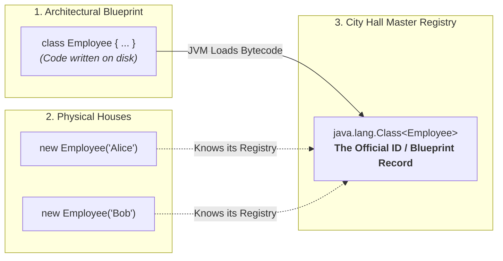

# 🏛️ Class class in Reflection API

---

## 🌟 Real-World Analogy: The "Passport & Master Blueprint"

To understand what the `Class` class is, imagine these three real-world concepts:



1. **The Blueprint (`class Employee`)**: The design written by the architect (you) in `.java` source code.
2. **The Objects (`new Employee()`)**: The actual physical houses built from that blueprint. You can build 1,000 houses from 1 blueprint.
3. **The `Class` Object (`java.lang.Class`)**: The **City Hall Master Registry Document**.
   - If someone asks: *"How many doors does this house design have?", "Does it have a secret room?", "Who is the parent model?"*, they don't inspect concrete bricks—they look up the **Master Registry Document (`Class` object)**!

---

## 📖 Introduction

- **Class class** in Java is part of the **Reflection API** and is used to represent the **runtime metadata** of a class or interface.
- It is present in the **`java.lang`** package and is denoted as **`java.lang.Class<T>`**.
- It allows you to get information about the class such as its **fields, methods, constructors, modifiers, superclass, and interfaces**.
- Objects of `Class` type are created **automatically by the JVM** in **Metaspace** when a class is loaded.

> 💡 **Core Insight (Singleton Rule):**  
> There is **only ONE singleton `Class` object** created per loaded class in the JVM. No matter how many objects you instantiate (`emp1`, `emp2`, `emp3`), they all point to the exact same `Class<Employee>` token in Metaspace!

```mermaid
flowchart LR
    subgraph Bytecode[".class Bytecode File"]
        B["Employee.class"]
    end

    subgraph JVM["JVM Metaspace Memory"]
        CL["ClassLoader"] --> CO["java.lang.Class (Singleton Metaspace Token)"]
    end

    subgraph Heap["JVM Heap Memory"]
        P1["Employee Instance 1"]
        P2["Employee Instance 2"]
    end

    B --> CL
    P1 -.->|getClass()| CO
    P2 -.->|getClass()| CO
```

---

## 🔑 Different Ways to get the Class object

There are mainly **three ways** to get the `Class` object:
1. **Using `Class.forName("fully.qualified.ClassName")`** *(Dynamic String Lookup)*
2. **Using `object.getClass()`** *(Active Runtime Object Reference)*
3. **Using `ClassName.class`** *(Direct Compile-Time Class Literal)*

### 🔍 Real-World "When to Use Which?"

| Approach | Real-World Scenario | Simple Explanation |
| :--- | :--- | :--- |
| **`Class.forName("...")`** | **Dynamic Plugin / Database Driver** | You only have a String from `application.properties` (e.g., `"com.mysql.cj.jdbc.Driver"`). You don't have the class at compile time! |
| **`obj.getClass()`** | **Polymorphic Object Inspection** | Someone hands you a mystery `Animal a` object, and you want to know its exact runtime type (is it a `Dog` or a `Cat`?). |
| **`Employee.class`** | **Direct Framework Configuration** | You already know the class name at compile time. Works directly with primitives too (`int.class`, `void.class`). |

---

### 🟢 1. Program Using `Class.forName("fully.qualified.ClassName")`

```java
public class MainApp
{
    public static void main(String[] args) throws Exception
    {
        // Getting Class object using Class.forName()
        Class<?> c = Class.forName("java.lang.String");

        System.out.println("Class Name : " + c.getName());
        System.out.println("Is Interface : " + c.isInterface());
        System.out.println("Superclass : " + c.getSuperclass());
    }
}
```

#### 🖥️ Output:
```text
Class Name : java.lang.String
Is Interface : false
Superclass : class java.lang.Object
```

---

### 🟣 & 🔵 2. & 3. Program Using `object.getClass()` and `ClassName.class`

```java
public class MainApp
{
    public static void main(String[] args)
    {
        // ------ Using getClass() ------
        String str = "Hello";
        Class<?> c1 = str.getClass();
        System.out.println("Class from getClass(): " + c1.getName());

        // ------ Using .class ------
        Class<?> c2 = String.class;
        System.out.println("Class from .class: " + c2.getName());
    }
}
```

#### 🖥️ Output:
```text
Class from getClass(): java.lang.String
Class from .class: java.lang.String
```

---

## 🛠️ Important Methods of Class class

Some important methods of `Class` class are as follows:

| S.No | Method | Use |
| :---: | :--- | :--- |
| **1** | **`getName()`** | Returns the fully qualified name of the class. |
| **2** | **`getSimpleName()`** | Returns the simple name of the class without package name. |
| **3** | **`getSuperclass()`** | Returns the superclass of the class. |
| **4** | **`getInterfaces()`** | Returns an array of interfaces implemented by the class. |
| **5** | **`getDeclaredFields()`** | Returns all fields (including private) declared in the class. |
| **6** | **`getDeclaredMethods()`** | Returns all methods (including private) declared in the class. |
| **7** | **`getDeclaredConstructors()`** | Returns all constructors (including private) declared in the class. |
| **8** | **`getModifiers()`** | Returns the modifiers (public, private, abstract, etc.) of the class as an int. |
| **9** | **`isInterface()`** | Checks if the Class object represents an interface. |
| **10** | **`isArray()`** | Checks if the Class object represents an array type. |
| **11** | **`newInstance()`** | Creates a new instance of the class (no-arg constructor only). |
| **12** | **`getPackage()`** | Returns the package of the class. |
| **13** | **`getDeclaredAnnotations()`** | Returns annotations present on the class. |

---

## 💻 Comprehensive Demonstration Program

```java
import java.lang.reflect.*;

class Employee
{
    public String name;
    private int salary;

    public Employee() {}

    public Employee(String name, int salary)
    {
        this.name = name;
        this.salary = salary;
    }

    public void work()
    {
        System.out.println(name + " is working");
    }

    private void secret()
    {
        System.out.println("Secret salary is: " + salary);
    }
}

public class MainApp3
{
    public static void main(String[] args)
    {
        Class<?> clazz = Employee.class;

        // Print basic information
        System.out.println("Class Name: " + clazz.getName());
        System.out.println("Simple Name: " + clazz.getSimpleName());
        System.out.println("Superclass: " + clazz.getSuperclass().getName());

        // Print interfaces
        System.out.println("\n[ Interfaces ]");
        for (Class<?> i : clazz.getInterfaces())
        {
            System.out.println(i.getName());
        }

        // Print fields
        System.out.println("\n[ Declared Fields ]");
        for (Field f : clazz.getDeclaredFields())
        {
            System.out.println(f.getName() + " : " + f.getType().getSimpleName());
        }

        // Print methods
        System.out.println("\n[ Declared Methods ]");
        for (Method m : clazz.getDeclaredMethods())
        {
            System.out.println(m.getName());
        }

        // Print constructors
        System.out.println("\n[ Declared Constructors ]");
        for (Constructor<?> c : clazz.getDeclaredConstructors())
        {
            System.out.println(c);
        }
    }
}
```

#### 🖥️ Output:
```text
Class Name: Employee
Simple Name: Employee
Superclass: java.lang.Object

[ Interfaces ]

[ Declared Fields ]
name : String
salary : int

[ Declared Methods ]
secret
work

[ Declared Constructors ]
public Employee()
public Employee(java.lang.String,int)
```

---

## 🎬 How the Interactive Animation Visualizer Works

Our interactive visualizer at the top of this lesson gives you a live sandbox to experiment with `java.lang.Class`:

### 🚀 Tab 1: 3 Ways to Obtain Class Token
- **Live Metaspace Resolution**: Click on `Class.forName()`, `obj.getClass()`, or `Employee.class` to trigger real-time bytecode resolution.
- **Singleton Token Proof**: Demonstrates that all 3 reference variables point to the exact same Metaspace memory token (`0x7F4A8801C200`), verifying `c1 == c2 == c3 === true`.

### 🔬 Tab 2: Employee.class Runtime Metaspace X-Ray
- **Interactive Member Audit**: Filter reflected members of `Employee.class` in real time:
  - **Declared Fields (2)**: `public String name`, `private int salary`.
  - **Declared Methods (2)**: `public void work()`, `private void secret()`.
  - **Declared Constructors (2)**: `public Employee()`, `public Employee(String, int)`.

### 📊 Tab 3: 13 Essential Methods Interactive Bench
- **Interactive Explorer**: Click through each of the 13 foundational methods (`getName()`, `getModifiers()`, `getDeclaredFields()`, etc.) to view its live return type, formal specification, and real-world usage examples.

### 🧠 Tab 4: Interactive Reflection Quiz
- **Self-Assessment**: Test your knowledge on primitive type tokens (`int.class`), visibility rules (`getFields()` vs `getDeclaredFields()`), and Metaspace memory management with instant score feedback.

---

## 🏢 How Modern Frameworks Use `Class` in Real Life

Have you ever wondered how **Spring Boot**, **Hibernate**, or **JUnit** work? They are built 100% on the `Class` class:

1. **Spring Boot `@Autowired` (Dependency Injection)**:
   - Spring takes your class (`UserService.class`), scans its declared fields via `clazz.getDeclaredFields()`, finds `@Autowired`, and injects the dependency into the private field dynamically!
2. **Hibernate / JPA (`@Entity` & `@Table`)**:
   - Hibernate reads `User.class.getDeclaredAnnotations()` to see which database table (`@Table(name="users")`) matches your class variables without you writing SQL queries by hand.
3. **JUnit Testing Framework (`@Test`)**:
   - JUnit inspects `MyTestClass.class.getDeclaredMethods()`, finds every method with `@Test`, and executes them dynamically using `method.invoke()`.

---

## 🧠 Key Rules to Remember

1. **`int.class` vs `Integer.class`**:
   - `int.class` represents the primitive type `int` (`int.class.isPrimitive() == true`).
   - `Integer.class` represents the wrapper class `java.lang.Integer`.
   - `Integer.TYPE` is an alias for `int.class`.
2. **`getFields()` vs `getDeclaredFields()`**:
   - `getFields()` returns only **public** fields (including inherited ones).
   - `getDeclaredFields()` returns **all fields** (public, private, protected) declared directly in that class, **excluding inherited fields**.
