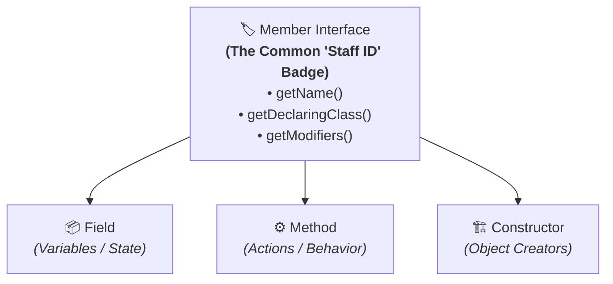
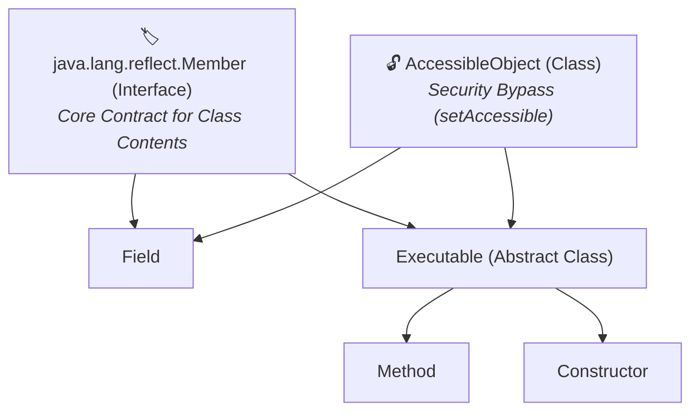

# 🧩 Member interface in Reflection API

---

## 🌟 Real-World Analogy: The "Staff ID Badge"

Imagine a company that employs **Software Engineers**, **Accountants**, and **Company Founders**:



1. **Different Jobs**:
   - A **Field** stores data (like a filing cabinet).
   - A **Method** performs actions (like an employee doing work).
   - A **Constructor** creates new objects (like the hiring department).
2. **Same Identity Card (`Member` interface)**:
   - Even though their jobs are completely different, they all wear the same **Staff ID Badge (`Member`)**!
   - Every member has:
     - A **Name** (`getName()`) -> e.g. `"name"`, `"study"`, or `"Student"`.
     - A **Company / Declaring Class** (`getDeclaringClass()`) -> e.g. `Student.class`.
     - A **Security Clearance / Access Level** (`getModifiers()`) -> e.g. `public`, `private`, `static`.

---

## 💡 What Problem Does the `Member` Interface Solve?

Without the `Member` interface, if you wanted to build a security auditor or logging tool, you would have to write 3 duplicate methods:
- `auditField(Field f)`
- `auditMethod(Method m)`
- `auditConstructor(Constructor c)`

With the **`Member` interface**, you write **just one single polymorphic method** for all three:
```java
public static void audit(Member member) {
    System.out.println("Inspecting Member: " + member.getName() + " in " + member.getDeclaringClass().getSimpleName());
}
```

---

## 📖 Introduction

- **Member interface** is part of the **Reflection API** and represents a **single member** (`Field`, `Method`, or `Constructor`) of a class.
- It is present in the **`java.lang.reflect`** package.
- It provides methods to get metadata about the member such as its **name, declaring class, and modifiers**.
- The classes that implement the `Member` interface are:
  - **`Field`** – represents class fields (variables)
  - **`Method`** – represents class methods
  - **`Constructor`** – represents class constructors

> 📌 **Important Note:**  
> The **`Class` class does NOT implement the `Member` interface** because it represents the class container itself, not an individual member declared inside it.



---

## 🛠️ Important Methods of Member Interface

Some important methods of the `Member` interface are as follows:

| S.No | Method | Use |
| :---: | :--- | :--- |
| **1** | **`getName()`** | Returns the name of the member (field/method/constructor). |
| **2** | **`getDeclaringClass()`** | Returns the `Class` object representing the class where this member is declared. |
| **3** | **`getModifiers()`** | Returns the Java language modifiers (public, private, static, etc.) as an `int`. |
| **4** | **`isSynthetic()`** | Checks if the member is a compiler-generated synthetic member. |

---

## 💻 Java Demonstration Program

```java
import java.lang.reflect.*;

class Student
{
    public String name;
    private int age;

    public Student() {}
    public void study() {}
}

public class MainApp
{
    public static void main(String[] args)
    {
        Class<?> clazz = Student.class;

        // Get declared fields and print Member details
        for (Field field : clazz.getDeclaredFields())
        {
            System.out.println("\nMember Name: " + field.getName());
            System.out.println("Declaring Class: " + field.getDeclaringClass().getSimpleName());
            System.out.println("Modifiers: " + Modifier.toString(field.getModifiers()));
            System.out.println("Is Synthetic: " + field.isSynthetic());
        }

        // Get declared methods and print Member details
        for (Method method : clazz.getDeclaredMethods())
        {
            System.out.println("\nMember Name: " + method.getName());
            System.out.println("Declaring Class: " + method.getDeclaringClass().getSimpleName());
            System.out.println("Modifiers: " + Modifier.toString(method.getModifiers()));
            System.out.println("Is Synthetic: " + method.isSynthetic());
        }

        // Get declared constructors and print Member details
        for (Constructor<?> constructor : clazz.getDeclaredConstructors())
        {
            System.out.println("\nMember Name: " + constructor.getName());
            System.out.println("Declaring Class: " + constructor.getDeclaringClass().getSimpleName());
            System.out.println("Modifiers: " + Modifier.toString(constructor.getModifiers()));
            System.out.println("Is Synthetic: " + constructor.isSynthetic());
        }
    }
}
```

#### 🖥️ Output:
```text
Member Name: name
Declaring Class: Student
Modifiers: public
Is Synthetic: false

Member Name: age
Declaring Class: Student
Modifiers: private
Is Synthetic: false

Member Name: study
Declaring Class: Student
Modifiers: public
Is Synthetic: false

Member Name: Student
Declaring Class: Student
Modifiers: public
Is Synthetic: false
```

---

## 📝 Step-by-Step Code Explanation for Beginners

1. **`clazz.getDeclaredFields()`**:
   - Queries the JVM for all fields written in `Student` (`name` and `age`).
   - Each `Field` object is an instance of `Member`, so we can call `field.getName()` and `field.getModifiers()`.
2. **`Modifier.toString(field.getModifiers())`**:
   - The JVM stores modifiers (`public`, `private`, `static`) as numbers (bitmasks).
   - `Modifier.toString()` translates `1` into `"public"` and `2` into `"private"`.
3. **`field.isSynthetic()`**:
   - Returns `false` because `name`, `age`, and `study()` were written by you in the `.java` file, not generated by the Java compiler.

---

## 🏢 3 Real-World Examples Where `Member` is Used Daily

### 1. 📦 JSON Serializers (Jackson / Gson)
When you convert an object into JSON (e.g. `{"name": "Alice", "age": 20}`), Jackson scans every `Field` (which is a `Member`) of your class. It checks:
- Is this member `public` or private?
- Is it marked `transient`?
- What is its `getName()` to use as the JSON key?

### 2. 🛡️ Code Security Scanners (SonarQube)
Security auditing tools inspect all `Member` objects of your classes. If a sensitive variable (like `apiKey` or `creditCardNumber`) has a `public` modifier instead of `private`, SonarQube flags a security vulnerability.

### 3. 💡 IDE Code Completion (IntelliJ IDEA / Eclipse / VS Code)
When you type `student.` in your editor, the IDE uses Reflection under the hood to inspect all `Member` objects of `Student.class` and displays the autocomplete popup with lock icons for private members and green dots for public members.

---

## 🎬 How the Interactive Animation Visualizer Works

Our interactive visualizer at the top of this lesson lets you explore `Member` objects dynamically:

### 👥 Tab 1: Polymorphic Member Inspector
- **Unified Member Auditing**: Filter members of `Student.class` across Fields (`name`, `age`), Methods (`study()`), and Constructors (`Student()`).
- **Live Output Stream**: Watch how calling `member.getName()`, `member.getDeclaringClass()`, and `member.getModifiers()` works polymorphically on any member.

### ⚙️ Tab 2: Modifier Bitmask Decoder
- **Bitwise Flag Explorer**: Toggle `public`, `static`, `final`, `synchronized`, and `transient` checkboxes to see the raw integer bitmask and hexadecimal representation.
- **`Modifier.toString(mask)`**: Observe how the JVM decodes integer bits (`0x0001` = public, `0x0008` = static) into human-readable Java keywords.

### 🛡️ Tab 3: Synthetic Members Lab
- **Compiler Magic Explained**: Demonstrates what `isSynthetic()` means by showing compiler-generated helper elements (such as enum `$VALUES` arrays or inner-class access bridges) that don't exist in human-written code.

### 🧠 Tab 4: Interactive Quiz
- **Mastery Check**: Test your understanding of reflection inheritance, modifier bitmasks, and synthetic members with instant scoring.

---

## 🧠 Key Rules to Remember

1. **`Field`**, **`Method`**, and **`Constructor`** are the only 3 core classes in `java.lang.reflect` that implement `Member`.
2. **`Class` does not implement `Member`** because it is the parent container, not an internal member.
3. Modifiers are stored as an **integer bitmask** for speed and minimal memory footprint in the JVM bytecode.
