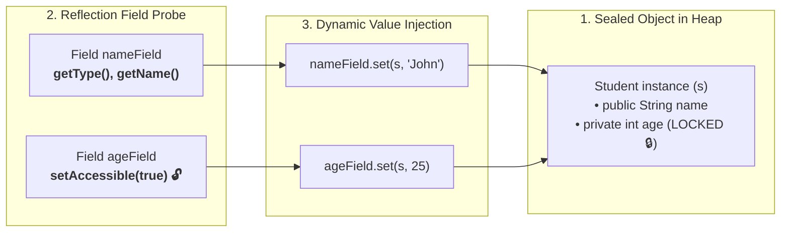
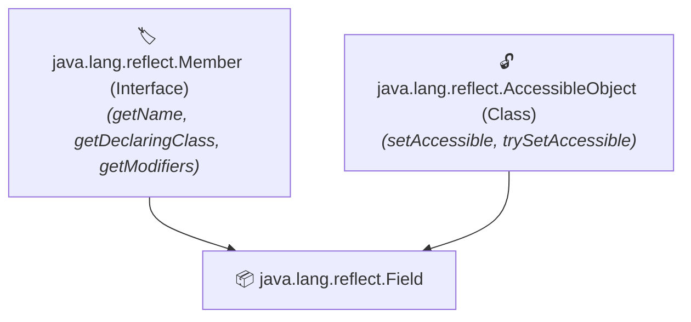
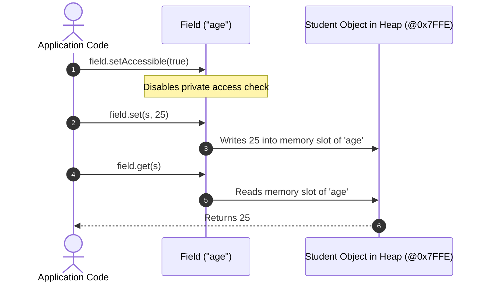

#  Field class in Reflection API

---

## 🌟 Real-World Analogy: The "X-Ray Probe & Precision Screwdriver"

Imagine you have a sealed electronic gadget (an **Object** in memory). Inside the gadget, there are batteries, memory chips, and circuits (the **Fields**):



### 1. 🔒 Normal Java Code
If a variable is marked `private`, the compiler locks the case shut. You cannot touch it directly (`s.age` produces a compile error).

### 2. 🔍 The `Field` Class (The X-Ray Probe)
- **X-Ray Discovery**: Reflection shines an X-Ray probe into the object to discover its type (`field.getType()`).
- **Access Bypass**: With **`field.setAccessible(true)`**, it unlocks the private casing.
- **Dynamic Mutation**: Uses a precision screwdriver (**`field.set(s, value)`**) to adjust the internal memory slot dynamically!

---

## 📖 Introduction

- **`Field` class** in Java is part of the **Reflection API** and represents a **single field (variable)** of a class or interface.

- It is present in the **`java.lang.reflect`** package.

- The `Field` class allows you to **get information about, and manipulate, fields of objects at runtime**.

- It provides methods to get metadata about a field, such as its **name, type, modifiers**, and also allows **getting and setting field values dynamically**.

- The `Field` class inherits the **`Member`** interface and extends **`AccessibleObject`**:



---

## 🛠️ Important Methods of Field Class

Below are some important methods of the `Field` class:

| S.No | Method | Use |
| :---: | :--- | :--- |
| **1** | **`getName()`** | Returns the name of the field as a `String`. |
| **2** | **`getType()`** | Returns the data type (`Class` object) of the field. |
| **3** | **`getModifiers()`** | Returns the Java language modifiers (public, private, static, etc.) as an `int`. |
| **4** | **`get(Object obj)`** | Returns the value of the field for the given object instance. |
| **5** | **`set(Object obj, Object value)`** | Sets the value of the field for the given object instance. |
| **6** | **`isSynthetic()`** | Checks if the field is compiler-generated (synthetic). |

---

## 💻 Java Demonstration Program

```java
import java.lang.reflect.*;

class Student
{
    public String name;
    private int age;

    public Student() {}
}

public class MainApp
{
    public static void main(String[] args) throws Exception
    {
        Student s = new Student();
        Class<?> c = Student.class;

        // Get declared fields
        for (Field field : c.getDeclaredFields())
        {
            System.out.println("\nField Name: " + field.getName());
            System.out.println("Type: " + field.getType().getSimpleName());
            System.out.println("Modifiers: " + Modifier.toString(field.getModifiers()));
            System.out.println("Is Synthetic: " + field.isSynthetic());

            // Access private fields
            field.setAccessible(true);

            // Set value dynamically
            if (field.getType() == String.class) field.set(s, "John");
            else if (field.getType() == int.class) field.set(s, 25);

            // Get value dynamically
            System.out.println("Value: " + field.get(s));
        }
    }
}
```

#### 🖥️ Output:
```text
Field Name: name
Type: String
Modifiers: public
Is Synthetic: false
Value: John

Field Name: age
Type: int
Modifiers: private
Is Synthetic: false
Value: 25
```

---

## 📝 Step-by-Step Code Explanation for Beginners



1. **`c.getDeclaredFields()`**:
   - Returns an array of all `Field` objects declared inside `Student` (`name` and `age`).
2. **`field.setAccessible(true)`**:
   - By default, attempting to modify `private int age` throws an `IllegalAccessException`.
   - Calling `setAccessible(true)` overrides Java's access-control check so your code can read and write to private fields.
3. **`field.set(s, "John")` and `field.set(s, 25)`**:
   - The first argument `s` tells Java **which object instance** in Heap memory to update.
   - The second argument is the new value to store.
4. **`field.get(s)`**:
   - Reads the current value stored in object `s` for that field.

---

## 🔍 `getField()` vs `getDeclaredField()`

| Method | Visibility Scope | Inherited Fields Included? | Throws Exception if Private? |
| :--- | :--- | :---: | :---: |
| **`c.getField("fieldName")`** | **Public only** | ✅ **Yes** (Superclasses included) | ❌ Yes (`NoSuchFieldException`) |
| **`c.getDeclaredField("fieldName")`** | **All (public, private, protected, default)** | ❌ **No** (Only current class) | ✅ No (Can access via `setAccessible`) |

---

## 🏢 Real-World Framework Applications

1. **🌱 Spring Boot (`@Autowired` & `@Value`)**:
   - When Spring injects a `@Service` or `@Value("${server.port}")` into a `private` field, it uses `field.setAccessible(true)` and `field.set(bean, dependency)` under the hood without needing getters/setters!
2. **🗄️ Hibernate / JPA Entity Hydration**:
   - When loading a row from SQL into a `User` entity, Hibernate uses `field.set()` to populate private table fields directly from result sets.
3. **📦 Jackson JSON Object Mapper**:
   - Reads private fields using `field.get(obj)` to serialize Java objects into JSON strings.

---

## 🎬 How the Interactive Animation Theater Works

Our interactive architecture theater at the top of this lesson lets you experiment dynamically:

### 📦 Tab 1: 4 Pillars of Field Class
- **Pillar 1 (Metadata Inspection)**: Inspect `name`, `type`, and `modifiers`.
- **Pillar 2 (Private Field Bypass)**: Watch how `setAccessible(true)` unlocks private variables.
- **Pillar 3 (Dynamic Getter)**: Observe `field.get(instance)` reading heap slots.
- **Pillar 4 (Static Field Resolution)**: Understand why static fields use `field.get(null)`.

### ⚡ Tab 2: Live Field Mutator Sandbox
- **Interactive Heap Mutator**: Type any name and age, click **"Execute field.set(s, value)"**, and watch the live Heap Memory slot update with real-time logging!
- **`setAccessible` Lock Toggle**: Toggle the lock off to see what happens when access checks block private field mutation (`IllegalAccessException`).

### 🔍 Tab 3: getField vs getDeclaredField
- Visual comparison matrix explaining when to use each method.

### 🧠 Tab 4: Interactive Quiz
- Multi-question test on Field class contracts and access modifiers with instant scoring.

---

## 🧠 Key Rules to Remember

1. Use **`getDeclaredFields()`** to discover all private and public fields of a class.
2. Always call **`field.setAccessible(true)`** before reading or modifying private fields.
3. For **static fields**, pass **`null`** to `field.get(null)` and `field.set(null, value)` because static fields belong to the Class, not an instance.
4. To avoid autoboxing overhead for numbers, use specialized primitive accessors: `field.getInt(obj)`, `field.getDouble(obj)`, and `field.setBoolean(obj, true)`.
