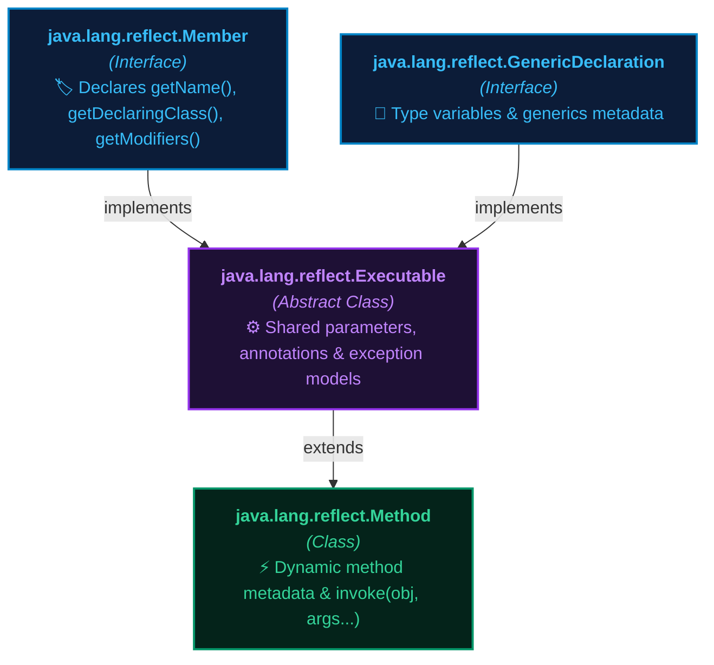
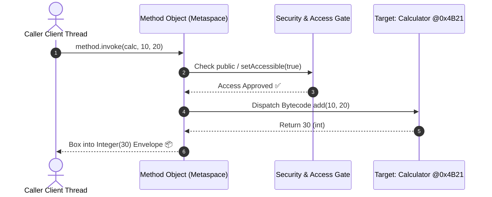

# 🚀 Method class in Reflection API

---

## 📖 1. Introduction & Overview

The **`Method` class** in Java is part of the **Reflection API** and represents a single method of a class (either declared directly or inherited from parent classes/interfaces).

It is present in the **`java.lang.reflect`** package.

The `Method` class allows you to get complete metadata about, and dynamically invoke, methods of any class at runtime without knowing the class structure during compile time.

It provides methods to get metadata such as its **name**, **return type**, **parameter types**, **modifiers**, and also allows calling the method dynamically using **`invoke(Object obj, Object... args)`**.

---

## 🏛️ 2. Method Class Architecture & Hierarchy

In Java's reflection architecture:
- **`Method`** inherits from the abstract class **`Executable`** (which also serves as the parent of `Constructor`).
- It implements the **`GenericDeclaration`** and **`Member`** interfaces.



> **Note**: Because `Method` implements the `Member` interface, it shares fundamental member methods like `getName()`, `getDeclaringClass()`, and `getModifiers()`.

---

## 🔑 3. Important Methods of Method Class

Below are the most crucial methods provided by the `Method` class:

| S.No | Method | Return Type | Description & Real-World Use |
| :--- | :--- | :--- | :--- |
| **1** | `getName()` | `String` | Returns the simple name of the method as a `String` (e.g., `"add"`, `"display"`). |
| **2** | `getReturnType()` | `Class<?>` | Returns a `Class` object representing the formal return type (e.g., `int.class`, `String.class`, `void.class`). |
| **3** | `getParameterTypes()` | `Class<?>[]` | Returns an array of `Class` objects representing the formal parameter types in declaration order. |
| **4** | `getModifiers()` | `int` | Returns the Java language modifiers (`public`, `private`, `static`, etc.) encoded as an integer bitmask. |
| **5** | `invoke(Object obj, Object... args)` | `Object` | Invokes the underlying method represented by this `Method` object on the specified target object with the supplied arguments. |
| **6** | `isVarArgs()` | `boolean` | Returns `true` if this method was declared to take a variable number of arguments (varargs `...`). |
| **7** | `setAccessible(boolean flag)` | `void` | Suppresses Java language access control checks, allowing dynamic invocation of `private` and `protected` methods. |
| **8** | `getExceptionTypes()` | `Class<?>[]` | Returns an array of `Class` objects representing the declared checked exception types in the `throws` clause. |

---

## 💡 4. Real-World Mental Models & Analogies

To understand why the `Method` class exists and how it operates, consider these real-world models:

### 🎙️ Analogy 1: The Smart Home Voice Assistant (Alexa / Siri)
- **Normal Java Method Call (`lamp.turnOn(75)`)**: You walk over to the physical bedside lamp and twist the physical knob to 75% brightness. Both you and the lamp must be directly wired together at compile time.
- **Reflective Invocation (`method.invoke(lamp, 75)`)**: You say into your smart speaker: *"Alexa, call 'turnOn' on 'lamp' with brightness 75"*. The voice assistant converts your spoken text string `"turnOn"` into a registered method lookup, passes the parameter `75`, and triggers the device wirelessly at runtime!

### 🍽️ Analogy 2: The Restaurant Order Ticket
- When a customer orders a meal, the waiter doesn't drag the customer into the kitchen.
- The waiter writes an order ticket with method name (`"bakePizza"`) and parameters (`"ThinCrust", "ExtraCheese"`). The chef executes it and delivers the meal in an **`Object` Return Envelope**.



---

## 💻 5. Complete Java Code Demonstration

Here is a complete, runnable program demonstrating method metadata extraction, parameter scanning, access bypass, and dynamic execution:

```java
import java.lang.reflect.*;

class Calculator
{
    public int add(int a, int b)
    {
        return a + b;
    }
    private void display(String msg)
    {
        System.out.println("Message: " + msg);
    }
}

public class MainApp
{
    public static void main(String[] args) throws Exception
    {
        Calculator calc = new Calculator();
        Class<?> c = Calculator.class;

        // Get declared methods
        for (Method method : c.getDeclaredMethods())
        {
            System.out.println("\nMethod Name: " + method.getName());
            System.out.println("Return Type: " + method.getReturnType().getSimpleName());
            System.out.println("Modifiers: " + Modifier.toString(method.getModifiers()));

            // Print parameter types
            Class<?>[] params = method.getParameterTypes();
            System.out.print("Parameter Types: ");
            for (Class<?> p : params)
            System.out.print(p.getSimpleName() + " ");
            System.out.println();

            // Access private methods
            method.setAccessible(true);

            // Dynamically invoke methods
            if (method.getName().equals("add"))
            {
                Object result = method.invoke(calc, 10, 20);
                System.out.println("Invoked Result: " + result);
            }
            else if (method.getName().equals("display"))
            {
                method.invoke(calc, "Hello Reflection!");
            }
        }
    }
}
```

### 🖥️ Exact Program Output:
```text
Method Name: add
Return Type: int
Modifiers: public
Parameter Types: int int 
Invoked Result: 30

Method Name: display
Return Type: void
Modifiers: private
Parameter Types: String 
Message: Hello Reflection!
```

---

## 🔍 6. Step-by-Step Breakdown of the Code

Let's dissect each critical phase of the program:

1. **Obtaining the Class Reference**:
   ```java
   Class<?> c = Calculator.class;
   ```
   Retrieves the reflection metadata handle for `Calculator` from the JVM Metaspace.

2. **Fetching All Declared Methods**:
   ```java
   Method[] methods = c.getDeclaredMethods();
   ```
   Returns both `public` (`add`) and `private` (`display`) methods declared directly inside `Calculator`.

3. **Inspecting Method Signature Details**:
   - `method.getName()` retrieves `"add"` or `"display"`.
   - `method.getReturnType().getSimpleName()` retrieves `"int"` or `"void"`.
   - `Modifier.toString(method.getModifiers())` decodes the integer bitmask into `"public"` or `"private"`.
   - `method.getParameterTypes()` returns an array of types (`int.class`, `String.class`).

4. **Bypassing Private Encapsulation**:
   ```java
   method.setAccessible(true);
   ```
   Instructs the JVM security checks to allow invocation even for private methods like `display(String)`.

5. **Dynamic Invocation via `invoke()`**:
   ```java
   Object result = method.invoke(calc, 10, 20);
   ```
   The JVM passes `10` and `20` to `calc.add(10, 20)`, executes the bytecode, auto-boxes the primitive `int 30` into a `java.lang.Integer`, and stores it in `result`.

---

## 🎯 7. Essential Concepts & Practical Scenarios

### Concept A: Overloaded Methods — Why Parameter Types are Mandatory
In Java, a class can have multiple methods with the exact same name (Method Overloading).
To fetch the exact method you want, you **must pass the parameter types** alongside the name:
```java
class Printer {
    public void print(String text) { ... }
    public void print(int number) { ... }
}

// Target print(String):
Method m1 = Printer.class.getMethod("print", String.class);

// Target print(int):
Method m2 = Printer.class.getMethod("print", int.class);
```

---

### Concept B: Invoking `static` Methods vs Instance Methods
- **Instance Methods**: Require a valid heap object instance passed as the first argument:
  ```java
  method.invoke(myObjectInstance, arg1, arg2);
  ```
- **Static Methods**: Belong to the class itself, not any specific object. Pass **`null`** as the first argument:
  ```java
  Method sqrtMethod = Math.class.getMethod("sqrt", double.class);
  Object result = sqrtMethod.invoke(null, 49.0); // Output: 7.0
  ```

---

### Concept C: Return Value Auto-Boxing & `void` Methods
When `method.invoke()` returns:
1. **Primitive types** (`int`, `boolean`, `double`) are automatically boxed into their wrapper classes (`Integer`, `Boolean`, `Double`).
2. **`void` methods** execute their body and return **`null`**.
3. **Reference types** return the exact object instance.

---

### Concept D: Handling Exceptions with `InvocationTargetException`
If the method being executed throws an exception (e.g., dividing by zero or `NullPointerException`), the Reflection API wraps it inside **`InvocationTargetException`**.
To get the actual root cause exception:
```java
try {
    Method divideMethod = Calculator.class.getMethod("divide", int.class, int.class);
    divideMethod.invoke(calc, 10, 0); // Throws ArithmeticException: / by zero
} catch (InvocationTargetException e) {
    Throwable rootError = e.getCause(); // Extracts ArithmeticException
    System.out.println("Underlying Error: " + rootError.getMessage());
}
```

---

## 🏢 8. How Major Industry Frameworks Use the `Method` Class

| Framework | How it Uses `Method.invoke()` Under the Hood |
| :--- | :--- |
| **Spring Boot / Spring MVC** | When an HTTP request `GET /products/101` arrives, Spring's `DispatcherServlet` matches the URL against controller methods annotated with `@GetMapping` and dynamically invokes `method.invoke(controllerBean, 101)`. |
| **JUnit 5 Testing Framework** | JUnit scans your test class, finds all methods annotated with `@Test`, and executes them sequentially using `testMethod.invoke(testInstance)`. |
| **Jackson / Gson JSON Parsers** | While converting JSON to Java objects, Jackson inspects setter methods (e.g., `setName(String)`) and calls `setter.invoke(targetObject, jsonValue)`. |
| **Discord / Telegram Bot SDKs** | When a user types `/ban @user 7d`, the bot engine finds the mapped command method and invokes it dynamically with parsed command parameters. |

---

## 📊 9. `getMethod()` vs `getDeclaredMethod()` Comparison

| Feature | `Class.getMethod(name, params...)` | `Class.getDeclaredMethod(name, params...)` |
| :--- | :--- | :--- |
| **Access Scope** | Returns **ONLY `public`** methods. | Returns **ALL** methods (`public`, `private`, `protected`, default). |
| **Inherited Methods** | **Includes** public methods inherited from parent classes and interfaces. | **Excludes** inherited methods (only methods declared directly in this class). |
| **Private Method Invocation** | Cannot access private methods (throws `NoSuchMethodException`). | Can access private methods when paired with `setAccessible(true)`. |
| **Plural Form** | `c.getMethods()` (returns array of all public methods). | `c.getDeclaredMethods()` (returns array of all declared methods). |

---

## 🎬 10. Interactive Architecture Simulation Theater

Head over to the **Architecture Tab** to experience the **Live 5-Stage Method Dispatch Simulation**:
1. **Stage 1 (Metaspace Lookup)**: Resolves the `Method` reference in Metaspace.
2. **Stage 2 (Security Gate)**: Displays dynamic unlocking of private encapsulation padlocks.
3. **Stage 3 (Argument Marshaling)**: Pushes arguments onto the invocation stack frame with auto-boxing.
4. **Stage 4 (Heap Dispatch)**: Executes bytecode dynamically on the target heap memory instance `@0x4B21`.
5. **Stage 5 (Result Unboxing)**: Captures the return value inside the `Object` envelope!
