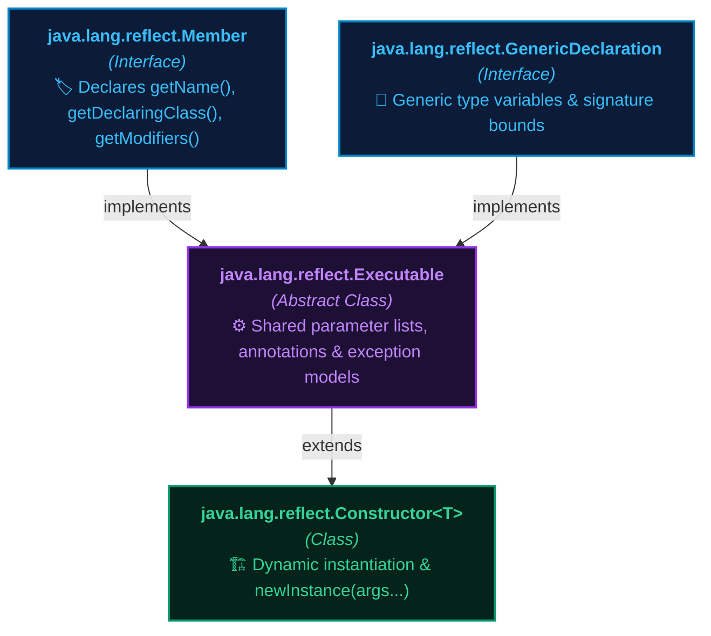
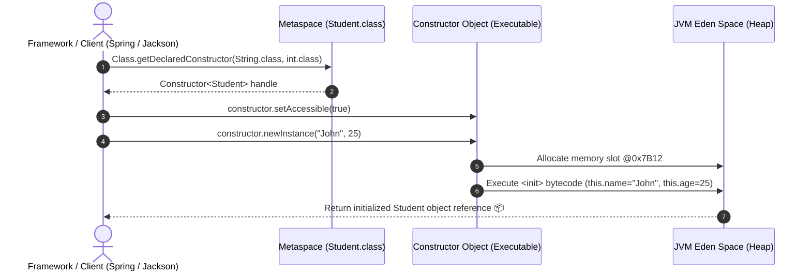

# 🏗️ Constructor class in Reflection API

---

## 📖 1. Introduction & Overview

The **`Constructor` class** in Java is part of the **Reflection API** and represents a single constructor of a class (either `public`, `private`, `protected`, or default package-private).

It is present in the **`java.lang.reflect`** package.

The `Constructor` class allows you to get information about, and instantiate objects using, constructors dynamically at runtime without invoking the standard `new` keyword at compile time.

It provides methods to get metadata about a constructor, such as its **name**, **parameter types**, **modifiers**, and also allows creating a new object dynamically using **`newInstance(Object... initargs)`**.

---

## 🏛️ 2. Constructor Class Hierarchy

In Java's reflection architecture:
- **`Constructor<T>`** inherits from the abstract class **`Executable`** (which also serves as the parent of `Method`).
- It implements the **`GenericDeclaration`** and **`Member`** interfaces.



---

## 🔑 3. Important Methods of Constructor Class

Below are the most crucial methods provided by the `Constructor` class:

| S.No | Method | Return Type | Description & Real-World Use |
| :--- | :--- | :--- | :--- |
| **1** | `getName()` | `String` | Returns the name of the constructor (always identical to the fully qualified class name). |
| **2** | `getParameterTypes()` | `Class<?>[]` | Returns an array of `Class` objects representing the formal parameter types in declaration order. |
| **3** | `getModifiers()` | `int` | Returns the Java language modifiers (`public`, `private`, etc.) as an integer bitmask. |
| **4** | `newInstance(Object... initargs)` | `T` | Creates a new instance of the class represented by this constructor using the specified initialization arguments. |
| **5** | `isVarArgs()` | `boolean` | Checks if the constructor was declared to accept a variable number of arguments (`...`). |
| **6** | `setAccessible(boolean flag)` | `void` | Suppresses Java language access checks, enabling instantiation via `private` constructors. |
| **7** | `getExceptionTypes()` | `Class<?>[]` | Returns an array of declared exception types in the constructor's `throws` clause. |

---

## 💡 4. Real-World Mental Models & Analogies

To clearly understand why the `Constructor` class is essential:

### 🏭 Analogy 1: The Automated 3D Factory Assembly Arm
- **Normal Java Instantiation (`Student s = new Student("John", 25)`)**: You manually take the raw materials, assemble the student figure with fixed parameters, and place it on your desk at compile time.
- **Reflective Instantiation (`constructor.newInstance("John", 25)`)**: You feed an architectural CAD blueprint (`Class<?>`) into an automated robotic factory. The factory arm inspects the available assembly molds (`Constructor<?>`), selects the matching parameter mold `(String, int)`, injects the initialization values, and rolls a brand new live object off the conveyor belt!

### 🔑 Analogy 2: The Master Key & Private Doors (Singleton Pattern)
- A class with a `private` constructor is like a bank vault with no public front door.
- Calling `constructor.setAccessible(true)` is like the master key that opens the vault, allowing frameworks (like Spring or Jackson) to instantiate instances even when traditional Java access rules forbid it.



---

## 💻 5. Complete Java Code Demonstration

```java
import java.lang.reflect.*;

class Student
{
    public String name;
    private int age;

    // Parameterized constructor
    public Student(String name, int age)
    {
        this.name = name;
        this.age = age;
    }

    // Default constructor
    private Student()
    {
        this.name = "Default";
        this.age = 0;
    }

    public void display()
    {
        System.out.println("Name: " + name + ", Age: " + age);
    }
}

public class MainApp
{
    public static void main(String[] args) throws Exception
    {
        Class<?> c = Student.class;

        // Get declared constructors
        for (Constructor<?> constructor : c.getDeclaredConstructors())
        {
            System.out.println("\nConstructor Name: " + constructor.getName());
            System.out.println("Modifiers: " + Modifier.toString(constructor.getModifiers()));

            // Print parameter types
            Class<?>[] params = constructor.getParameterTypes();
            System.out.print("Parameter Types: ");
            for (Class<?> p : params)
                System.out.print(p.getSimpleName() + " ");
            System.out.println();

            // Access private constructors
            constructor.setAccessible(true);

            // Dynamically create object
            Object obj;
            if (params.length == 0)
                obj = constructor.newInstance();
            else
                obj = constructor.newInstance("John", 25);

            // Invoke display() method
            Method displayMethod = c.getMethod("display");
            displayMethod.invoke(obj);
        }
    }
}
```

### 🖥️ Exact Program Output:
```text
Constructor Name: Student
Modifiers: private
Parameter Types: 
Name: Default, Age: 0

Constructor Name: Student
Modifiers: public
Parameter Types: String int 
Name: John, Age: 25
```

---

## 🔍 6. Step-by-Step Code Breakdown

1. **Querying All Constructors**:
   ```java
   Constructor<?>[] constructors = c.getDeclaredConstructors();
   ```
   Retrieves both the `private` default constructor `Student()` and the `public` parameterized constructor `Student(String, int)`.

2. **Inspecting Constructor Signatures**:
   - `constructor.getName()` returns `"Student"`.
   - `Modifier.toString(constructor.getModifiers())` identifies if it is `public` or `private`.
   - `constructor.getParameterTypes()` returns the array of required argument types (`[String.class, int.class]` or empty `[]`).

3. **Suppressing Private Access**:
   ```java
   constructor.setAccessible(true);
   ```
   Allows the reflective code to instantiate objects using the `private Student()` constructor without throwing `IllegalAccessException`.

4. **Dynamic Object Creation**:
   ```java
   Object obj = constructor.newInstance("John", 25);
   ```
   Allocates a new memory block on the JVM Heap, initializes instance variables `name="John"` and `age=25`, and returns the live object reference.

---

## 🎯 7. Essential Concepts & Practical Scenarios

### Concept A: `Constructor.newInstance()` vs Deprecated `Class.newInstance()`
Prior to Java 9, developers often called `clazz.newInstance()`. However, it was **deprecated in Java 9** because:
1. `Class.newInstance()` only works for **zero-argument (no-arg)** constructors.
2. It bypasses compile-time exception checking and propagates checked exceptions without declaring them.
3. `Constructor.newInstance(args...)` is the **official modern standard** because it works for any constructor (parameterized or no-arg) and wraps checked exceptions into `InvocationTargetException`.

```java
// ❌ DEPRECATED (Java 9+):
Student s1 = Student.class.newInstance(); 

// ✅ RECOMMENDED & MODERN:
Constructor<Student> ctor = Student.class.getDeclaredConstructor(String.class, int.class);
Student s2 = ctor.newInstance("John", 25);
```

---

### Concept B: Breaking & Defending the Singleton Pattern
Reflection can bypass `private` constructors and create multiple instances of a Singleton class!

#### The Reflection Singleton Attack:
```java
class EagerSingleton {
    private static final EagerSingleton INSTANCE = new EagerSingleton();
    private EagerSingleton() {} // Private Constructor
    public static EagerSingleton getInstance() { return INSTANCE; }
}

// Breaking Singleton via Reflection:
Constructor<EagerSingleton> ctor = EagerSingleton.class.getDeclaredConstructor();
ctor.setAccessible(true);
EagerSingleton instance2 = ctor.newInstance(); // ⚠️ Second instance created!
```

#### How to Defend Against Reflection Attacks:
1. **Throw an Exception inside the private constructor** if an instance already exists:
   ```java
   private EagerSingleton() {
       if (INSTANCE != null) {
           throw new IllegalStateException("Singleton instance already exists! Reflection instantiation blocked.");
       }
   }
   ```
2. **Use an `enum` Singleton**: The JVM internally guarantees that `enum` constructors can NEVER be invoked via Reflection (throws `IllegalArgumentException: Cannot reflectively create enum objects`).

---

## 🏢 8. How Top Frameworks Use the `Constructor` Class Daily

| Framework | How it Uses `Constructor.newInstance()` Under the Hood |
| :--- | :--- |
| **Spring Framework (IoC)** | When creating Spring Beans (`@Component`, `@Service`), Spring discovers the bean constructor marked with `@Autowired`, resolves its dependencies, and creates the instance via `constructor.newInstance(deps...)`. |
| **Jackson JSON Parser** | When deserializing JSON into a Java object (`mapper.readValue(json, Student.class)`), Jackson finds the default constructor, creates a blank instance via `ctor.newInstance()`, and populates fields. |
| **Hibernate ORM / JPA** | Hibernate requires a no-arg constructor on all `@Entity` classes so it can reflectively instantiate entity proxies when fetching rows from database tables. |
| **JUnit 5 Runner** | JUnit reflectively creates a fresh instance of your test class for each `@Test` method to ensure complete test isolation. |

---

## 🎬 9. Interactive Architecture Simulation Theater

Explore the **Architecture Tab** to experience the **Live 5-Stage Constructor Instantiation Simulator**:
1. **Stage 1 (Metaspace Lookup)**: Scans parameter signatures in `Student.class`.
2. **Stage 2 (Access Gate)**: Unlocks the private constructor padlock with `setAccessible(true)`.
3. **Stage 3 (Heap Allocation)**: Allocates a fresh uninitialized memory slot `@0x7B12` in Eden Space.
4. **Stage 4 (`<init>` Execution)**: Runs constructor bytecode to assign instance fields.
5. **Stage 5 (Object Return)**: Delivers the fully initialized live object to the caller!
