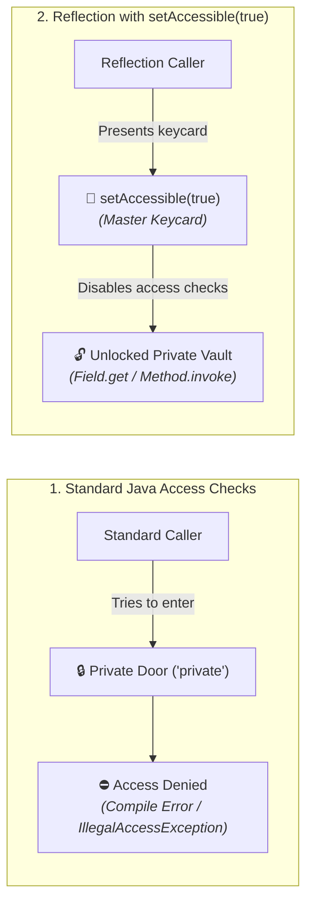
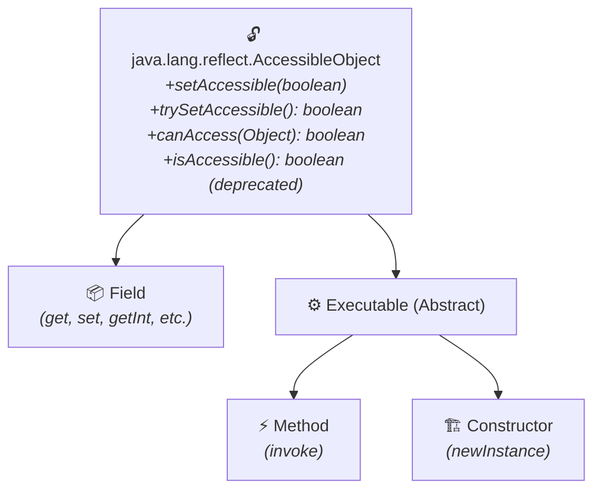
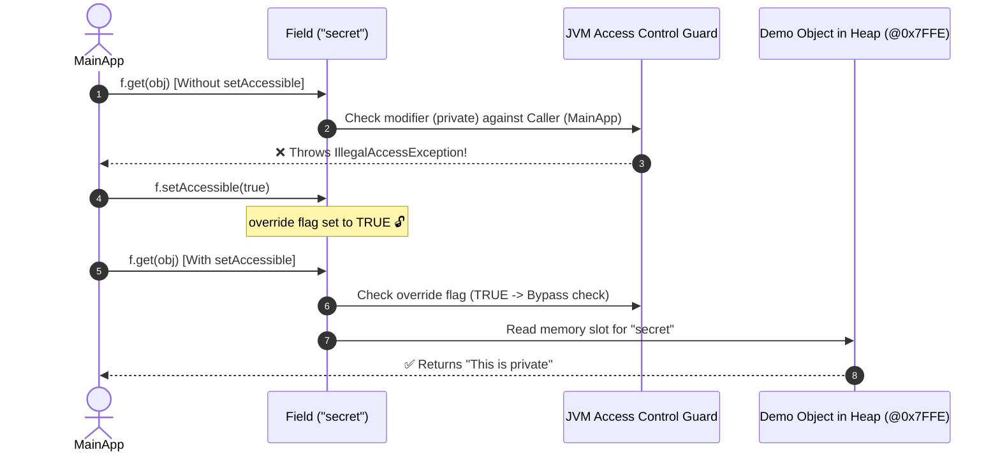
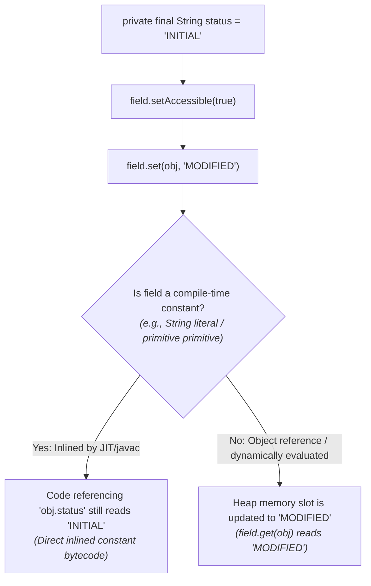
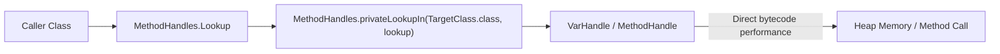
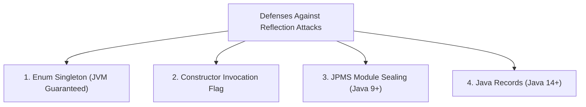
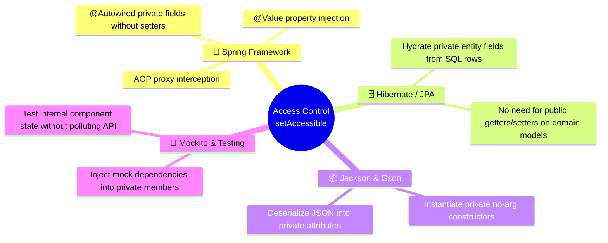
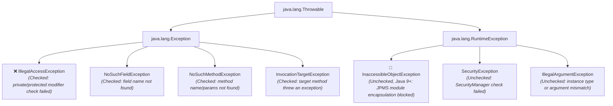

# 🛡️ Access Control in Java Reflection

---

## 🌟 Real-World Analogy: The "Master Security Keycard"

Imagine a high-security corporate facility with **locked executive offices** (representing `private` fields, methods, and constructors):



### 1. 🔒 Normal Java Code
By default, the Java compiler and JVM strictly enforce visibility modifiers (`private`, `protected`, package-private, `public`). Direct code access like `obj.secret` causes a compile-time error.

### 2. 🔍 Reflection Without Permission
If you use Reflection to inspect a private member without special permission, the JVM runtime security layer intercepts the call and immediately throws **`IllegalAccessException`**.

### 3. 🔑 Reflection with `setAccessible(true)`
Calling **`setAccessible(true)`** acts like presenting a **Master Security Keycard**. It flags the reflected member to **suppress all Java language access checks**, granting full read, write, and invocation privileges!

---

## 📖 1. Introduction & Core Fundamentals

### 🚫 By Default:
- We **cannot** access `private` fields, methods, or constructors of another class directly.
- Even if we try to access private members using Reflection without any special permission, it will throw an **`IllegalAccessException`**.

### 🔓 Bypassing Access Checks:
- But we can bypass Java's access control checks and access private members of any class.
- For this, Java Reflection provides the **`setAccessible(true)`** method which can be called on **`Field`**, **`Method`**, and **`Constructor`** objects.
- So, **Access Control in Reflection API** decides whether our code can access fields, methods, or constructors of a class, especially private ones.

---

## 🌳 2. The `AccessibleObject` Class Hierarchy & JVM Internal Mechanics

The **`java.lang.reflect.AccessibleObject`** class is the common superclass for `Field`, `Method`, and `Constructor` objects:



### ⚙️ How JVM Evaluates Access Under the Hood:
Inside the OpenJDK JVM, every `AccessibleObject` maintains an internal boolean property:
```java
// OpenJDK Internal Concept
private boolean override; // Defaults to false
```
1. When `override == false` (the default):
   - Whenever `field.get(obj)`, `field.set(obj, val)`, `method.invoke(obj, args)`, or `constructor.newInstance(args)` is called, the JVM performs a caller access check.
   - It verifies if the calling class (retrieved via internal `Reflection.getCallerClass()`) has visibility according to Java language rules (`private`, `protected`, package-private, `public`).
   - If visibility checks fail, the JVM throws **`java.lang.IllegalAccessException`**.
2. When `override == true` (set via `setAccessible(true)` or `trySetAccessible()`):
   - The JVM **skips the visibility check completely** and directly invokes the internal native `FieldAccessor` or `MethodAccessor` to read/write memory in the Heap!

---

## 💻 3. Java Demonstration Programs

### 📌 Program 1: Accessing a Private Field With and Without `setAccessible(true)`

```java
import java.lang.reflect.*;

class Demo
{
    private String secret = "This is private";

    private void showSecret()
    {
        System.out.println("Secret: " + secret);
    }
}

public class MainApp
{
    public static void main(String[] args) throws Exception
    {
        Demo obj = new Demo();
        Class<?> c = obj.getClass();

        // Try to access private field without setAccessible()
        Field f = c.getDeclaredField("secret");

        try
        {
            System.out.println(f.get(obj)); // ❌ Throws IllegalAccessException
        }
        catch (IllegalAccessException e)
        {
            System.out.println("Cannot access private field without setAccessible(true)");
        }

        // Now bypass access control
        f.setAccessible(true); // ✅ Disables access checks
        System.out.println("Private Field Value: " + f.get(obj)); // Works fine
    }
}
```

#### 🖥️ Output:
```text
Cannot access private field without setAccessible(true)
Private Field Value: This is private
```

---

### 📝 Step-by-Step Breakdown of Program 1:



1. **`c.getDeclaredField("secret")`**: Retrieves metadata for the private attribute `secret`.
2. **`f.get(obj)` (First Attempt)**: The JVM checks the access modifier of the field (`private`). Since `MainApp` is outside `Demo`, the JVM throws **`IllegalAccessException`**.
3. **`f.setAccessible(true)`**: Flips the internal `override` flag of the `Field` object to `true`.
4. **`f.get(obj)` (Second Attempt)**: The JVM bypasses access validation and reads `"This is private"` directly from heap memory.

---

### 📌 Program 2: Accessing Both a Private Field and a Private Method Using `setAccessible(true)`

```java
import java.lang.reflect.*;

class Student
{
    private String name = "Deepak";

    private void showMessage()
    {
        System.out.println("Hello from private method!");
    }
}

public class MainApp
{
    public static void main(String[] args) throws Exception
    {
        Student s = new Student();
        Class<?> c = Student.class;

        // Access private field
        Field field = c.getDeclaredField("name");
        field.setAccessible(true); // ✅ bypass access control
        System.out.println("Private Field Value: " + field.get(s));

        // Access private method
        Method method = c.getDeclaredMethod("showMessage");
        method.setAccessible(true); // ✅ allow invocation
        method.invoke(s);
    }
}
```

#### 🖥️ Output:
```text
Private Field Value: Deepak
Hello from private method!
```

---

### 📝 Step-by-Step Breakdown of Program 2:

1. **`c.getDeclaredField("name")` & `field.setAccessible(true)`**:
   - Unlocks the private field `name`. Calling `field.get(s)` retrieves the string `"Deepak"`.
2. **`c.getDeclaredMethod("showMessage")` & `method.setAccessible(true)`**:
   - Unlocks the private method `showMessage()`.
   - Calling `method.invoke(s)` executes the private method body on target instance `s`, printing `"Hello from private method!"`.

---

### 📌 Program 3: Accessing a Private Constructor (Singleton Pattern Bypass)

Reflection can also bypass private constructors to create new instances of classes designed to restrict instantiation:

```java
import java.lang.reflect.*;

class DatabaseConnection {
    private static DatabaseConnection instance;

    // Private constructor prevents direct instantiation
    private DatabaseConnection() {
        System.out.println("DatabaseConnection instance created!");
    }

    public static DatabaseConnection getInstance() {
        if (instance == null) instance = new DatabaseConnection();
        return instance;
    }
}

public class SingletonReflectionDemo {
    public static void main(String[] args) throws Exception {
        // Standard singleton access
        DatabaseConnection conn1 = DatabaseConnection.getInstance();

        // Reflection attack on private constructor
        Constructor<DatabaseConnection> ctor = DatabaseConnection.class.getDeclaredConstructor();
        ctor.setAccessible(true); // 🔓 Unlock private constructor
        DatabaseConnection conn2 = ctor.newInstance(); // Creates a second instance!

        System.out.println("conn1 hashCode: " + conn1.hashCode());
        System.out.println("conn2 hashCode: " + conn2.hashCode());
        System.out.println("Are both instances identical? " + (conn1 == conn2)); // false
    }
}
```

#### 🖥️ Output:
```text
DatabaseConnection instance created!
DatabaseConnection instance created!
conn1 hashCode: 1554874586
conn2 hashCode: 189568108
Are both instances identical? false
```

---

## 🔬 4. Deep Dive: Modifying `private final` Fields via Reflection

One of the most nuanced areas in Java Reflection is mutating `private final` fields.



### 💻 Code Example:
```java
import java.lang.reflect.*;

class Configuration {
    // Non-constant final object reference
    private final StringBuilder configName = new StringBuilder("Production");
    
    // Compile-time inlined final constant
    private final String VERSION = "1.0.0";

    public StringBuilder getConfigName() { return configName; }
    public String getVersion() { return VERSION; }
}

public class FinalFieldMutationDemo {
    public static void main(String[] args) throws Exception {
        Configuration cfg = new Configuration();

        Field nameField = Configuration.class.getDeclaredField("configName");
        nameField.setAccessible(true);
        nameField.set(cfg, new StringBuilder("Staging")); // ✅ Heap updated!
        System.out.println("Getter configName: " + cfg.getConfigName()); // Prints "Staging"

        Field versionField = Configuration.class.getDeclaredField("VERSION");
        versionField.setAccessible(true);
        versionField.set(cfg, "2.0.0"); // ⚠️ Heap updated, but javac inlines "1.0.0" in getVersion()
        System.out.println("field.get(): " + versionField.get(cfg)); // Prints "2.0.0"
        System.out.println("Getter getVersion(): " + cfg.getVersion()); // Prints "1.0.0" (Inlined constant!)
    }
}
```

> [!WARNING]
> **Java 12+ and Java 17+ Update:**
> In older Java versions (Java 8), developers modified `Field.modifiers` reflectively to strip the `Modifier.FINAL` bitmask. Starting in **Java 12+**, the JVM explicitly blocks reflective modification of the `modifiers` field by throwing `NoSuchFieldException` / `IllegalAccessException`.

---

## 🔑 5. Evolution of Access Control: `setAccessible(true)` vs `trySetAccessible()` vs `canAccess()`

With the introduction of the **Java Platform Module System (JPMS)** in Java 9, the access control API was modernized:

| Method | Added In | Return Type | Behavior on Restricted Module / Security Failure | Recommended Use Case |
| :--- | :--- | :--- | :--- | :--- |
| **`setAccessible(true)`** | Java 1.2 | `void` | Throws `InaccessibleObjectException` or `SecurityException` | Legacy code or when permissions are guaranteed |
| **`trySetAccessible()`** | **Java 9+** | `boolean` | **Returns `false` gracefully without throwing an exception** | Modern frameworks safely probing access |
| **`canAccess(Object obj)`** | **Java 9+** | `boolean` | Returns `true` if the caller can access the member without altering state | Safe pre-checks before get/set/invoke |
| **`isAccessible()`** | Java 1.2 | `boolean` | **Deprecated in Java 9** (Does not account for module barriers) | Avoid in modern Java |

### 💡 Example of Safe Access Probing with `trySetAccessible()`:
```java
Field field = MyClass.class.getDeclaredField("secretData");

// Gracefully attempts access without crashing if JPMS blocks it
if (field.trySetAccessible()) {
    System.out.println("Value: " + field.get(instance));
} else {
    System.out.println("Access denied by JPMS Module encapsulation!");
}
```

---

## 🚀 6. Modern Alternative: `MethodHandles.Lookup` & `privateLookupIn()`

In modern Java (Java 7+ and refined in Java 9+), **Method Handles** (`java.lang.invoke`) provide a faster, type-safe, and bytecode-optimized alternative to standard Reflection.



### 💻 Code Example:
```java
import java.lang.invoke.MethodHandles;
import java.lang.invoke.VarHandle;

class Account {
    private double balance = 1500.00;
}

public class VarHandleAccessDemo {
    public static void main(String[] args) throws Throwable {
        Account account = new Account();

        // 1. Obtain private lookup capability for Account class (Java 9+)
        MethodHandles.Lookup privateLookup = MethodHandles.privateLookupIn(
            Account.class, 
            MethodHandles.lookup()
        );

        // 2. Find private VarHandle for 'balance' field
        VarHandle balanceHandle = privateLookup.findVarHandle(
            Account.class, 
            "balance", 
            double.class
        );

        // 3. Read and write with near-direct bytecode speed!
        double currentBalance = (double) balanceHandle.get(account);
        System.out.println("Current Balance: " + currentBalance);

        balanceHandle.set(account, 2500.00);
        System.out.println("Updated Balance: " + (double) balanceHandle.get(account));
    }
}
```

---

## ☕ 7. Modern Java (JPMS - Java 9 to Java 21+) Strong Encapsulation

Starting in **Java 9** and fully enforced in **Java 17+ (LTS)**, the **Java Platform Module System (JPMS)** enforces **Strong Encapsulation**:

1. A module cannot access non-public members of another module via reflection **unless the target module explicitly `opens` that package**.
2. Calling `setAccessible(true)` on an unopened internal JDK package (such as `java.lang.String`) throws:
   ```text
   java.lang.reflect.InaccessibleObjectException: Unable to make field private final byte[] 
   java.lang.String.value accessible: module java.base does not "opens java.lang" to unnamed module
   ```

### 🔓 Permitting Reflection Across Modules:
- **In `module-info.java`:**
  ```java
  module com.mycompany.app {
      // Opens models package for runtime reflection specifically to Spring and Hibernate
      opens com.mycompany.app.models to spring.core, org.hibernate.orm.core;
  }
  ```
- **Via JVM CLI Argument:**
  ```bash
  java --add-opens java.base/java.lang=ALL-UNNAMED -jar myapp.jar
  ```

---

## 🛡️ 8. Defending Your Classes Against Reflection Attacks

Can a class protect itself from unwanted reflection access and singleton corruption? Yes! Here are the 4 standard defensive patterns:



### 1. 🛡️ The Enum Singleton (Best Practice - Joshua Bloch)
```java
public enum ConnectionPool {
    INSTANCE;
    public void executeQuery(String sql) { /* ... */ }
}
```
> **Why it's impenetrable:** The JVM explicitly forbids reflective instantiation of `enum` types. Calling `Constructor.newInstance()` on an enum class throws:
> `IllegalArgumentException: Cannot reflectively create enum objects`

### 2. 🛡️ Constructor Guard Flag
```java
public class SecureSingleton {
    private static SecureSingleton instance;
    private static boolean isInstantiated = false;

    private SecureSingleton() {
        if (isInstantiated) {
            throw new RuntimeException("Reflection attack blocked: Instance already created!");
        }
        isInstantiated = true;
    }

    public static synchronized SecureSingleton getInstance() {
        if (instance == null) instance = new SecureSingleton();
        return instance;
    }
}
```

### 3. 🛡️ Java Records (Java 14+ Immutability)
In Java 14+, `record` components cannot have their values mutated via reflection without throwing `IllegalAccessException`. The JVM treats record fields as strictly immutable.

---

## 🏢 9. Real-World Enterprise Framework Applications

Access control bypassing is the foundation of the modern Java enterprise ecosystem:



| Framework | Mechanism Used | Why Access Control Bypass is Crucial |
| :--- | :--- | :--- |
| **🌱 Spring Framework** | `field.setAccessible(true)` + `field.set()` | Injects `@Autowired` beans and `@Value` configuration directly into `private` fields without polluting domain classes with unnecessary setters. |
| **🗄️ Hibernate / JPA** | Direct Field Access (`Field.set`) | Hydrates database rows into private entity fields, avoiding side effects from custom setter logic. |
| **📦 Jackson / Gson** | `Constructor.setAccessible(true)` + `Field.set` | Creates instances using private default constructors and deserializes JSON properties into private variables. |
| **🧪 Mockito** | Reflection Field Injection | Injects `@Mock` and `@Spy` instances into private dependencies for clean unit testing without altering production code. |
| **⚡ Lombok** | Bytecode AST Transformation | Operates at compile-time to generate accessors, eliminating runtime reflection overhead. |

---

## ⚠️ 10. Security Risks, Performance Overhead & JIT Inlining

| Consideration | Problem / Risk | Solution / Industry Best Practice |
| :--- | :--- | :--- |
| **🛡️ Breaks Encapsulation** | Bypassing `private` allows external code to mutate internal invariants, potentially corrupting application state. | Restrict access control bypassing to infrastructure frameworks, serialization, or test suites. |
| **⚡ Performance Overhead** | Reflected access bypasses JIT compiler optimizations like method inlining and loop unrolling, running ~20x–50x slower. | Cache `Field` and `Method` references in static lookup maps, or use `MethodHandle` / `VarHandle`. |
| **🔒 JPMS Module Errors** | Running applications on Java 17+ can crash with `InaccessibleObjectException` if packages are sealed. | Use `trySetAccessible()` and configure `opens` in `module-info.java` or `--add-opens` flags. |

---

## 🚨 11. Reflection Exception Hierarchy in Access Control



---

## 🎬 12. How the Interactive Animation Theater & Simulator Works

Our interactive architecture visualizer at the top of this lesson provides a hands-on laboratory to explore Access Control dynamics:

### 📦 Tab 1: 4 Core Pillars of Access Control
- **Pillar 1 (Default Access Block)**: Inspect how Java guards private members and throws `IllegalAccessException`.
- **Pillar 2 (`setAccessible(true)` Master Key)**: Observe the universal bypass mechanism on Fields, Methods, and Constructors.
- **Pillar 3 (`trySetAccessible` & `canAccess`)**: Understand modern non-throwing Java 9+ access methods.
- **Pillar 4 (JPMS Strong Encapsulation)**: See how the Java Platform Module System enforces boundaries with `InaccessibleObjectException` and `--add-opens`.

### 🛡️ Tab 2: Interactive Security Gate & Barrier Simulator
- **Target Member Selector**: Choose between a private field (`secret`), private method (`showMessage`), or private constructor (`Singleton`).
- **`setAccessible(true)` Keycard Toggle**: Toggle the master key ON or OFF.
- **JPMS Module Mode Toggle**: Switch between an open classpath and a sealed JDK module (`java.base`).
- **Live Animation Barrier**: Click **"Execute Reflection Access"** to watch the animated JVM Security Barrier either:
  - 🛑 **Block** the call with a red `IllegalAccessException`, or
  - 🔓 **Unlock** with a glowing green key and display the real-time memory slot and console log!

### 📊 Tab 3: Hierarchy & JPMS Matrix
- Visual inheritance tree (`AccessibleObject` → `Field`, `Executable` → `Method`, `Constructor`).
- Method comparison matrix (`setAccessible` vs `trySetAccessible` vs `canAccess`).
- Framework cheat sheet explaining Spring, Hibernate, Jackson, and Mockito integrations.

### 🧠 Tab 4: Interactive Knowledge Assessment
- Comprehensive quiz testing your understanding of access control exceptions, methods, and modern module security.

---

## 🧠 13. Top High-Yield Interview Q&A on Reflection Access Control

### ❓ Q1: Does `setAccessible(true)` change the actual `private` keyword in the class bytecode?
> **Answer:** **No.** `setAccessible(true)` does **not** modify the `.class` file or change the bytecode access flags. It only sets an internal boolean `override = true` on that specific runtime `Field`, `Method`, or `Constructor` instance in memory, telling the JVM to skip access verification for operations executed through that instance.

### ❓ Q2: What is the difference between `IllegalAccessException` and `InaccessibleObjectException`?
> **Answer:**
> - **`IllegalAccessException`** is a **checked exception** thrown when reflection attempts to access a member whose Java language modifier (`private`, `protected`, package-private) prevents access, because `setAccessible(true)` was not called.
> - **`InaccessibleObjectException`** is an **unchecked runtime exception (introduced in Java 9)** thrown when calling `setAccessible(true)` on a member located in a package that is **sealed by JPMS** and not opened to the caller's module.

### ❓ Q3: Why is creating Singletons via `enum` immune to reflection attacks?
> **Answer:** In Java, the `Constructor.newInstance()` method checks if the declaring class is an `Enum`. If `(modifiers & Modifier.ENUM) != 0`, the JVM immediately throws `IllegalArgumentException("Cannot reflectively create enum objects")`. No reflection call can bypass this JVM-level constraint.

### ❓ Q4: What is the difference between `setAccessible(true)` and `trySetAccessible()`?
> **Answer:** `setAccessible(true)` throws an `InaccessibleObjectException` if access cannot be enabled due to JPMS module boundaries. In contrast, `trySetAccessible()` (introduced in Java 9) attempts to enable access and returns `false` gracefully without throwing an exception if access is denied.

---

## 📌 14. Key Rules to Remember

1. **`setAccessible(true)`** suppresses Java access checks for **`Field`**, **`Method`**, and **`Constructor`** instances.
2. Without `setAccessible(true)`, accessing a private member throws **`IllegalAccessException`**.
3. In **Java 9+**, prefer **`trySetAccessible()`** to avoid unexpected `InaccessibleObjectException` crashes when dealing with modules.
4. On **Java 17+**, accessing internal JDK modules requires explicit `--add-opens` flags or `opens` statements in `module-info.java`.
5. For performance-critical private access, consider modern **`MethodHandles.privateLookupIn()`** and **`VarHandle`**.
6. Access control overriding should be reserved for **frameworks, serialization tools, and testing**—not general application business logic.
