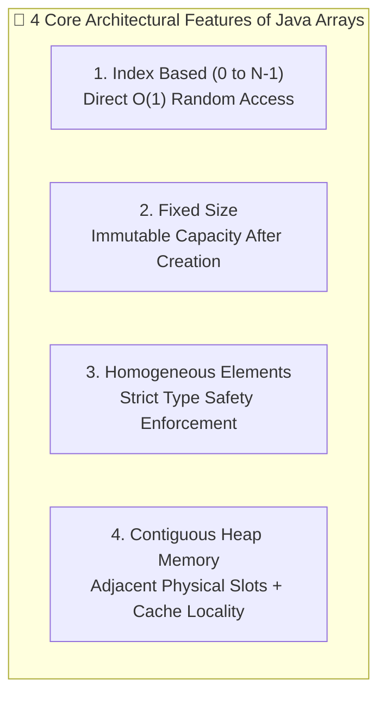
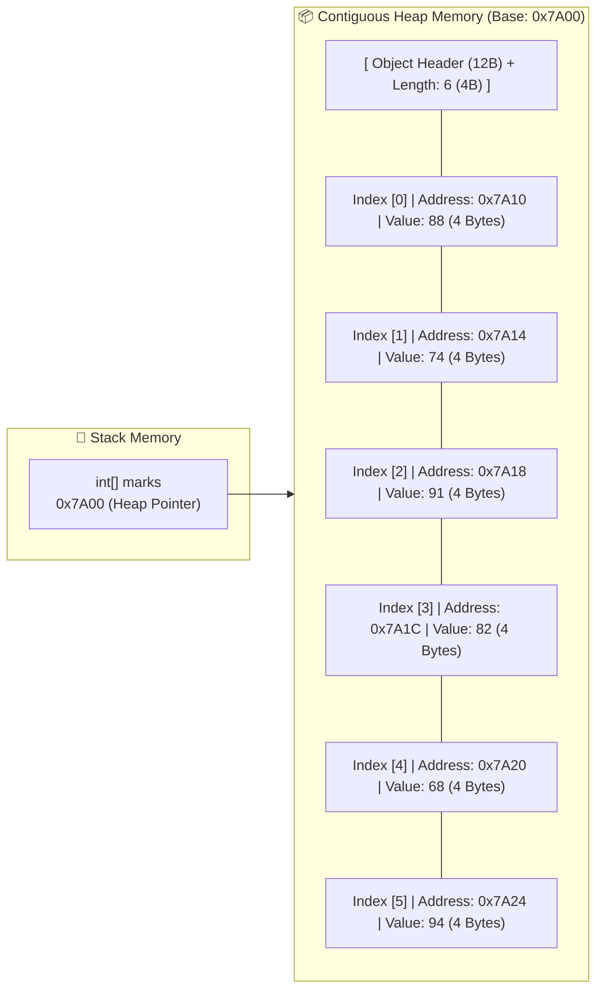
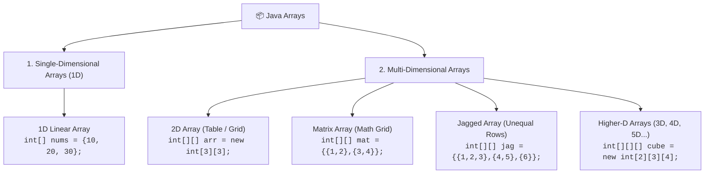
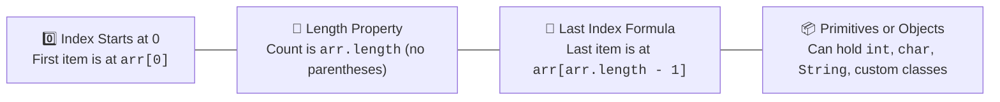

# 📦 Arrays in Java — Complete Masterclass

---

## 📖 1. Introduction to Arrays

In Java, an **array** is an **object** that stores a **fixed number of elements of the same data type** (homogeneous data). It allows us to group multiple related values together under a **single variable name** instead of declaring individual separate variables for each item.

### 📝 Basic Syntax:
```java
int[] marks = {88, 74, 91, 82, 68, 94};
```

---

## ❓ 2. Why Do We Need Arrays?

Suppose a teacher has **6 students** in a class and wants to store their exam marks:

### ❌ Approach 1: Without Arrays (Individual Variables)
```java
int marks1 = 88;
int marks2 = 74;
int marks3 = 91;
int marks4 = 82;
int marks5 = 68;
int marks6 = 94;
```
- **The Problem**: This works fine for 6 students. But imagine managing a school with **100, 1,000, or 10,000 students**!
  - Declaring 1,000 separate variable names (`marks1` to `marks1000`) is exhausting, error-prone, and unmaintainable.
  - You cannot easily iterate through separate variables using a loop.
  - Calculating the average or finding the highest mark requires writing 1,000 lines of manual code.

---

### ✅ Approach 2: With Arrays (Single Unified Variable)
```java
int[] marks = {88, 74, 91, 82, 68, 94};
```
- **The Solution**: 
  - All 6 marks (or 10,000 marks) are stored inside a **single variable** named `marks`.
  - Every student's score is accessed in $O(1)$ constant time using a numeric **index** (`marks[0]`, `marks[1]`, ...).
  - We can iterate, sort, search, calculate averages, and find highest/lowest scores with a simple 3-line loop!

```java
// Calculating average marks in 3 lines
int total = 0;
for (int mark : marks) {
    total += mark;
}
double average = (double) total / marks.length;
System.out.println("Class Average: " + average);
```

---

## 🔑 3. Key Features of Java Arrays



### 1️⃣ Index Based (0-Indexed)
Array elements are accessed using zero-based indices starting from `0` up to `length - 1`.
```java
int[] numbers = {10, 20, 30};

System.out.println(numbers[0]); // Output: 10 (First element)
System.out.println(numbers[2]); // Output: 30 (Third element)
```

---

### 2️⃣ Fixed Size (Non-Dynamic)
Once an array is created on the Heap, its size **cannot be expanded or shrunk**.
```java
int[] numbers = new int[5]; // Size is strictly 5 (indices 0 to 4)

// Attempting to assign an element past the allocated size:
numbers[5] = 10; // ❌ Runtime Error: ArrayIndexOutOfBoundsException!
```

---

### 3️⃣ Stores Same Type of Elements (Homogeneous)
An array can only store elements of its declared data type (or valid subclasses for objects).
```java
int[] numbers = {10, 20, 30}; // Only int values allowed

// numbers[0] = 5.5;    // ❌ Compile-Time Error: Type mismatch (cannot convert double to int)
// numbers[1] = "Java"; // ❌ Compile-Time Error: Type mismatch (cannot convert String to int)
```

---

### 4️⃣ Contiguous Memory Allocation
In JVM Heap memory, array slots are placed side-by-side in **continuous memory addresses**. This allows the CPU to calculate the physical memory address of any element instantly using pointer arithmetic in **$O(1)$ time**:

$$\text{Address of } A[i] = \text{Base Address} + (i \times \text{Size of Data Type})$$



---

## 🚀 4. Advantages of Arrays

| # | Advantage | Description | Code Example |
| :--- | :--- | :--- | :--- |
| **1** | **Efficient Multi-Value Storage** | Stores multiple elements of the same type under 1 variable name. | `int[] marks = {88, 74, 91, 82, 68, 94};`<br>`String[] names = {"Amit", "Bhupinder", "Deepak", "Kamal", "Rahul", "Ravi"};` |
| **2** | **High Versatility** | Can store primitives (`int`, `double`, `char`), Strings, or custom domain objects. | `char[] vowels = {'A', 'E', 'I', 'O', 'U'};`<br>`Student[] list = {new Student("Deepak"), new Student("Rahul")};` |
| **3** | **Easy Iteration via Loops** | Effortlessly iterate forwards, backwards, or with enhanced for-each loops. | `for (int i = 0; i < marks.length; i++) System.out.println(marks[i]);`<br>`for (String name : names) System.out.println(name);` |
| **4** | **Direct Random Access ($O(1)$)** | Direct instant reading and writing using element index. | `System.out.println(marks[2]); // 91`<br>`names[1] = "Harpreet"; // Updates "Bhupinder" -> "Harpreet"` |
| **5** | **Building Block for Complex Structures** | Fundamental underlying engine for `ArrayList`, `Vector`, `ArrayDeque`, `HashMap` buckets, `Stack`, and `Queue`. | `ArrayList` internally wraps an `Object[] elementData` array that grows automatically! |
| **6** | **No Object Casting Needed** | Object arrays preserve concrete type safety, allowing direct method calls. | `Person[] people = {new Person("Deepak"), new Person("Rahul")};`<br>`System.out.println(people[0].getName()); // Direct invocation!` |

---

## ⚠️ 5. Disadvantages & Limitations of Arrays

### 1️⃣ Fixed Size (Zero Dynamic Flexibility)
Once created, an array cannot grow to accommodate extra elements. If you allocate an array of size 5 and need to insert a 6th element, you must manually create a brand-new larger array and copy all old elements over.
```java
int[] numbers = new int[5];
// Cannot add 6th element directly!
```

---

### 2️⃣ Cannot Store Heterogeneous (Mixed) Types
All elements must adhere to the single declared type. You cannot store integers and strings in the same primitive array.
```java
int[] numbers = {10, 20, 30};
// numbers[3] = "Hello"; // ❌ Compile-time error
```

---

### 3️⃣ Costly Insertion and Deletion in the Middle ($O(N)$ Shifting)
Because memory must remain strictly contiguous, deleting or inserting an item in the middle requires shifting all subsequent elements to the left or right.

```java
// Example: Deleting element 20 from {10, 20, 30, 40} at index 1:
int[] numbers = {10, 20, 30, 40};

// Shift 30 and 40 to the left:
numbers[1] = numbers[2]; // numbers becomes {10, 30, 30, 40}
numbers[2] = numbers[3]; // numbers becomes {10, 30, 40, 40}
numbers[3] = 0;          // Clear last slot: {10, 30, 40, 0}
```

---

### 4️⃣ Memory Wastage (Over-Allocation)
If you allocate an array larger than required, the unused slots permanently occupy Heap memory with default values.
```java
int[] numbers = new int[10]; // 10 integer slots reserved (40 bytes)
numbers[0] = 5;
numbers[1] = 10;
// Only 2 slots are used, but remaining 8 slots remain allocated in memory!
```

---

### 5️⃣ No Built-in Instance Utility Methods
Java array objects do not have instance methods like `add()`, `remove()`, `contains()`, or `indexOf()`. Developers must either write custom algorithms or use the static helper methods in `java.util.Arrays`.

---

## 🗂️ 6. Types of Arrays in Java

Java supports two primary categories of arrays:



### 1️⃣ Single-Dimensional Arrays (1D)
Stores elements in a single sequential linear row.
```java
int[] numbers = {10, 20, 30};
```

---

### 2️⃣ Multi-Dimensional Arrays
Arrays with more than one dimension (arrays of array references).

- **2D Array**: Represents data in a 2-dimensional table of rows and columns ($M \times N$).
  ```java
  int[][] matrix = {
      {1, 2},
      {3, 4}
  };
  ```

- **Matrix Array**: A specialized rectangular 2D array specifically used for mathematical matrix operations (addition, multiplication, transpose, determinants).

- **Jagged (Ragged) Array**: A multidimensional array where each row contains a **different number of columns**, optimizing memory for non-uniform data structures (like Pascal's Triangle).
  ```java
  int[][] jagged = {
      {1, 2, 3}, // Row 0 has 3 elements
      {4, 5},    // Row 1 has 2 elements
      {6}        // Row 2 has 1 element
  };
  ```

- **Higher-Dimensional Arrays (3D, 4D, 5D...)**: Arrays of arrays of arrays, used in 3D graphic rendering, coordinate geometry, and tensor processing.
  ```java
  int[][][] space3D = new int[3][3][3]; // 3D Cube
  ```

---

## 📌 7. Essential Points to Remember



### 1. Index Starts from 0
The first element of any array in Java is always at index `0`.
```java
int[] marks = {88, 74, 91, 82, 68, 94};
System.out.println(marks[0]); // Output: 88
```

### 2. Number of Elements = `array.length`
We obtain the total capacity of an array using its public, final `length` property (**not** a method).
```java
int[] marks = {88, 74, 91, 82, 68, 94};
System.out.println(marks.length); // Output: 6
```

### 3. Last Index = `array.length - 1`
The last valid index in any array is always one less than its total size.
```java
int[] marks = {88, 74, 91, 82, 68, 94};

System.out.println("Last index position: " + (marks.length - 1)); // Output: 5
System.out.println("Last Element: " + marks[marks.length - 1]);   // Output: 94
```

### 4. Can Store Primitives or Objects
```java
char[] letters = {'A', 'B', 'C'};
String[] names = {"Deepak", "Rahul", "Kamal"};
Person[] people = {new Person("Deepak"), new Person("Rahul")};
```

---

## 🧠 8. Advanced Intelligent Insights: JVM Internal Array Anatomy

### 🔬 What Does an Array Look Like Inside JVM Heap Memory?

When you create `int[] arr = new int[4];`, HotSpot JVM allocates a single contiguous block consisting of:
1. **Mark Word (8 Bytes on 64-bit JVM)**: Stores identity hashcode, lock state, and GC age bits.
2. **Klass Word / Compressed Oops (4 or 8 Bytes)**: Points to the internal class metadata in Metaspace (`[I` for primitive int array).
3. **Array Length (4 Bytes)**: A dedicated 32-bit integer storing the fixed array length property.
4. **Contiguous Element Payload ($4 \times 4 = 16\text{ Bytes}$)**: 4 consecutive 32-bit integer slots initialized to `0`.
5. **Padding**: Rounded to the nearest multiple of 8 bytes for 64-bit memory word alignment.

### 📊 Default Zero-Values Table
When instantiated with `new Type[N]`, all elements are immediately given default zero-values:

| Data Type | Default Allocated Value |
| :--- | :--- |
| `byte`, `short`, `int`, `long` | `0` |
| `float`, `double` | `0.0` / `0.0f` |
| `boolean` | `false` |
| `char` | `'\u0000'` (Null Character) |
| Any Object Reference (`String`, `Student`, `Object`) | `null` |

---

## 🎬 9. Interactive Architecture Animation Walkthrough

To help you build a crystalline mental model of how Java arrays operate under the hood, explore the **Interactive Visualizer Animation** in the **Architecture Tab**:

1. **Memory & Contiguous Allocation Simulator**:
   - Inspect the **Stack Pointer (`0x7FFE`)** connecting directly to the **Heap Memory Object**.
   - Modify values live and watch the physical memory address (`Base + index * 4`) compute automatically.
2. **Variable Explosion vs Array Comparison**:
   - Visually compare 6 scattered loose variables vs 1 organized contiguous array container.
3. **Trap Demonstration**:
   - Trigger an **`ArrayIndexOutOfBoundsException`** live to see how JVM boundary enforcement works.
4. **Insertion / Deletion Shifting Animation**:
   - Watch step-by-step element shifting animations illustrating why middle insertions take $O(N)$ time.

---

## ❓ 10. Top Interview FAQs

<details>
<summary><b>Q1: Is an array a primitive or an Object in Java?</b></summary>
Arrays are always <b>first-class Objects</b> in Java. They inherit directly from <code>java.lang.Object</code>, implement <code>Cloneable</code> and <code>java.io.Serializable</code>, and are created on the Heap.
</details>

<details>
<summary><b>Q2: What is the difference between <code>array.length</code> and <code>string.length()</code>?</b></summary>
<code>array.length</code> is an immutable <b>field / property</b> built into the array object header. In contrast, <code>string.length()</code> is an accessor <b>method</b> of the <code>java.lang.String</code> class.
</details>

<details>
<summary><b>Q3: Can an array size be negative?</b></summary>
No. Attempting to allocate an array with negative size (e.g. <code>new int[-5]</code>) throws a runtime <code>NegativeArraySizeException</code>.
</details>
