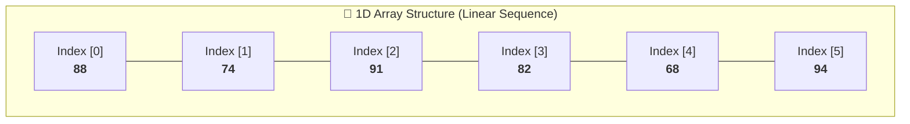
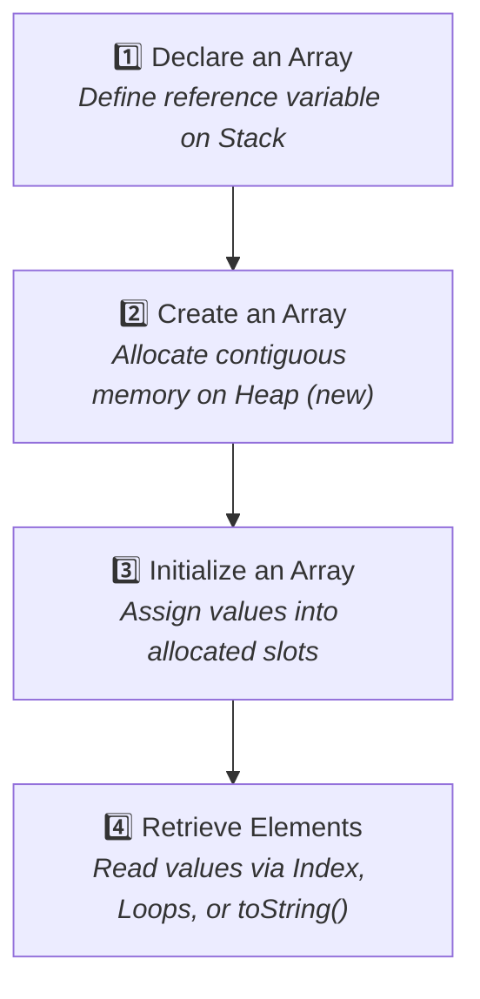
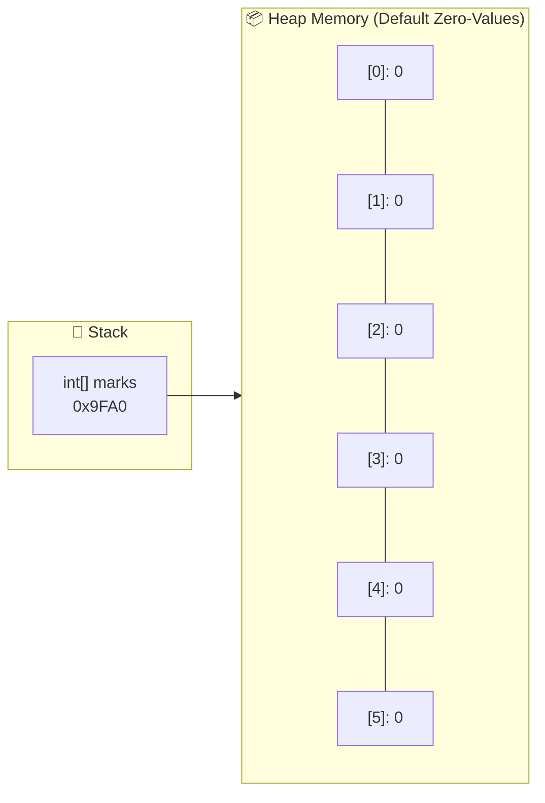

# 📏 One-Dimensional (1D) Arrays in Java

---

## 📖 1. Introduction

A **one-dimensional (1D) array** is the simplest and most fundamental form of an array in Java.
- It stores a collection of elements of the **same data type** in a **linear sequence**.
- Each element in the array is accessed using a **single integer index**.
- It is commonly used to represent linear lists, such as student marks, product prices, employee IDs, or names.

### 📝 Example:
```java
int[] marks = {88, 74, 91, 82, 68, 94};
```



---

## 🛠️ 2. The 4 Essential Steps of Working with 1D Arrays

To master 1D arrays in Java, you must understand the **4 lifecycle steps**:



---

## 📝 Step 1: Declare an Array

Array declaration is the process of **defining a reference variable** that will point to an array of a specific data type (`int`, `float`, `String`, etc.).

> ⚠️ **Key JVM Rule:** At the declaration stage, **no memory is allocated on the Heap**. Only a reference variable is created on the Stack with a value of `null` (or uninitialized if local).

### 🏷️ Recommended Standard Syntax:
```java
dataType[] arrayName;
```
### Examples:
```java
int[] marks;
String[] names;
double[] salaries;
```

### 🔄 Alternate Valid Syntaxes in Java:
Java also permits C/C++ style bracket placements:
```java
dataType arrayName[];   // e.g., int marks[];
dataType []arrayName;   // e.g., int []marks;
```
*(Best Practice: Always place brackets next to the data type `int[] marks;` for clean, idiomatic Java code).*

---

## 📦 Step 2: Create an Array

Array creation is the process of **allocating memory on the Heap** using the **`new` keyword**.

- A fixed, contiguous block of memory is reserved on the Heap.
- The **size of the array must be specified** during creation and cannot be changed later.
- All allocated slots are automatically initialized to their **default zero-values** (`0` for `int`, `0.0` for `double`, `false` for `boolean`, `null` for objects).

### 🏷️ Creation Syntax:
```java
arrayName = new dataType[size];
```
### Examples:
```java
marks = new int[6];      // Reserves 6 integer slots (24 bytes) on Heap
names = new String[6];   // Reserves 6 reference slots on Heap
```

### ⚡ Combining Declaration & Creation in a Single Line:
```java
dataType[] arrayName = new dataType[size];

// Examples:
int[] marks = new int[6];
String[] names = new String[6];
```



---

## ✏️ Step 3: Initialize an Array

Array initialization is the process of **assigning actual data values** to the elements of an array.

### 🏷️ Manual Initialization by Index:
```java
arrayName[index] = value;
```
### Examples:
```java
marks[0] = 88;
marks[1] = 74;
marks[2] = 91;
marks[3] = 82;
marks[4] = 68;
marks[5] = 94;
```

---

### 💡 Combining Declaration, Creation & Initialization (Shorthand Literal)

We can combine all 3 steps into a single concise line using the **array literal syntax**:

```java
dataType[] arrayName = {value1, value2, value3, ...};

// Example:
int[] marks = {88, 74, 91, 82, 68, 94};
```

> 🔍 **Deep Dive Insight:** The shorthand `{...}` is syntactic sugar for:
> ```java
> int[] marks = new int[] {88, 74, 91, 82, 68, 94};
> ```
> The JVM automatically counts the number of values (6) and allocates the exact Heap size.

---

## 🔍 Step 4: Retrieve Elements of an Array

Retrieving array elements means **reading the values stored in memory** using zero-based indexing (`0` to `length - 1`).

Java provides **4 primary ways** to retrieve elements:

### 1️⃣ Using Single Direct Index
```java
System.out.println(marks[0]);  // Output: 88 (First element)
System.out.println(marks[3]);  // Output: 82 (Fourth element)
System.out.println(marks[marks.length - 1]); // Output: 94 (Last element)
```

### 2️⃣ Using Traditional `for` Loop
Best when you need the numerical index position:
```java
for (int i = 0; i < marks.length; i++) {
    System.out.println("Student " + i + " Mark: " + marks[i]);
}
```

### 3️⃣ Using Enhanced `for-each` Loop (Recommended & Preferred)
The cleanest, most readable way to iterate over all elements:
```java
for (int num : marks) {
    System.out.println(num);
}
```

### 4️⃣ Using `Arrays.toString()` Utility
Displays the entire array contents formatted as a string `[e1, e2, ...]`:
```java
import java.util.Arrays;

System.out.println(Arrays.toString(marks)); 
// Output: [88, 74, 91, 82, 68, 94]
```

---

## 💻 3. Complete Code Programs & Walkthrough

### 📜 Program 1: Step-by-Step Declaration, Allocation & Retrieval
```java
public class MainApp1 {
    public static void main(String[] args) {
        // Step 1 & 2: Declare and create an array of size 6
        int[] marks = new int[6];

        // Step 3: Initialize array elements
        marks[0] = 88;
        marks[1] = 74;
        marks[2] = 91;
        marks[3] = 82;
        marks[4] = 68;
        marks[5] = 94;

        // Step 4: Access and print array elements using normal for loop (Way 1)
        System.out.print("Way 1: ");
        for (int i = 0; i < marks.length; i++) {
            System.out.print(marks[i] + " ");
        }
        System.out.println(); // Move to next line

        // Step 4: Access and print array elements using for-each loop (Way 2)
        System.out.print("Way 2: ");
        for (int no : marks) {
            System.out.print(no + " ");
        }
        System.out.println(); // Move to next line
    }
}
```

### 🖥️ Output:
```text
Way 1: 88 74 91 82 68 94 
Way 2: 88 74 91 82 68 94 
```

#### 📌 Points to Note:
1. We accessed the array elements in 2 ways: normal `for` loop and `for-each` loop.
2. The `for-each` loop is preferred for read-only traversals because it eliminates loop counters, boundary conditions, and indexing errors.
3. Declaring and initializing slot-by-slot is lengthy; shorthand literal notation is much more concise!

---

### 📜 Program 2: Shorthand Inline Initialization
```java
public class MainApp2 {
    public static void main(String[] args) {
        // 1. Declare, create, and initialize using shorthand notation
        // The JVM automatically computes the size as 6
        int[] marks = {88, 74, 91, 82, 68, 94};

        // 2. Access and print array elements using a for-each loop
        // The variable 'no' sequentially receives each element value
        System.out.print("Marks are: ");
        for (int no : marks) {
            System.out.print(no + " ");
        }
        System.out.println();
    }
}
```

### 🖥️ Output:
```text
Marks are: 88 74 91 82 68 94
```

---

## 🧠 4. Advanced Concepts & Best Practices

### 1️⃣ Anonymous 1D Arrays
You can pass an array directly into a method without assigning it to a reference variable:
```java
public class AnonymousArrayDemo {
    public static void main(String[] args) {
        // Passing anonymous array on the fly
        printSum(new int[] {10, 20, 30, 40});
    }

    public static void printSum(int[] arr) {
        int sum = 0;
        for (int n : arr) sum += n;
        System.out.println("Total Sum: " + sum);
    }
}
```

### 2️⃣ Dynamic User Input with `Scanner`
```java
import java.util.Scanner;

public class DynamicArrayInput {
    public static void main(String[] args) {
        Scanner sc = new Scanner(System.in);

        System.out.print("Enter number of students: ");
        int n = sc.nextInt();

        int[] scores = new int[n]; // Dynamically sized at runtime

        System.out.println("Enter " + n + " scores:");
        for (int i = 0; i < scores.length; i++) {
            scores[i] = sc.nextInt();
        }

        System.out.println("Scores recorded successfully!");
        sc.close();
    }
}
```

---

## 🎬 5. Interactive Visualizer Animation Walkthrough

To see 1D Arrays in action, open the **Architecture Tab**:

1. **Step-by-Step Lifecycle Simulator**:
   - Watch the 4 phases live: **Step 1 (Declaration)** ➔ **Step 2 (Memory Allocation on Heap with 0s)** ➔ **Step 3 (Slot Initialization)** ➔ **Step 4 (Loop Traversal & Retrieval)**.
2. **Loop Pointer Tracer**:
   - Watch the active loop pointer `i` or `no` move along the contiguous memory slots in real time.
3. **Retrieval Method Comparator**:
   - Switch between **Index Access**, **Normal For Loop**, **For-Each Loop**, and **`Arrays.toString()`**.
4. **Interactive Knowledge Assessment Quiz**:
   - Test your understanding of 1D array mechanics with instant grading.

---

## ❓ 6. Frequently Asked Interview Questions

<details>
<summary><b>Q1: Can we change the size of an array after creation in Java?</b></summary>
No. Array size is immutable in Java. Once allocated on the Heap with a specific length, its capacity is permanently fixed. To add more elements, you must allocate a new array or use <code>ArrayList</code>.
</details>

<details>
<summary><b>Q2: What are the default values of array elements after Step 2 (Creation)?</b></summary>
<ul>
  <li><code>byte</code>, <code>short</code>, <code>int</code>, <code>long</code>: <code>0</code></li>
  <li><code>float</code>, <code>double</code>: <code>0.0</code></li>
  <li><code>boolean</code>: <code>false</code></li>
  <li><code>char</code>: <code>'\u0000'</code></li>
  <li>Object references (e.g. <code>String[]</code>, <code>Student[]</code>): <code>null</code></li>
</ul>
</details>

<details>
<summary><b>Q3: Can we modify array elements using a for-each loop?</b></summary>
No. In <code>for(int no : marks) { no = 100; }</code>, the variable <code>no</code> is a local copy of each element value. Changing <code>no</code> does not modify the original array slot in Heap memory.
</details>
