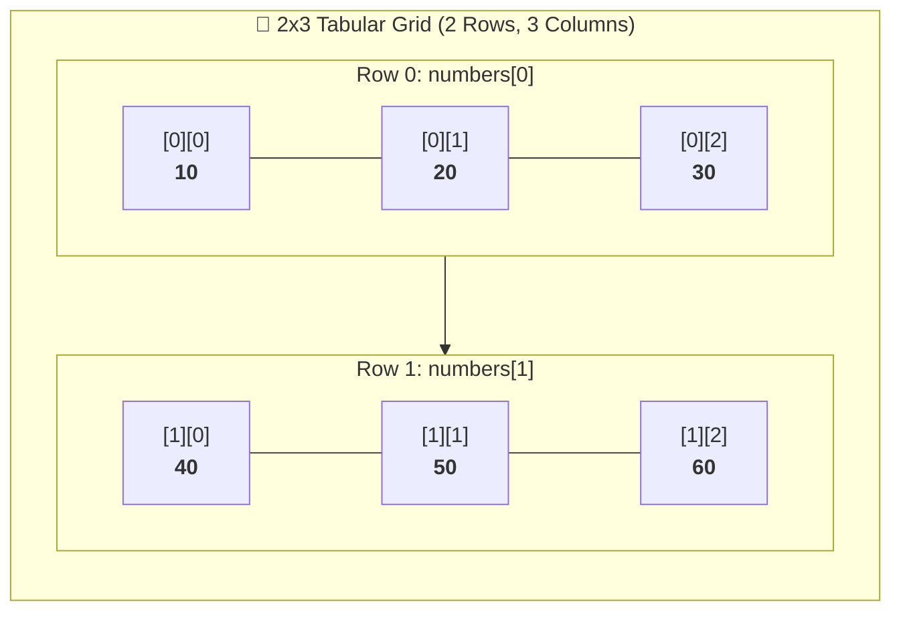
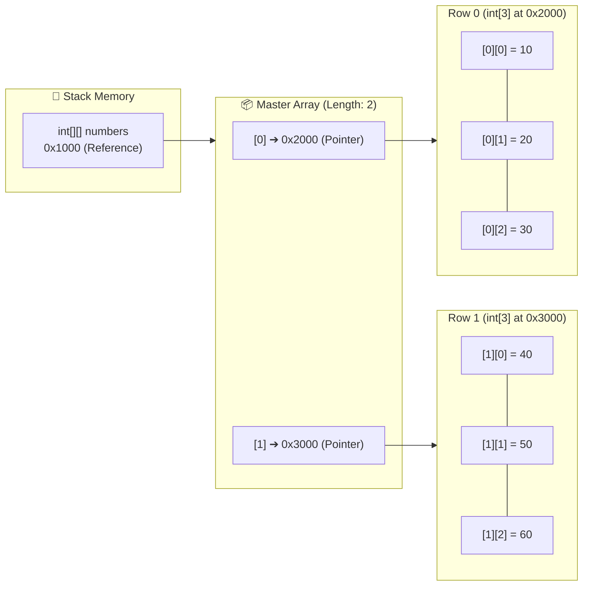

# 📐 Multi-Dimensional Array (2D) in Java

---

## 📖 1. Introduction to 2D Arrays

A **two-dimensional (2D) array** is the most common form of a **multi-dimensional array** in Java.
- In Java, a 2D array is fundamentally an **"array of arrays"**.
- It stores data in a **table-like structure consisting of rows and columns**.
- Elements are accessed using **two indices**: `[rowIndex][columnIndex]`.
- 2D arrays are widely used to represent mathematical matrices, chessboard grids, image pixels, student marks across multiple subjects, and cinema seating charts.

### 📝 Example:
```java
int[][] numbers = {
    {10, 20, 30},
    {40, 50, 60}
};
```



---

## 🧠 2. The JVM "Array of Arrays" Memory Architecture

In languages like C or C++, a 2D array is stored as a single contiguous block in row-major order.

In Java, **there is no contiguous 2D memory block**. Instead:
1. The Stack variable `numbers` holds a reference to a **Master 1D Array** on the Heap.
2. The Master Array slots hold **reference pointers** to independent **Child 1D Array objects** on the Heap.



---

## 🛠️ 3. The 4 Essential Steps of Working with 2D Arrays

---

### 📝 Step 1: Declare a 2D Array
Array declaration defines a reference variable that will point to a 2D array of a specific data type.

> ⚠️ **Key Rule:** At declaration, **no memory is allocated on the Heap**. The Stack reference is simply `null`.

#### 🏷️ Recommended Standard Syntax:
```java
dataType[][] arrayName;

// Example:
int[][] numbers;
String[][] seatingChart;
```

#### 🔄 Alternate Valid Syntaxes:
```java
dataType arrayName[][]; // e.g. int numbers[][];
dataType [][]arrayName; // e.g. int [][]numbers;
```
*(Best Practice: Always use `dataType[][] arrayName;` for idiomatic Java).*

---

### 📦 Step 2: Create a 2D Array
Array creation allocates memory on the Heap using the **`new` keyword**.

- A fixed block of memory is reserved for the specified number of rows and columns.
- All elements are automatically initialized to their default values (`0` for `int`, `null` for objects).

#### 🏷️ Creation Syntax:
```java
arrayName = new dataType[rows][columns];

// Example:
numbers = new int[2][3]; // 2 rows, 3 columns (6 total slots)
```

#### ⚡ Combining Declaration & Creation in a Single Line:
```java
dataType[][] arrayName = new dataType[rows][columns];

// Example:
int[][] numbers = new int[2][3];
```

---

### ✏️ Step 3: Initialize a 2D Array
Array initialization assigns actual values to individual matrix cells.

#### 🏷️ Manual Element-by-Element Assignment:
```java
int[][] numbers = new int[2][3];

// Row 0
numbers[0][0] = 10;
numbers[0][1] = 20;
numbers[0][2] = 30;

// Row 1
numbers[1][0] = 40;
numbers[1][1] = 50;
numbers[1][2] = 60;
```

#### 💡 Shorthand Array Literal Syntax (All 3 Steps in One Line):
```java
dataType[][] arrayName = {
    {value1, value2, value3, ...},
    {value4, value5, value6, ...}
};

// Example:
int[][] numbers = {
    {10, 20, 30},
    {40, 50, 60}
};
```
> 🔍 **Compiler Insight:** This shorthand is syntactic sugar for:
> ```java
> int[][] numbers = new int[][] { {10, 20, 30}, {40, 50, 60} };
> ```

---

### 🔍 Step 4: Retrieve Elements of a 2D Array
Elements are accessed using **zero-based row and column indices**:
- First element: `[0][0]`
- Last element: `[rows - 1][columns - 1]`

#### 1️⃣ Using Row and Column Index Directly:
```java
int[][] numbers = {
    {10, 20, 30},
    {40, 50, 60}
};

System.out.println(numbers[0][1]); // Output: 20 (Row 0, Col 1)
System.out.println(numbers[1][2]); // Output: 60 (Row 1, Col 2)
```

#### 2️⃣ Using Nested Traditional `for` Loops:
```java
for (int i = 0; i < numbers.length; i++) {
    for (int j = 0; j < numbers[i].length; j++) {
        System.out.print(numbers[i][j] + " ");
    }
    System.out.println(); // Move to next line after printing a row
}
```

#### 3️⃣ Using Nested Enhanced `for-each` Loops (Preferred & Recommended):
```java
for (int[] row : numbers) {
    for (int num : row) {
        System.out.print(num + " ");
    }
    System.out.println(); // Move to next line
}
```

#### 4️⃣ Using `Arrays.deepToString()` Utility:
```java
import java.util.Arrays;

System.out.println(Arrays.deepToString(numbers));
// Output: [[10, 20, 30], [40, 50, 60]]
```

---

## 💻 4. Complete Code Programs & Walkthrough

### 📜 Program 1: Step-by-Step Explicit 2D Array Creation (MainApp1)
```java
public class MainApp1 {
    public static void main(String[] args) {
        // 1. Declare and create a 2D array of size 2x3
        int[][] numbers = new int[2][3];

        // 2. Initialize array elements slot by slot
        numbers[0][0] = 10;
        numbers[0][1] = 20;
        numbers[0][2] = 30;
        numbers[1][0] = 40;
        numbers[1][1] = 50;
        numbers[1][2] = 60;

        // 3. Access and print array elements using nested for loop (Way 1)
        System.out.println("Way 1:");
        for (int i = 0; i < numbers.length; i++) {
            for (int j = 0; j < numbers[i].length; j++) {
                System.out.print(numbers[i][j] + " ");
            }
            System.out.println(); // Move to next row
        }

        // 4. Access and print array elements using nested for-each loop (Way 2)
        System.out.println("Way 2:");
        for (int[] row : numbers) {
            for (int num : row) {
                System.out.print(num + " ");
            }
            System.out.println(); // Move to next row
        }
    }
}
```

### 🖥️ Output:
```text
Way 1:
10 20 30 
40 50 60 
Way 2:
10 20 30 
40 50 60 
```

#### 📌 Points to Note:
1. `numbers.length` gives the **total number of rows** (2).
2. `numbers[i].length` gives the **number of columns in row $i$** (3).
3. The nested `for-each` loop is cleaner and eliminates index tracking errors.

---

### 📜 Program 2: Shorthand Array Literal Initialization (MainApp2)
```java
public class MainApp2 {
    public static void main(String[] args) {
        // 1. Declare, create, and initialize a 2D array in a single line
        int[][] numbers = {
            {10, 20, 30},
            {40, 50, 60}
        };

        // 2. Access and print array elements using nested for-each loop
        System.out.println("Numbers are:");
        for (int[] row : numbers) {
            for (int num : row) {
                System.out.print(num + " ");
            }
            System.out.println(); // Move to next row
        }
    }
}
```

### 🖥️ Output:
```text
Numbers are:
10 20 30 
40 50 60 
```

---

## 📊 5. Important Dimensions & Calculations in 2D Arrays

| Property / Operation | Code | Description / Value |
| :--- | :--- | :--- |
| **Row Count ($M$)** | `numbers.length` | Returns number of rows (e.g., `2`). |
| **Column Count in Row $i$ ($N$)** | `numbers[i].length` | Returns column count of row $i$ (e.g., `3`). |
| **Total Elements** | `rows * cols` | $2 \times 3 = 6$ total elements. |
| **Deep String Print** | `Arrays.deepToString(arr)` | Formats nested 2D array to readable string. |

---

## 🎬 6. Interactive Visualizer Animation Walkthrough

Open the **Architecture Tab** to explore the **Interactive 2D Array Visualizer**:

1. **Array of Arrays Heap Pointer Simulator**:
   - Inspect the **Stack reference pointer** connecting to the **Master Row array**, which in turn points to the **Child Row objects**.
2. **4-Step 2D Lifecycle Animator**:
   - Step through **Declaration ➔ Heap Allocation ($2 \times 3$ grid with 0s) ➔ Value Initialization ➔ Grid Retrieval**.
3. **Nested Loop Cell-by-Cell Pointer Tracer**:
   - Watch the outer loop pointer `i` (row) and inner loop pointer `j` (column) visit each cell in real time with live terminal output!
4. **Interactive 2D Array Quiz**:
   - Test your understanding of row lengths, indices, and nested loops.

---

## ❓ 7. Top Interview FAQs

<details>
<summary><b>Q1: What is the difference between <code>arr.length</code> and <code>arr[0].length</code> in a 2D array?</b></summary>
<code>arr.length</code> returns the number of <b>rows</b> (number of child array references in the master array). <code>arr[0].length</code> returns the number of <b>columns in row 0</b>.
</details>

<details>
<summary><b>Q2: Can different rows have different column lengths in Java?</b></summary>
Yes! Because Java implements 2D arrays as arrays of independent array references, each row can have a different size. This is called a <b>Jagged (Ragged) Array</b> (e.g. <code>int[][] arr = new int[3][]; arr[0] = new int[2]; arr[1] = new int[4];</code>).
</details>

<details>
<summary><b>Q3: Why doesn't <code>Arrays.toString(numbers)</code> print the 2D array values properly?</b></summary>
<code>Arrays.toString()</code> only converts 1D elements. For a 2D array, it prints the memory hashcodes of the row array objects (e.g. <code>[[I@15db9742, [I@6d06d69c]</code>). You must use <b><code>Arrays.deepToString(numbers)</code></b> for multidimensional arrays.
</details>
