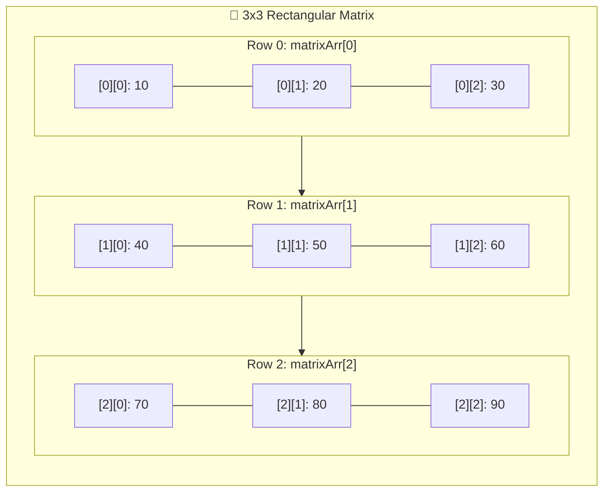

# 🧮 Matrix Array in Java — Masterclass

---

## 📖 1. Introduction to Matrix Arrays

A **Matrix Array** is a specialized type of **two-dimensional (2D) array** that stores data in a **$M \text{ rows} \times N \text{ columns}$** format, just like a mathematical matrix or table.

It is widely used in scientific computing, game development, image processing, machine learning, and computer graphics to perform mathematical operations such as:
- **Matrix Addition & Subtraction**
- **Matrix Multiplication ($A \times B$)**
- **Matrix Transpose ($A^T$)**
- **Determinants & Inverse Matrices**
- **Diagonal & Symmetry Checks**

### 📝 Example:
```java
int[][] matrixArr = {
    {10, 20, 30},
    {40, 50, 60},
    {70, 80, 90}
};
```



---

## 📌 2. Important Points to Remember

1. **Numeric Values Only**:
   - A Matrix Array stores only **numeric types** (`int`, `float`, `double`, `long`), **not** `String` or custom objects.
   - *Reason*: Mathematical operations like $+$, $-$, $\times$, determinants, and transformations only make mathematical sense with numeric numbers.
2. **Uniform Columns (Rectangular Grid)**:
   - A matrix array can have any number of rows ($M$), but **every row must have the exact same number of columns ($N$)**.
   - *Note*: If rows have different column lengths, Java considers it a **Jagged Array**, not a mathematical matrix.
3. **Dimensions**:
   - `matrix.length` $\rightarrow$ gives the **number of rows ($M$)**.
   - `matrix[i].length` $\rightarrow$ gives the **number of columns ($N$)** in row $i$.

---

## 🛠️ 3. Working with Matrix Arrays (The 4 Steps)

---

### 📝 Step 1: Declare a Matrix Array
Defines the reference variable on the Stack without allocating Heap memory:
```java
dataType[][] arrayName;

// Example:
int[][] numbers;
```

---

### 📦 Step 2: Create a Matrix Array
Allocates contiguous memory on the Heap for the specified rows and columns:
```java
arrayName = new dataType[rows][columns];

// Example:
numbers = new int[2][3]; // 2 rows, 3 columns (6 elements initialized to 0)
```

#### ⚡ Combined Declaration & Creation:
```java
int[][] numbers = new int[2][3];
```

---

### ✏️ Step 3: Initialize a Matrix Array

#### 🏷️ Manual Element-by-Element Assignment:
```java
int[][] numbers = new int[2][3];

// Row 0
numbers[0][0] = 10;
numbers[0][1] = 20;
numbers[0][2] = 30;

// Row 1
numbers[1][0] = 40;
numbers[1][1] = 50;
numbers[1][2] = 60;
```

#### 💡 Shorthand Array Literal (All in One Line):
```java
int[][] numbers = {
    {10, 20, 30},
    {40, 50, 60}
};
```

---

### 🔍 Step 4: Retrieve Elements of a Matrix Array

#### 1️⃣ Using Nested `for` Loops (With Row & Column Indices):
```java
for (int i = 0; i < numbers.length; i++) {
    for (int j = 0; j < numbers[i].length; j++) {
        System.out.print(numbers[i][j] + " ");
    }
    System.out.println();
}
```

#### 2️⃣ Using Nested Enhanced `for-each` Loops (Preferred for Clean Display):
```java
for (int[] row : numbers) {
    for (int num : row) {
        System.out.print(num + " ");
    }
    System.out.println();
}
```

---

## 💻 4. Complete Code Programs & Walkthrough

### 📜 Program 1: Basic Matrix Array Display (MainApp1)
```java
public class MainApp1 {
    public static void main(String[] args) {
        // 1. Declare, create, and initialize matrix array in a single line
        int[][] numbers = {
            {10, 20, 30},
            {40, 50, 60}
        };

        // 2. Access and print array elements using nested for-each loop
        System.out.println("Numbers are:");
        for (int[] row : numbers) {
            for (int num : row) {
                System.out.print(num + " ");
            }
            System.out.println(); // Move to next row
        }
    }
}
```

### 🖥️ Output:
```text
Numbers are:
10 20 30 
40 50 60 
```

---

### 📜 Program 2: Matrix Addition in Java (MatrixAddition)
```java
public class MatrixAddition {
    public static void main(String[] args) {
        // 1. Declare and initialize two 2x3 matrices
        int[][] matrix1 = {
            {1, 2, 3},
            {4, 5, 6}
        };

        int[][] matrix2 = {
            {7, 8, 9},
            {10, 11, 12}
        };

        // 2. Create a result matrix of the same size (2x3)
        int[][] sum = new int[2][3];

        // 3. Perform matrix addition using nested for loop
        // Formula: sum[i][j] = matrix1[i][j] + matrix2[i][j]
        for (int i = 0; i < matrix1.length; i++) {          // rows
            for (int j = 0; j < matrix1[i].length; j++) {   // columns
                sum[i][j] = matrix1[i][j] + matrix2[i][j];
            }
        }

        // 4. Print the result matrix
        System.out.println("Result of Matrix Addition:");
        for (int i = 0; i < sum.length; i++) {
            for (int j = 0; j < sum[i].length; j++) {
                System.out.print(sum[i][j] + " ");
            }
            System.out.println(); // Move to next row
        }
    }
}
```

### 🖥️ Output:
```text
Result of Matrix Addition:
8 10 12 
14 16 18 
```

#### 📌 Points to Note:
1. **Dimension Requirement**: To perform addition (or subtraction), both matrices **must have identical dimensions** ($R_1 = R_2$ and $C_1 = C_2$).
2. **Operation**: Each cell in the result matrix is the direct sum of the corresponding cells at `[i][j]`:
   - `sum[0][0] = 1 + 7 = 8`
   - `sum[0][1] = 2 + 8 = 10`
   - `sum[0][2] = 3 + 9 = 12`
   - `sum[1][0] = 4 + 10 = 14`
   - `sum[1][1] = 5 + 11 = 16`
   - `sum[1][2] = 6 + 12 = 18`

---

## 🧠 5. Advanced Matrix Operations

### 1️⃣ Matrix Multiplication ($A \times B$)
- **Condition**: Columns of Matrix $A$ must equal Rows of Matrix $B$ ($C_1 == R_2$).
- If $A$ is $(R_1 \times C_1)$ and $B$ is $(R_2 \times C_2)$, the resulting matrix $C$ has size $(R_1 \times C_2)$.
- **Time Complexity**: $O(R_1 \times C_2 \times C_1)$.

```java
public static int[][] multiply(int[][] a, int[][] b) {
    int r1 = a.length, c1 = a[0].length;
    int r2 = b.length, c2 = b[0].length;

    if (c1 != r2) {
        throw new IllegalArgumentException("Multiplication impossible: Columns of A != Rows of B");
    }

    int[][] result = new int[r1][c2];

    for (int i = 0; i < r1; i++) {
        for (int j = 0; j < c2; j++) {
            for (int k = 0; k < c1; k++) {
                result[i][j] += a[i][k] * b[k][j];
            }
        }
    }
    return result;
}
```

---

### 2️⃣ Matrix Transpose ($A^T$)
- Swapping rows with columns: element at `[i][j]` moves to `[j][i]`.
- An $M \times N$ matrix becomes an $N \times M$ transposed matrix.

```java
public static int[][] transpose(int[][] matrix) {
    int rows = matrix.length;
    int cols = matrix[0].length;
    int[][] transposed = new int[cols][rows];

    for (int i = 0; i < rows; i++) {
        for (int j = 0; j < cols; j++) {
            transposed[j][i] = matrix[i][j];
        }
    }
    return transposed;
}
```

---

### 3️⃣ Primary and Secondary Diagonals (Square Matrix $N \times N$)
- **Primary Diagonal**: Elements where $i == j$.
- **Secondary Diagonal**: Elements where $i + j == N - 1$.

```java
public static void printDiagonals(int[][] matrix) {
    int n = matrix.length;
    System.out.print("Primary Diagonal: ");
    for (int i = 0; i < n; i++) System.out.print(matrix[i][i] + " ");

    System.out.print("\nSecondary Diagonal: ");
    for (int i = 0; i < n; i++) System.out.print(matrix[i][n - 1 - i] + " ");
    System.out.println();
}
```

---

## 📊 6. Summary of Matrix Complexity

| Matrix Operation | Time Complexity | Space Complexity | Compatibility Rule |
| :--- | :--- | :--- | :--- |
| **Matrix Addition ($A + B$)** | $O(M \times N)$ | $O(M \times N)$ | $R_1 = R_2$ and $C_1 = C_2$ |
| **Matrix Subtraction ($A - B$)** | $O(M \times N)$ | $O(M \times N)$ | $R_1 = R_2$ and $C_1 = C_2$ |
| **Matrix Multiplication ($A \times B$)** | $O(R_1 \times C_2 \times C_1)$ | $O(R_1 \times C_2)$ | $C_1 = R_2$ |
| **Matrix Transpose ($A^T$)** | $O(M \times N)$ | $O(N \times M)$ | Any $M \times N$ grid |
| **Diagonal Extraction** | $O(N)$ | $O(1)$ | Square Matrix ($N \times N$) |

---

## 🎬 7. Interactive Visualizer Animation Walkthrough

Open the **Architecture Tab** to explore the **Interactive Matrix Array Visualizer**:

1. **Live Matrix Addition Simulator**:
   - Step through Matrix $A + \text{Matrix } B = \text{Matrix } C$ with animated corresponding cell highlights ($1+7=8$, $2+8=10$, etc.).
2. **Matrix Multiplication Lab**:
   - Watch the row of Matrix $A$ and column of Matrix $B$ highlight together as their dot product sum is computed.
3. **Transpose & Diagonal Visualizer**:
   - Watch $(i, j)$ flip to $(j, i)$ live, or trace primary and secondary diagonals on a square grid.
4. **Interactive Matrix Assessment Quiz**:
   - Test your understanding of matrix dimension rules, compatibility checks, and addition algorithms.

---

## ❓ 8. Top Interview FAQs

<details>
<summary><b>Q1: Why do matrix arrays only store numeric types?</b></summary>
Because mathematical operations like addition, subtraction, multiplication, and determinant calculations are only valid on numeric numbers (integers, floats, doubles). Storing strings or non-numeric objects would make matrix arithmetic impossible.
</details>

<details>
<summary><b>Q2: What is the condition required to multiply two matrices A and B?</b></summary>
The number of <b>columns in Matrix A</b> must equal the number of <b>rows in Matrix B</b> (<code>A[0].length == B.length</code>).
</details>

<details>
<summary><b>Q3: What is the difference between a general 2D Array and a Matrix Array?</b></summary>
A general 2D array in Java can be <b>jagged</b> (different column counts per row) and can hold any object type. A <b>Matrix Array</b> is strictly a <b>rectangular grid</b> ($M \times N$) holding numeric values for mathematical operations.
</details>
