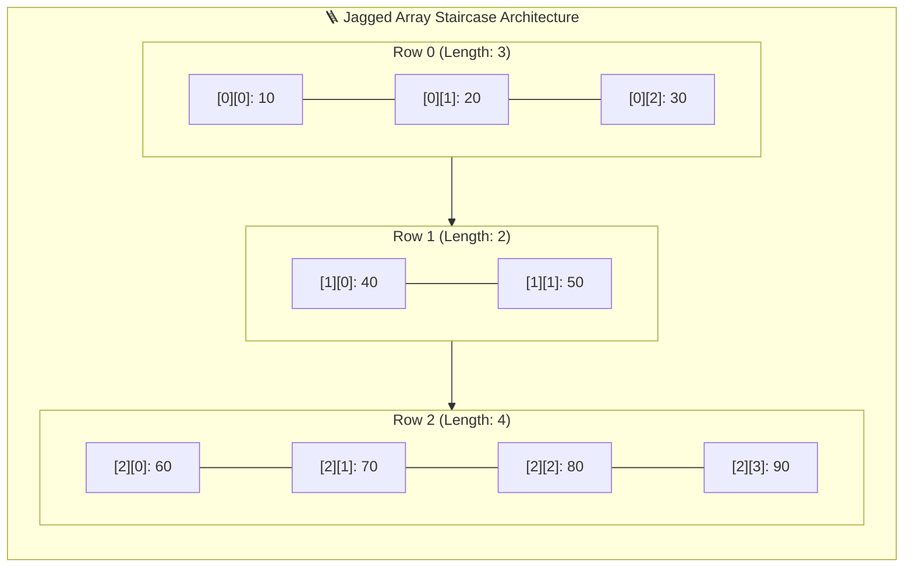
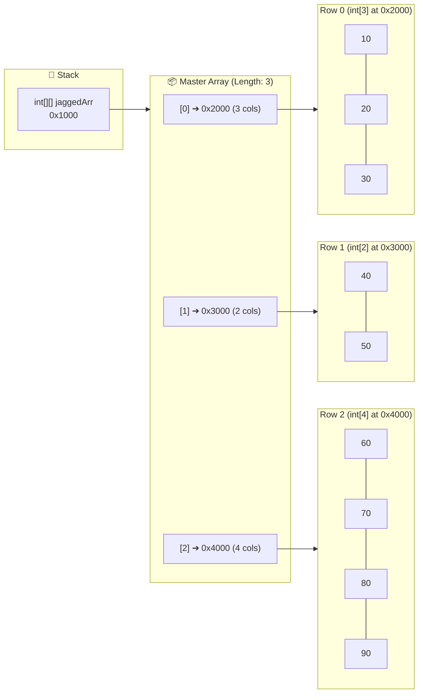

# 🪜 Jagged Array in Java — Masterclass

---

## 📖 1. Introduction to Jagged Arrays

A **Jagged Array** (also known as a **Ragged Array**) in Java is a type of **2D array** where **the number of columns in each row can be different**.

- In Java, all multi-dimensional arrays are fundamentally **"arrays of arrays"**.
- Unlike a standard **Matrix** (where every row has the exact same number of columns in an $M \times N$ rectangular shape), a Jagged Array allows **variable-length rows**, creating a **staircase** or **ragged** layout.

### 📝 Example:
```java
int[][] jaggedArr = {
    {10, 20, 30},       // Row 0 has 3 columns
    {40, 50},           // Row 1 has 2 columns
    {60, 70, 80, 90}    // Row 2 has 4 columns
};
```



---

## 📌 2. Points to Remember & Architecture Insights

1. **High Memory Efficiency**:
   - In a rectangular matrix, if some rows only need 2 elements while one row needs 4, you must allocate a $3 \times 4 = 12$ slot matrix, wasting 3 empty slots.
   - With a Jagged Array, you allocate exactly $3 + 2 + 4 = 9$ slots on the Heap — saving **25% memory**!
2. **Ideal for Irregular Real-World Data**:
   - Useful for storing student marks when different students enroll in different numbers of elective courses.
   - Cinema halls or stadiums where front rows have fewer seats than rear rows.
   - Monthly sales logs where each month has a different number of days (28, 30, or 31).
3. **Not Suitable for Matrix Math**:
   - Unlike uniform matrices, jagged arrays **cannot** undergo matrix addition, multiplication, or determinant calculations because column dimensions do not match.
4. **Dimension Properties**:
   - `jaggedArr.length` $\rightarrow$ gives the **number of rows** (3).
   - `jaggedArr[i].length` $\rightarrow$ gives the **number of columns in row $i$** (varies per row).

---

## 🧠 3. JVM "Array of Arrays" Memory Structure

Because Java does not allocate contiguous 2D memory blocks, the Master Array simply holds reference pointers (`0x2000`, `0x3000`, `0x4000`) pointing to three completely independent 1D array instances of different capacities on the Heap!



---

## 🛠️ 4. Working with Jagged Arrays (The 4 Steps)

---

### 📝 Step 1: Declare a Jagged Array
Defines the reference variable on the Stack without allocating memory on the Heap:
```java
dataType[][] arrayName;

// Example:
int[][] jaggedArr;
```

---

### 📦 Step 2: Create a Jagged Array
Unlike a rectangular matrix where you specify `new int[rows][cols]`, a jagged array is created in **two stages**:

1. **Allocate the Master Row Array** (Leave column size empty):
   ```java
   jaggedArr = new int[3][]; // Allocates 3 row pointer slots (initialized to null)
   ```
2. **Allocate Each Child Row Individually with its Custom Column Size**:
   ```java
   jaggedArr[0] = new int[3]; // Row 0 has 3 columns (initialized to 0, 0, 0)
   jaggedArr[1] = new int[2]; // Row 1 has 2 columns (initialized to 0, 0)
   jaggedArr[2] = new int[4]; // Row 2 has 4 columns (initialized to 0, 0, 0, 0)
   ```

> ⚠️ **Critical Trap:** If you try to assign `jaggedArr[0][0] = 10;` before executing `jaggedArr[0] = new int[3];`, Java throws a **`NullPointerException`** because `jaggedArr[0]` is still `null`!

---

### ✏️ Step 3: Initialize a Jagged Array

#### 🏷️ Manual Element Assignment:
```java
// Row 0 (3 elements)
jaggedArr[0][0] = 10;
jaggedArr[0][1] = 20;
jaggedArr[0][2] = 30;

// Row 1 (2 elements)
jaggedArr[1][0] = 40;
jaggedArr[1][1] = 50;

// Row 2 (4 elements)
jaggedArr[2][0] = 60;
jaggedArr[2][1] = 70;
jaggedArr[2][2] = 80;
jaggedArr[2][3] = 90;
```

#### 💡 Shorthand Array Literal (All 3 Steps in One Line):
```java
dataType[][] arrayName = {
    {value1, value2, value3},        // Row 0
    {value4, value5},                // Row 1 (different length)
    {value6, value7, value8, value9} // Row 2 (different length)
};

// Example:
int[][] jaggedArr = {
    {10, 20, 30},
    {40, 50},
    {60, 70, 80, 90}
};
```

---

### 🔍 Step 4: Retrieve Elements of a Jagged Array

#### 1️⃣ Using Row and Column Index:
```java
System.out.println(jaggedArr[0][1]); // Output: 20 (Row 0, Col 1)
System.out.println(jaggedArr[2][3]); // Output: 90 (Row 2, Col 3)
```

#### 2️⃣ Using Nested Traditional `for` Loops:
> ⚠️ **Important:** Notice that the inner loop condition must be `j < jaggedArr[i].length` (using row $i$'s length), **not** a fixed number!
```java
for (int i = 0; i < jaggedArr.length; i++) {
    for (int j = 0; j < jaggedArr[i].length; j++) {
        System.out.print(jaggedArr[i][j] + " ");
    }
    System.out.println(); // Move to next line
}
```

#### 3️⃣ Using Nested Enhanced `for-each` Loops (Preferred & Cleanest):
```java
for (int[] row : jaggedArr) {
    for (int num : row) {
        System.out.print(num + " ");
    }
    System.out.println();
}
```

---

## 💻 5. Complete Code Programs & Walkthrough

### 📜 Program 1: Step-by-Step Explicit Jagged Array (JaggedArray1)
```java
public class JaggedArray1 {
    public static void main(String[] args) {
        // 1. Declare and create a jagged array with 3 rows
        int[][] jaggedArr = new int[3][];
        jaggedArr[0] = new int[3]; // first row has 3 columns
        jaggedArr[1] = new int[2]; // second row has 2 columns
        jaggedArr[2] = new int[4]; // third row has 4 columns

        // 2. Initialize array elements
        jaggedArr[0][0] = 10;
        jaggedArr[0][1] = 20;
        jaggedArr[0][2] = 30;
        jaggedArr[1][0] = 40;
        jaggedArr[1][1] = 50;
        jaggedArr[2][0] = 60;
        jaggedArr[2][1] = 70;
        jaggedArr[2][2] = 80;
        jaggedArr[2][3] = 90;

        // 3. Access and print elements using nested for loop (Way 1)
        System.out.println("Way 1:");
        for (int i = 0; i < jaggedArr.length; i++) {
            for (int j = 0; j < jaggedArr[i].length; j++) {
                System.out.print(jaggedArr[i][j] + " ");
            }
            System.out.println();
        }

        // 4. Access and print elements using nested for-each loop (Way 2)
        System.out.println("Way 2:");
        for (int[] row : jaggedArr) {
            for (int num : row) {
                System.out.print(num + " ");
            }
            System.out.println();
        }
    }
}
```

### 🖥️ Output:
```text
Way 1:
10 20 30 
40 50 
60 70 80 90 
Way 2:
10 20 30 
40 50 
60 70 80 90 
```

---

### 📜 Program 2: Shorthand Jagged Array Initialization (MainJaggedArray2)
```java
public class MainJaggedArray2 {
    public static void main(String[] args) {
        // 1. Declare, create, and initialize a jagged array in a single step
        int[][] jaggedArr = {
            {10, 20},            // Row 0 has 2 elements
            {30, 40, 50, 60},    // Row 1 has 4 elements
            {70, 80, 90}         // Row 2 has 3 elements
        };

        // 2. Access and print array elements using nested for-each loop
        System.out.println("Jagged Array Elements:");
        for (int[] row : jaggedArr) {
            for (int num : row) {
                System.out.print(num + " ");
            }
            System.out.println(); // Move to next row
        }
    }
}
```

### 🖥️ Output:
```text
Jagged Array Elements:
10 20 
30 40 50 60 
70 80 90 
```

---

## 🌟 6. Classic Algorithm: Pascal's Triangle Using a Jagged Array

Pascal's Triangle is the most famous computer science application of a Jagged Array, where row $i$ has exactly $i + 1$ elements, and each inner element is the sum of the two elements directly above it:

```java
public class PascalsTriangle {
    public static void main(String[] args) {
        int numRows = 5;
        int[][] triangle = new int[numRows][];

        for (int i = 0; i < numRows; i++) {
            triangle[i] = new int[i + 1]; // Row i has i+1 elements
            triangle[i][0] = 1;           // First element is always 1
            triangle[i][i] = 1;           // Last element is always 1

            for (int j = 1; j < i; j++) {
                triangle[i][j] = triangle[i - 1][j - 1] + triangle[i - 1][j];
            }
        }

        System.out.println("Pascal's Triangle (Jagged Array):");
        for (int[] row : triangle) {
            for (int num : row) System.out.print(num + " ");
            System.out.println();
        }
    }
}
```

### 🖥️ Output:
```text
1 
1 1 
1 2 1 
1 3 3 1 
1 4 6 4 1 
```

---

## 🎬 7. Interactive Visualizer Animation Walkthrough

Open the **Architecture Tab** to explore the **Interactive Jagged Array Visualizer**:

1. **Heap Pointer Staircase Map**:
   - Inspect the **Master Pointer Array** holding 3 references pointing to 3 independent Child Arrays of lengths **3, 2, and 4** in Heap memory.
2. **2-Stage Creation Simulator**:
   - Watch the JVM allocate `new int[3][]` (master holding `null`), followed by individual allocations for `new int[3]`, `new int[2]`, and `new int[4]`.
3. **Memory Waste Comparison Tool**:
   - See a live side-by-side visual comparison between a $3 \times 4$ Rectangular Matrix (wasted slots) vs a Jagged Array (0% waste).
4. **Interactive Pascal's Triangle Generator**:
   - Watch a jagged array dynamically construct Pascal's Triangle row-by-row in real time.
5. **Interactive Assessment Quiz**:
   - 4 multiple-choice questions on jagged memory layout and traversal rules.

---

## ❓ 8. Top Interview FAQs

<details>
<summary><b>Q1: Can we create a jagged array with <code>int[][] arr = new int[][3];</code> in Java?</b></summary>
<b>No!</b> This causes a compile-time error. Java requires the <b>first (row) dimension</b> to be specified at creation time (<code>new int[3][]</code>). The second (column) dimension can be omitted and allocated later for each row individually.
</details>

<details>
<summary><b>Q2: What happens if you access <code>arr[0][0]</code> immediately after executing <code>int[][] arr = new int[3][];</code>?</b></summary>
A <b><code>NullPointerException</code></b> is thrown at runtime because <code>arr[0]</code> contains <code>null</code>. You must first execute <code>arr[0] = new int[size];</code> before accessing its elements.
</details>

<details>
<summary><b>Q3: What are the main memory advantages of a Jagged Array over a standard Matrix?</b></summary>
A Jagged Array eliminates wasted memory by allocating only the exact number of slots required for each row, preventing unused memory padding.
</details>
