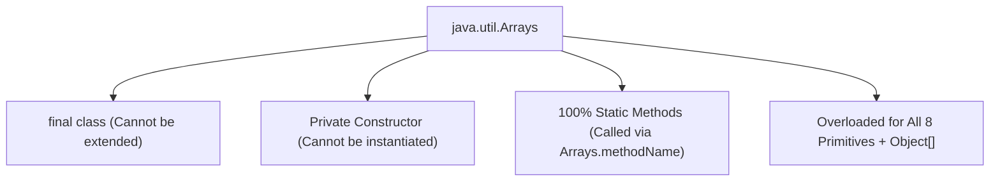

# 🛠️ Arrays Class in Java (`java.util.Arrays`)

---

## 📌 1. Introduction & Overview

### 🏷️ What is `java.util.Arrays`?
`Arrays` is a predefined utility class present in the **`java.util`** package of the Java Development Kit (JDK). It provides a rich set of **static methods** designed to dynamically manipulate arrays—including sorting, searching, copying, comparing, filling, and converting arrays to human-readable strings.

```java
package java.util;

public final class Arrays extends Object {
    // Suppress default constructor for non-instantiability
    private Arrays() {}

    // Static utility methods...
}
```

---

### 🎯 Why Do We Need the `Arrays` Class?
1. **Fixed-Size Limitation**: In Java, arrays are fixed in size once instantiated in Heap memory.
2. **Boilerplate Reduction**: Operations like sorting, searching, copying, and equality comparison normally require complex manual loops and index pointers.
3. **Optimized Performance**: The methods in `Arrays` are heavily optimized by the JVM engineering team (using **Dual-Pivot Quicksort**, **TimSort**, and vectorized SIMD instructions).

---

## ⚙️ 2. Key Characteristics & Syntax



### 📋 Characteristics:
1. **`final` Class**: Declared as `public final class Arrays`, preventing inheritance or modification.
2. **Private Constructor**: Prevents instantiation (`new Arrays()` is a compile-time error).
3. **All Methods are `static`**: Always invoked directly using the class name:
   ```java
   Arrays.methodName(arguments);
   ```
4. **Universal Overloads**: Almost every method is overloaded for all 8 primitive types (`int[]`, `double[]`, `char[]`, `boolean[]`, `byte[]`, `short[]`, `long[]`, `float[]`) and generic reference arrays (`Object[]`, `T[]`).
5. **Import Statement Required**:
   ```java
   import java.util.Arrays;
   ```

---

## 💎 3. Major Advantages

| Advantage | Practical Benefit in Production |
| :--- | :--- |
| **🚀 Eliminates Boilerplate** | Perform sorting, searching, copying, and string conversion in a single line of code. |
| **⚡ High Performance** | Powered by **Dual-Pivot Quicksort** for primitives ($O(N \log N)$) and stable **TimSort** for objects. |
| **🛡️ Thoroughly Tested** | Standard library implementation eliminates edge-case bugs (off-by-one errors, bounds checks). |
| **📖 Readability & Clean Code** | Code is instantly recognizable and standardized across Java development teams worldwide. |

---

## 📚 4. Master Methods of the `Arrays` Class

| Method Signature | Description | Time Complexity | Code Example |
| :--- | :--- | :--- | :--- |
| `Arrays.toString(array)` | Returns readable string representation of a 1D array `[e1, e2, ...]` | $O(N)$ | `Arrays.toString(arr)` |
| `Arrays.deepToString(array)` | Returns string representation of a multidimensional/nested array | $O(N)$ | `Arrays.deepToString(matrix)` |
| `Arrays.sort(array)` | Sorts array elements into ascending numerical/lexicographical order | $O(N \log N)$ | `Arrays.sort(arr)` |
| `Arrays.binarySearch(array, key)` | Searches for target key in a sorted array; returns index (or negative value if absent) | $O(\log N)$ | `int idx = Arrays.binarySearch(arr, 50);` |
| `Arrays.copyOf(original, newLen)` | Copies original array into a new array of specified capacity (padded or truncated) | $O(N)$ | `int[] b = Arrays.copyOf(a, 10);` |
| `Arrays.copyOfRange(orig, from, to)` | Slices a range `[from, to)` into a newly allocated array | $O(K)$ | `int[] slice = Arrays.copyOfRange(arr, 2, 6);` |
| `Arrays.fill(array, value)` | Assigns specified value to every element slot of the array | $O(N)$ | `Arrays.fill(arr, 0);` |
| `Arrays.equals(arr1, arr2)` | Returns `true` if two 1D arrays have the same length and identical elements | $O(N)$ | `boolean eq = Arrays.equals(a, b);` |
| `Arrays.deepEquals(arr1, arr2)` | Recursively checks value equality for multidimensional arrays | $O(N)$ | `boolean eq = Arrays.deepEquals(m1, m2);` |
| `Arrays.hashCode(array)` | Computes hash code based on array contents | $O(N)$ | `int h = Arrays.hashCode(arr);` |
| `Arrays.mismatch(arr1, arr2)` | Finds the first index where two arrays differ (Java 9+); returns `-1` if identical | $O(N)$ | `int diffIdx = Arrays.mismatch(a, b);` |
| `Arrays.parallelSort(array)` | Multi-threaded sorting using the Fork/Join framework (Java 8+) | $O(N \log N)$ | `Arrays.parallelSort(hugeArray);` |
| `Arrays.asList(elements...)` | Bridges array to a fixed-size `List<T>` collection wrapper | $O(1)$ | `List<String> list = Arrays.asList("A", "B");` |

---

## 🔍 5. Deep Dive into Essential Methods

### 1️⃣ `Arrays.toString()` and `Arrays.deepToString()`
When you print an array reference directly using `System.out.println(arr)`, Java prints the default `Object.toString()` format: `[I@1b6d3586` (Type code + Memory HashCode). To view the actual array contents, use `Arrays.toString()`.

```java
int[] numbers = {10, 20, 30};
System.out.println(numbers);                 // Output: [I@1b6d3586 (Memory Address Hash)
System.out.println(Arrays.toString(numbers)); // Output: [10, 20, 30] (Readable Values)

int[][] matrix = {{1, 2}, {3, 4}};
System.out.println(Arrays.toString(matrix));     // Output: [[I@1b6d3586, [I@74a14482] (Incorrect for 2D)
System.out.println(Arrays.deepToString(matrix)); // Output: [[1, 2], [3, 4]] (Deep Recursive)
```

---

### 2️⃣ `Arrays.sort()` — Dual-Pivot Quicksort & TimSort
- For **primitive arrays** (`int[]`, `double[]`), Java uses Vladimir Yaroslavskiy's **Dual-Pivot Quicksort** ($O(N \log N)$).
- For **Object arrays** (`String[]`, `User[]`), Java uses **TimSort** (a stable adaptive mergesort).

```java
int[] scores = {89, 45, 92, 67, 12};
Arrays.sort(scores);
System.out.println(Arrays.toString(scores)); // Output: [12, 45, 67, 89, 92]

// Range Sorting: sort elements from index 1 to 4 (exclusive)
int[] arr = {50, 40, 30, 20, 10};
Arrays.sort(arr, 1, 4); // Sorts only [40, 30, 20]
System.out.println(Arrays.toString(arr)); // Output: [50, 20, 30, 40, 10]
```

---

### 3️⃣ `Arrays.binarySearch()` — Understanding Return Values
⚠️ **Critical Rule**: The array **MUST be sorted in ascending order** before calling `Arrays.binarySearch()`. If the array is unsorted, the result is undefined.

- **Element Found**: Returns the 0-based index of the target key.
- **Element NOT Found**: Returns `-(insertion_point + 1)`, where `insertion_point` is the index where the key would be inserted to maintain sorted order!

```java
int[] sorted = {10, 20, 30, 40, 50};

// Target 30 is present at index 2
System.out.println(Arrays.binarySearch(sorted, 30)); // Output: 2

// Target 25 is missing! It would belong between index 1 (20) and index 2 (30) -> insertion_point = 2
// Return value: -(2 + 1) = -3
System.out.println(Arrays.binarySearch(sorted, 25)); // Output: -3
```

---

### 4️⃣ `Arrays.copyOf()` & `Arrays.copyOfRange()`
Creates an independent, deeply allocated copy of an array with arbitrary sizing:

```java
int[] original = {10, 20, 30, 40, 50};

// 1. Truncating: take first 3 elements
int[] smaller = Arrays.copyOf(original, 3);
System.out.println(Arrays.toString(smaller)); // Output: [10, 20, 30]

// 2. Expanding: new slots automatically initialized to default (0)
int[] expanded = Arrays.copyOf(original, 7);
System.out.println(Arrays.toString(expanded)); // Output: [10, 20, 30, 40, 50, 0, 0]

// 3. Sub-array Slicing: [fromIndex, toIndex)
int[] slice = Arrays.copyOfRange(original, 1, 4);
System.out.println(Arrays.toString(slice)); // Output: [20, 30, 40]
```

---

### 5️⃣ `Arrays.equals()` vs `Arrays.deepEquals()`

```java
// 1D Arrays: Arrays.equals compares element values
int[] a = {1, 2, 3};
int[] b = {1, 2, 3};
System.out.println(Arrays.equals(a, b)); // Output: true

// 2D Arrays: Arrays.equals checks reference pointers (Fails for nested arrays!)
int[][] m1 = {{1, 2}, {3, 4}};
int[][] m2 = {{1, 2}, {3, 4}};
System.out.println(Arrays.equals(m1, m2));     // Output: false (Different row object references!)
System.out.println(Arrays.deepEquals(m1, m2)); // Output: true (Compares recursive values!)
```

---

### 6️⃣ `Arrays.fill()`
Assigns a default constant value to every slot or a sub-range of an array:

```java
int[] board = new int[5];
Arrays.fill(board, -1);
System.out.println(Arrays.toString(board)); // Output: [-1, -1, -1, -1, -1]

// Range Fill: fill index 1 to 4 with 7
Arrays.fill(board, 1, 4, 7);
System.out.println(Arrays.toString(board)); // Output: [-1, 7, 7, 7, -1]
```

---

## ⚠️ 6. Common Traps & Interview Pitfalls

> [!CAUTION]
> **Trap 1: Calling `binarySearch()` on an Unsorted Array**
> Calling `Arrays.binarySearch()` on an unsorted array returns unpredictable or negative results even if the key is present. Always execute `Arrays.sort(arr)` first!

> [!WARNING]
> **Trap 2: `Arrays.asList()` Returns a Fixed-Size Wrapper**
> `Arrays.asList(arr)` returns a `java.util.Arrays$ArrayList` wrapper backed by the original array. Calling `.add()` or `.remove()` throws `UnsupportedOperationException`. Modifying elements with `.set()` mutates the underlying array!

> [!TIP]
> **Pro-Tip: Java 9+ `Arrays.mismatch()`**
> Use `Arrays.mismatch(arr1, arr2)` to find the index of the first mismatching element between two arrays in $O(N)$ time with early termination.

---

## 🎯 7. Complete Hands-on Code Example

```java
import java.util.Arrays;

public class CompleteArraysClassDemo {
    public static void main(String[] args) {
        // 1. Initialization
        int[] scores = {95, 82, 67, 88, 74, 91, 55};
        System.out.println("Initial Array: " + Arrays.toString(scores));

        // 2. Sort
        Arrays.sort(scores);
        System.out.println("After Sort:    " + Arrays.toString(scores));

        // 3. Search
        int target = 88;
        int index = Arrays.binarySearch(scores, target);
        System.out.println("Score " + target + " found at index: " + index);

        // 4. Slicing
        int[] topThree = Arrays.copyOfRange(scores, scores.length - 3, scores.length);
        System.out.println("Top 3 Scores:  " + Arrays.toString(topThree));

        // 5. Fill
        int[] flags = new int[4];
        Arrays.fill(flags, 1);
        System.out.println("Flags Array:   " + Arrays.toString(flags));

        // 6. Equality
        int[] copyScores = Arrays.copyOf(scores, scores.length);
        System.out.println("Is copy equal? " + Arrays.equals(scores, copyScores));
    }
}
```
