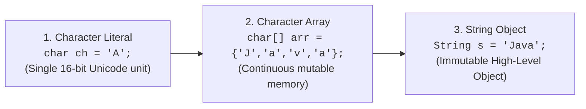
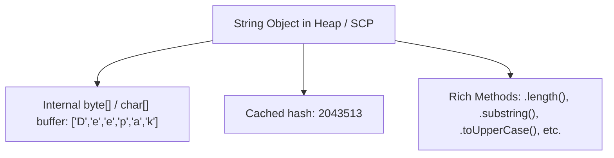
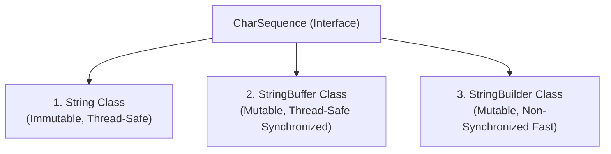

# 🔤 Character Literal, Character Array & String in Java

---

## 📌 1. Introduction

Before diving into [Strings](https://smartprogramming.in/tutorials/java/string-class.php) in Java, it is essential to first understand **Character Literals** and **Character Arrays**, because Strings are ultimately constructed from sequences of characters.



---

## 🔤 2. Character Literal in Java

A **character literal** represents a **single character** enclosed within single quotes `' '`.

```java
char ch = 'A';
char digit = '5';
char symbol = '#';
char newline = '\n'; // Escape sequence
char hindiChar = 'अ'; // Unicode Character
```

### 📋 Key Points:
1. **Single Character Only**: Only one character is permitted inside single quotes (e.g. `'AB'` is a compile-time error).
2. **Character Types**: It can be a letter, digit, punctuation symbol, or an escape sequence (`\n`, `\t`, `\'`, `\\`).
3. **16-bit Unicode Representation**: In Java, the `char` primitive data type occupies **16 bits (2 bytes)** of memory and uses **UTF-16 encoding** (range `\u0000` to `\uFFFF`, decimal `0` to `65,535`).
4. **Beyond ASCII**: Unlike C/C++ which historically used 8-bit ASCII (0–127), Java can natively store characters from global languages (Hindi, Japanese, Chinese, Arabic, Cyrillic).

---

## 🧱 3. Character Array in Java (`char[]`)

A **character array** is a collection of characters stored together in a **continuous, contiguous memory location** on the JVM Heap.

```java
char[] ch = {'d', 'e', 'e', 'p', 'a', 'k'};

// Access elements via 0-based index
System.out.println(ch[0]); // Prints 'd'
System.out.println(ch[5]); // Prints 'k'

// In-place modification (Mutable)
ch[0] = 'D';
System.out.println(ch[0]); // Prints 'D'
```

### 📋 Key Points:
1. **Stores Multiple Characters**: Group of characters indexed from `0` to `length - 1`.
2. **Mutable**: Individual characters at any index can be updated in-place directly in memory.
3. **Low-Level Control**: Preferred when fine-grained, low-level character manipulation or secure wiping (e.g., zeroing passwords in memory `ch[i] = 0`) is required.
4. **Limitation**: **Fixed Size**—once declared, the capacity of the array cannot grow or shrink dynamically.

---

## 🧵 4. String in Java (`java.lang.String`)

A **`String`** is a sequence of characters enclosed within double quotes `" "`.

```java
String name = "Deepak";
String message = "Hello Deepak, how are you ?";
```



### 📋 Key Points:
1. **Objects, Not Primitives**: In Java, `String` is an instantiated class (`java.lang.String`), not a primitive data type.
2. **Immutability**: Once a `String` object is created in Heap memory, its content **can never be changed**.
3. **UTF-16 Unicode Engine**: Java Strings store data as UTF-16 encoded Unicode characters.
   - For example: `String s = "A";` — `'A'` has ASCII value `65`, but Java stores it as Unicode `U+0041`.
   - This allows Java to natively process international scripts and emojis:
     ```java
     String hindi = "नमस्ते";
     String emoji = "😊";
     ```

---

## 🛠️ 5. Different Classes Used to Handle Strings in Java

Java provides three primary classes to process text data:



### 1️⃣ `String` Class
- The standard class to handle text in Java.
- **Immutable**: Content cannot change once created.
- **Rich Methods**: `.length()`, `.substring()`, `.toUpperCase()`, `.concat()`, `.replace()`, etc.
```java
String s1 = "Hello";
System.out.println(s1.toUpperCase()); // "HELLO" (Returns a new String)
```

---

### 2️⃣ `StringBuffer` Class
- Used to create **mutable strings** (content can be updated in-place without creating new objects).
- **Thread-Safe**: All mutating methods are `synchronized`, making it safe for multi-threaded environments.
- Common methods: `.append()`, `.insert()`, `.delete()`, `.reverse()`.
```java
StringBuffer sb = new StringBuffer("Hello");
sb.append(" World");
System.out.println(sb); // "Hello World" (Modified in-place)
```

---

### 3️⃣ `StringBuilder` Class
- Introduced in **Java 5** to create **mutable strings** with maximum single-threaded performance.
- **Non-Synchronized**: Omits thread locks, making it **2x to 3x faster** than `StringBuffer`.
- Provides identical methods to `StringBuffer`: `.append()`, `.insert()`, `.delete()`, `.reverse()`.
```java
StringBuilder sb = new StringBuilder("Deepak");
sb.insert(6, " Panwar");
System.out.println(sb); // "Deepak Panwar"
```

---

## 📊 6. Difference: Character Literal vs Character Array vs String

| Feature | Character Literal | Character Array (`char[]`) | String (`java.lang.String`) |
| :--- | :--- | :--- | :--- |
| **Definition** | Represents a single character enclosed in single quotes (`'A'`). | A collection of characters stored contiguously in memory (`{'J','a','v','a'}`). | A sequence of characters enclosed in double quotes (`"Java"`). |
| **Data Type** | `char` (Primitive data type) | `char[]` (Array of primitive characters) | `String` (Predefined class in `java.lang`) |
| **Memory Storage** | Stores a single 16-bit Unicode value in Stack/Local frame. | Stores multiple 16-bit Unicode units in contiguous Heap array. | Stores UTF-16 encoded characters as an object on Heap / SCP. |
| **Mutability** | Single value; cannot hold multiple characters. | **Mutable** — individual elements can be updated in-place (`arr[0] = 'X'`). | **Immutable** — content cannot be modified once created. |
| **Syntax Example** | `char ch = 'A';` | `char[] arr = {'J', 'a', 'v', 'a'};` | `String str = "Java";` |
| **Methods Available** | None (Primitive value) | Standard array properties (`.length`, `clone()`) | 60+ utility methods (`.substring()`, `.replace()`, `.trim()`, etc.) |

---

## 💡 7. Quick Summary Points to Remember

1. **`String`** ➔ Immutable class (content cannot change once created; 100% thread-safe).
2. **`StringBuffer`** ➔ Mutable & Thread-safe (synchronized methods; slightly slower due to lock overhead).
3. **`StringBuilder`** ➔ Mutable & Non-thread-safe (non-synchronized; fastest for single-threaded loops).
4. **`char[]` vs `String` for Passwords** ➔ `char[]` is preferred for sensitive passwords because it can be zeroed out (`Arrays.fill(pwd, '0')`) immediately after use, whereas a `String` remains in memory until garbage collected.
