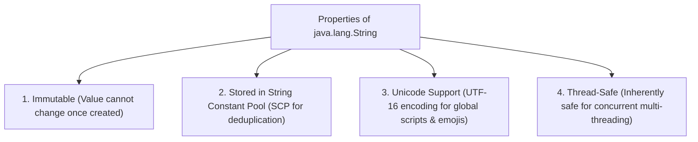
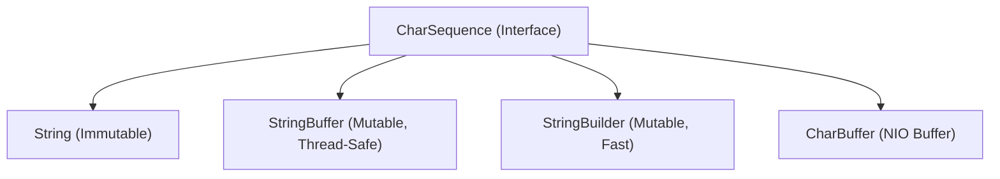

# 📖 String Class in Java (`java.lang.String`)

---

## 📌 1. Introduction

The **`String` class** in Java represents a sequence of characters enclosed within double quotes (`" "`).

It is present in the standard **`java.lang`** package and is automatically imported in every Java application.

```java
package java.lang;

public final class String extends Object 
    implements Serializable, Comparable<String>, CharSequence {
    // Fields
    // Constructors
    // Methods
}
```

Unlike primitive types, `String` in Java is an **object (reference type)**:
```java
int rollno = 101;       // Primitive data type (Stores raw value directly in stack)
String name = "Deepak"; // Reference type (Stores memory address pointing to object)
```

Strings are universally used to represent textual data in programming—such as displaying UI messages, storing usernames, addresses, emails, and transaction logs.

---

## 🛠️ 2. Methods of the `String` Class

Below is a reference of the most important and frequently used methods in the `String` class with examples and outputs:

| Method Signature | Description | Example Snippet | Expected Output |
| :--- | :--- | :--- | :--- |
| `length()` | Returns the number of characters in the string. | `String s = "Java";`<br/>`System.out.println(s.length());` | `4` |
| `charAt(int index)` | Returns the character at the specified 0-based index. | `String s = "Java";`<br/>`System.out.println(s.charAt(2));` | `v` |
| `substring(int begin, int end)` | Returns substring from `begin` (inclusive) to `end` (exclusive). | `String s = "Programming";`<br/>`System.out.println(s.substring(0, 6));` | `Progra` |
| `equals(Object obj)` | Compares two strings for exact character equality (case-sensitive). | `String s1 = "Java"; String s2 = "Java";`<br/>`System.out.println(s1.equals(s2));` | `true` |
| `equalsIgnoreCase(String str)` | Compares two strings ignoring case differences. | `String s1 = "java"; String s2 = "JAVA";`<br/>`System.out.println(s1.equalsIgnoreCase(s2));` | `true` |
| `toUpperCase()` | Converts all characters to uppercase. | `String s = "hello";`<br/>`System.out.println(s.toUpperCase());` | `HELLO` |
| `toLowerCase()` | Converts all characters to lowercase. | `String s = "HELLO";`<br/>`System.out.println(s.toLowerCase());` | `hello` |
| `trim()` | Removes leading and trailing whitespaces. | `String s = " Java ";`<br/>`System.out.println(s.trim());` | `Java` |
| `concat(String str)` | Concatenates (joins) two strings. | `String s1 = "Hello"; String s2 = "World";`<br/>`System.out.println(s1.concat(" " + s2));` | `Hello World` |
| `replace(char old, char new)` | Replaces all occurrences of a character with another. | `String s = "Java";`<br/>`System.out.println(s.replace('a', 'o'));` | `Jovo` |
| `contains(CharSequence s)` | Checks if string contains a sequence of characters. | `String s = "Programming";`<br/>`System.out.println(s.contains("gram"));` | `true` |
| `compareTo(String another)` | Compares strings lexicographically (alphabetical order). | `String s1 = "Apple"; String s2 = "Banana";`<br/>`System.out.println(s1.compareTo(s2));` | `-1` (`"Apple" < "Banana"`) |
| `intern()` | Returns canonical representation from String Constant Pool (SCP). | `String s1 = new String("Hello");`<br/>`String s2 = s1.intern(); String s3 = "Hello";`<br/>`System.out.println(s1 == s2);`<br/>`System.out.println(s2 == s3);` | `false`<br/>`true` |

---

## 🏗️ 3. Different Ways to Create a String Object in Java

### 1️⃣ Using String Literals (Recommended)
This is the most common and memory-efficient way to create strings in Java.
```java
String s1 = "Hello";
String s2 = "Hello"; // s1 and s2 point to the SAME object in SCP!
```
- In this case, the JVM stores the string object in the **String Constant Pool (SCP)**.
- If the literal already exists, it reuses the pooled object instead of creating duplicate memory allocations.

---

### 2️⃣ Using the `new` Keyword
```java
String s3 = new String("Hello"); // Created in Heap memory
```
- A new `String` object is allocated directly in normal **Heap memory**, even if the same string literal value already exists in the String Constant Pool.

---

## 💎 4. Core Properties of the `String` Class



1. **Immutable**: Once a `String` object is created in memory, its value cannot be changed. Any modification operation creates a fresh new String object.
2. **Stored in String Constant Pool (SCP)**: String literals are cached in the SCP within Heap memory to avoid redundant object instantiation.
3. **Unicode Support**: Strings store text as UTF-16 encoded Unicode characters, supporting languages like Hindi (`"नमस्ते"`), Japanese, and emojis (`"😊"`).
4. **Thread-Safe**: Because String objects are immutable, multiple threads can access them concurrently without synchronization locks or race conditions.

---

## 🔒 5. Why is the `String` Class `final`? (6 Major Reasons)

The `String` class is declared as **`public final class String`**. Here are the 6 architectural reasons:

1. **🛡️ Immutability Guarantee**: Making `String` final ensures that subclasses cannot override methods (like `.substring()` or `.length()`) to introduce mutable behavior.
2. **🔐 Security Reasons**: Strings hold sensitive system data—passwords, usernames, database URLs (`jdbc:mysql://...`), network socket ports, and file paths. If `String` were not final, a malicious subclass could override `.equals()` or bypass access checks.
3. **⚡ Thread-Safety**: Since String objects cannot be modified by subclasses, they remain 100% thread-safe across all JVM threads.
4. **🏎️ Performance Optimization**: The String Constant Pool (SCP) depends entirely on String being immutable. If String were mutable, changing a pooled string would break all other variables referencing it.
5. **🗄️ Hashcode Caching**: `String` caches its `hashCode` after the first calculation. This is only safe because strings are immutable, enabling $O(1)$ lookups in `HashMap` and `HashSet`.
6. **🌐 Consistency Across JVM**: Because `String` is deeply embedded in class loading, bytecode verification, and reflection, declaring it `final` guarantees predictable behavior across all JVM implementations.

---

## 📜 6. The `CharSequence` Interface

`CharSequence` is a readable, read-only interface in `java.lang` that represents a uniform sequence of characters.



### Common `CharSequence` Methods:
- `length()` ➔ Returns number of characters.
- `charAt(int index)` ➔ Returns character at index.
- `subSequence(int start, int end)` ➔ Returns a subsequence.
- `toString()` ➔ Converts the sequence into a `String` object.

```java
CharSequence seq = "Deepak";
System.out.println(seq.length());           // 6
System.out.println(seq.charAt(0));           // 'D'
System.out.println(seq.subSequence(0, 4));   // "Deep"
System.out.println(seq.toString());          // "Deepak"
```

> [!NOTE]
> `CharSequence` allows methods (like `Pattern.matcher(CharSequence)`) to accept `String`, `StringBuilder`, and `StringBuffer` interchangeably without code duplication!

---

## ⚔️ 7. Quick Summary: `String` vs `StringBuffer` vs `StringBuilder`

| Class | Mutability | Thread-Safety | Speed / Performance |
| :--- | :--- | :--- | :--- |
| **`String`** | **Immutable** (Modification creates new object) | **Thread-Safe** (No locks needed) | Fast for static text; slow for loop concatenation |
| **`StringBuffer`** | **Mutable** (In-place buffer modification) | **Thread-Safe** (`synchronized` methods) | Moderate (overhead from lock acquisition) |
| **`StringBuilder`** | **Mutable** (In-place buffer modification) | **Not Thread-Safe** (Non-synchronized) | **Fastest** (Zero lock overhead for single threads) |
