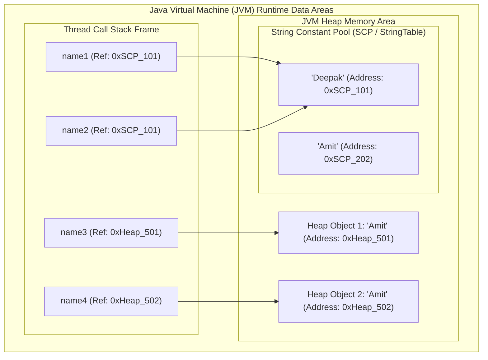
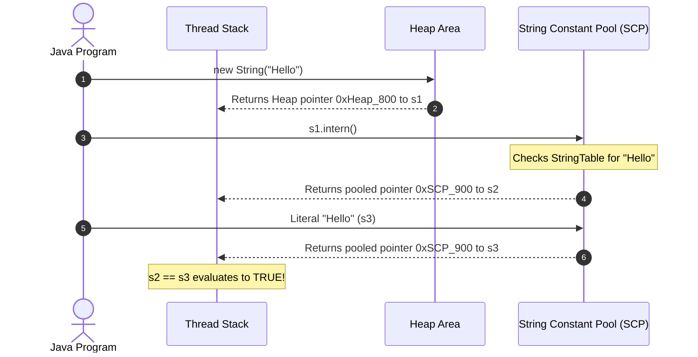

# Memory Management via String Constant Pool (SCP)

---

## 1. Introduction

Strings are the most heavily used data structure in almost all Java applications. In typical enterprise applications, studies show that **25% to 40% of the entire JVM Heap memory is occupied by String objects**. 

Because Strings are used so frequently (names, descriptions, database column values, JSON payloads, URLs, configurations), creating a new object in memory every time a string is declared would result in severe memory bloat, high Garbage Collection (GC) pauses, and degraded application performance.

To solve this problem, Java provides a special memory area called the **String Constant Pool (SCP)** (also known as the **String Literal Pool**). The primary objective of SCP is to **store string literals and reuse them**, preventing duplicate String objects from consuming valuable RAM.

In this comprehensive guide, we will explore:
1. What the String Constant Pool is and how it is organized inside the JVM.
2. The exact difference between String creation using literals versus the `new` keyword.
3. Detailed execution traces and memory pointers.
4. Why SCP is designed the way it is (naming, GC, performance, and immutability).
5. The `intern()` method and its real-world enterprise applications.
6. Common interview questions, tricky edge cases, and memory optimization rules.

---

## 2. What is String Constant Pool (SCP)?

The **String Constant Pool (SCP)** is a specialized memory region inside the **JVM Heap area** where Java stores string literals for maximum memory efficiency, instant reusability, and reduced allocation overhead.



### Architectural Evolution of SCP:
- **Java 6 and Earlier**: The SCP was placed inside the **PermGen (Permanent Generation)** space in the Method Area. PermGen had a fixed default size, did not easily expand, and was not cleaned aggressively by the Garbage Collector, frequently resulting in `java.lang.OutOfMemoryError: PermGen space`.
- **Java 7, 8, 11, 17, 21+**: Oracle and the OpenJDK team moved the String Constant Pool into the **Main JVM Heap**. This allows unreferenced pooled strings to be cleaned up by standard Garbage Collection when memory is tight and allows the pool to dynamically resize with the Heap.

### Internal Data Structure of SCP:
Inside the HotSpot JVM, the SCP is implemented as a native C++ hash table called **`StringTable`**. When the JVM encounters a string literal, it computes its hash code and searches the `StringTable`:
- If an identical string exists, it immediately returns the pointer to that object.
- If it does not exist, a new String object is allocated in the pool and registered in the `StringTable`.

---

## 3. Two Ways to Create String Objects in Java

In Java, there are two common ways to create String objects, and their memory allocation behaviors differ significantly:

```
+------------------------------------------------------------------------------------+
|  Method 1: Using String Literals              Method 2: Using the 'new' Keyword    |
|  String s = "Deepak";                         String s = new String("Amit");       |
|  -> Allocated directly in SCP                 -> Allocated in regular Heap         |
|  -> Fully reused by JVM                       -> Brand new object on every call    |
|  -> 0 or 1 object created                     -> 1 or 2 objects created            |
+------------------------------------------------------------------------------------+
```

---

### Method 1: Using String Literals

#### Example:
```java
String name = "Deepak";
```

#### How it works step-by-step:
1. The JVM compiles the literal `"Deepak"` into the class file's constant pool table using the bytecode instruction `ldc` (load constant).
2. At runtime, the JVM checks the String Constant Pool (SCP) to see if an object with the content `"Deepak"` already exists.
3. **If not present**: The JVM creates a new `String` object representing `"Deepak"` inside the SCP and returns its reference.
4. **If already present**: The JVM skips object creation and directly assigns the existing SCP object's memory address to the reference variable `name`.
5. The reference variable `name` resides on the **Thread Call Stack** and holds a 64-bit reference address pointing directly into the SCP.

---

### Method 2: Using the `new` Keyword

#### Example:
```java
String name = new String("Amit");
```

#### How it works step-by-step:
1. The `new` keyword instructs the JVM to allocate a **brand new `String` object in the standard Heap area** (outside the SCP), regardless of whether `"Amit"` already exists in memory.
2. At the same time, the constructor parameter `"Amit"` is a string literal. Therefore, the JVM checks the String Constant Pool (SCP) for `"Amit"`:
   - If `"Amit"` does not already exist in the SCP, a literal copy is created in the SCP.
   - If `"Amit"` already exists in the SCP, it is reused for the literal lookup.
3. **Crucial Rule**: The reference variable `name` in the Stack points to the **Heap object**, **NOT** the SCP object.
4. **Total Objects Created**:
   - **2 objects** if `"Amit"` was not previously present in the SCP (1 in Heap + 1 in SCP).
   - **1 object** if `"Amit"` was already present in the SCP (1 in Heap only).

---

## 4. Comprehensive Trace Analysis: The Deepak & Amit Scenario

Let us analyze the exact memory execution step-by-step for the following 4 statements:

```java
String name1 = "Deepak";
String name2 = "Deepak";
String name3 = new String("Amit");
String name4 = new String("Amit");
```

---

### Statement 1: `String name1 = "Deepak";`
- **Action**: JVM checks SCP for `"Deepak"`. It is not found.
- **Allocation**: A new object with content `"Deepak"` is allocated in SCP at memory address `0xSCP_101`.
- **Reference**: Variable `name1` in the Stack points to `0xSCP_101`.
- **Objects Created**: **1 object** (in SCP).

---

### Statement 2: `String name2 = "Deepak";`
- **Action**: JVM checks SCP for `"Deepak"`. It is found at address `0xSCP_101`.
- **Allocation**: **No new object is created**. The JVM reuses the existing object.
- **Reference**: Variable `name2` in the Stack points to the same address `0xSCP_101`.
- **Objects Created**: **0 objects**.
- **Result**: `name1 == name2` evaluates to **`true`** because both references hold the identical memory address `0xSCP_101`.

---

### Statement 3: `String name3 = new String("Amit");`
- **Action**: 
  1. The `new` operator creates a new object in the standard Heap at address `0xHeap_501`.
  2. The literal `"Amit"` is checked in SCP. Since `"Amit"` does not exist in SCP, it is created at address `0xSCP_202`.
- **Reference**: Variable `name3` in the Stack points to the Heap object `0xHeap_501`.
- **Objects Created**: **2 objects** (1 in Heap at `0xHeap_501`, 1 in SCP at `0xSCP_202`).

---

### Statement 4: `String name4 = new String("Amit");`
- **Action**: 
  1. The `new` operator creates another distinct object in the standard Heap at address `0xHeap_502`.
  2. The literal `"Amit"` is checked in SCP. It already exists at address `0xSCP_202`, so no new SCP object is created.
- **Reference**: Variable `name4` in the Stack points to the new Heap object `0xHeap_502`.
- **Objects Created**: **1 object** (in Heap at `0xHeap_502`).
- **Result**: 
  - `name3 == name4` evaluates to **`false`** (because `0xHeap_501 != 0xHeap_502`).
  - `name3.equals(name4)` evaluates to **`true`** (because both contain the exact characters `{'A','m','i','t'}`).

---

### Memory Allocation Summary Table:

| Variable | Creation Syntax | Reference Points To | Memory Address | Location | Object Count in Step |
| :--- | :--- | :--- | :--- | :--- | :--- |
| `name1` | Literal (`"Deepak"`) | SCP Object | `0xSCP_101` | String Constant Pool | 1 (in SCP) |
| `name2` | Literal (`"Deepak"`) | SCP Object (Reused) | `0xSCP_101` | String Constant Pool | 0 (Reused) |
| `name3` | `new String("Amit")` | Heap Object 1 | `0xHeap_501` | Heap RAM (outside SCP) | 2 (1 Heap + 1 SCP) |
| `name4` | `new String("Amit")` | Heap Object 2 | `0xHeap_502` | Heap RAM (outside SCP) | 1 (1 Heap only) |

---

## 5. Key Points About String Constant Pool (SCP)

### 1. How it gets its name?
The term **"Constant Pool"** is used because it stores string constants (immutable literals). Whenever you write a literal like `String s = "Java";`, the value `"Java"` is a compile-time constant that cannot change at runtime. Hence, it is safely stored in this centralized constant pool.

### 2. Memory Location & JVM Separation
SCP is physically located inside the Heap area, but it is **managed separately by the JVM subsystem**. The JVM maintains a distinct native hash index (`StringTable`) for the pool, ensuring that duplicate literals can never be stored twice within the same pool.

### 3. Reusability
If hundreds of variables, methods, or classes in your application refer to the literal `"SUCCESS"`, all of them share one single object in the SCP.
```java
String s1 = "Hello";
String s2 = "Hello";
System.out.println(s1 == s2); // true (Points to same memory block)
```

### 4. Objects Created Using `new` Keyword
When we use `new`, we explicitly tell the JVM: *"Allocate a brand new instance on the Heap"*. The JVM bypasses SCP reuse for the reference variable:
```java
String s1 = new String("World");
String s2 = new String("World");
System.out.println(s1 == s2); // false (Different addresses in Heap)
```

### 5. Garbage Collection in SCP
In regular Heap memory, objects are immediately eligible for Garbage Collection as soon as they lose all active references.

Objects inside the String Constant Pool (SCP) are treated specially:
- Even if no active reference variable is pointing to a pooled string literal, the literal is **not garbage collected immediately**.
- It remains cached in the `StringTable` pool so that any future execution can instantly reuse it.
- In modern JVMs (Java 7+), if Heap memory pressure becomes critically high, unreferenced SCP strings can be garbage collected, but under normal conditions they persist throughout the JVM lifecycle.

### 6. Performance Benefits
1. **Reduced Memory Footprint**: Eliminates millions of duplicate string instances across large applications.
2. **Faster String Comparisons**: When strings are pooled or interned, they can be compared using the ultra-fast `==` reference operator (single CPU instruction) rather than looping through characters with `.equals()`.
3. **Better CPU Cache Locality**: Sharing common objects improves L1/L2 CPU cache hit rates.

---

## 6. The `intern()` Method in Depth

The `intern()` method is a native method provided in `java.lang.String` designed for manual memory optimization:

```java
public native String intern();
```

### Purpose:
It ensures that only **one canonical copy** of each distinct string exists in the JVM's String Constant Pool (SCP).

---

### How `intern()` Works Step-by-Step:

```java
String s1 = new String("Hello"); // Created in Heap (e.g. 0xHeap_800)
String s2 = s1.intern();          // Retrieves canonical SCP reference (0xSCP_900)
String s3 = "Hello";              // Literal pointing directly to 0xSCP_900

System.out.println(s1 == s2); // false (0xHeap_800 != 0xSCP_900)
System.out.println(s2 == s3); // true  (Both point to 0xSCP_900 in SCP)
```



---

### Rules Governing `intern()`:

1. **If the string already exists in the SCP**:
   - `intern()` returns the memory address of the already existing pooled string object.
2. **If the string does not exist in the SCP**:
   - The string is added to the String Constant Pool, and its reference is returned.

---

### Why does `intern()` work safely?

The `intern()` method is safe **only because String objects in Java are immutable**. 

Because a String cannot be modified after creation, hundreds of distinct threads or subsystems can safely read and share the exact same SCP object without the risk of one thread mutating the string and corrupting data for other threads.

> [!NOTE]
> Mutable objects (like `StringBuffer`, `StringBuilder`, or custom classes) cannot be pooled in this way, because modifying one instance would accidentally change the value for every reference sharing that object.

---

## 7. String Immutability and Memory Optimization

### Why are Strings Immutable in Java?

```
+--------------------------------------------------------------------------------------+
|                               Why String is Immutable                                |
+--------------------------------------------------------------------------------------+
|  1. String Constant Pool (SCP) : Enables memory sharing without risk of mutation.    |
|  2. Thread Safety              : Read-only access prevents race conditions.          |
|  3. Security                   : Safe for storing passwords, file paths, and URLs.   |
|  4. HashCode Caching           : Hash is computed once and cached for fast HashMap.  |
+--------------------------------------------------------------------------------------+
```

1. **Enabling the String Constant Pool**: If Strings were mutable, if `name1` changed `"Deepak"` to `"Rahul"`, `name2` (which points to the same object) would automatically change to `"Rahul"` as well! Immutability guarantees that sharing memory never causes unexpected side effects.
2. **Caching HashCodes**: The `hashCode()` of a String is computed once upon first call and cached in a private field (`private int hash;`). This makes Strings extremely fast when used as keys in `HashMap` and `HashSet`.

---

## 8. Complete Comparison Matrix

| Comparison Dimension | String Literal (`"Deepak"`) | `new String("Amit")` | `s.intern()` |
| :--- | :--- | :--- | :--- |
| **Primary Memory Location** | String Constant Pool (SCP) inside Heap | Standard Heap RAM (outside SCP) | String Constant Pool (SCP) |
| **Objects Created (If Absent in SCP)** | 1 object (in SCP) | 2 objects (1 Heap + 1 SCP) | 1 object (added to SCP) |
| **Objects Created (If Present in SCP)** | 0 objects (reused from SCP) | 1 object (in Heap only) | 0 objects (pooled reference returned) |
| **Stack Reference Points To** | Directly to SCP object | Heap object | Directly to SCP object |
| **Reference Equality (`==`)** | `true` for identical literals | `false` across separate `new` instances | `true` when compared with SCP literal |
| **Garbage Collection Behavior** | Cached in pool across JVM runtime | Collected when dereferenced | Managed by SCP retention rules |
| **Recommended Usage** | **Default choice** for all literals | Rare (only when explicit Heap isolation needed) | High-volume deduplication of runtime strings |

---

## 9. Common Traps, Edge Cases & Interview Questions

### Trap 1: Compile-Time Constant Folding
```java
String s1 = "Hello" + "World";
String s2 = "HelloWorld";
System.out.println(s1 == s2); // true
```
**Explanation**: The Java compiler evaluates constant expressions (`"Hello" + "World"`) at **compile time** and stores the combined literal `"HelloWorld"` directly into the bytecode constant pool. Therefore, `s1` and `s2` point to the exact same SCP object.

---

### Trap 2: Runtime String Concatenation
```java
String a = "Hello";
String s1 = a + "World"; // Dynamic runtime concatenation
String s2 = "HelloWorld";
System.out.println(s1 == s2); // false
```
**Explanation**: Because variable `a` is evaluated at **runtime**, the JVM uses `StringBuilder.append()` (or `StringConcatFactory` in Java 9+) which calls `new String()`, allocating a new object on the Heap outside the SCP.

---

### Trap 3: Final Variable Constant Folding
```java
final String a = "Hello";
String s1 = a + "World";
String s2 = "HelloWorld";
System.out.println(s1 == s2); // true
```
**Explanation**: Because `a` is marked `final`, the compiler knows its value can never change, so it performs compile-time constant folding just like Trap 1!

---

### Interview FAQ Quick Reference:

1. **How many objects are created by `String s = new String("Java");`?**
   - **Answer**: If `"Java"` is not already present in the SCP, **2 objects** are created (1 in Heap, 1 in SCP). If `"Java"` is already present in the SCP, **1 object** is created (in Heap).
2. **Does Garbage Collection apply to SCP?**
   - **Answer**: Yes. In modern Java (Java 7+), SCP is inside the Heap and unreferenced strings can be collected during GC cycles, although the JVM retains literals as long as possible to maximize reuse.
3. **What is the difference between `==` and `.equals()` for Strings?**
   - **Answer**: `==` tests **reference identity** (whether both variables point to the exact same memory address). `.equals()` tests **value equality** (whether both strings contain the exact same sequence of characters).

---

## 10. Best Practice Guidelines

> [!TIP]
> **Core Memory Best Practices:**
> 1. **Always use string literals** instead of `new String()` unless you have an explicit requirement for distinct Heap references.
> 2. **Use `.equals()` or `Objects.equals()`** for logical content comparison; never rely on `==` unless strings are guaranteed to be interned.
> 3. **Use `intern()` selectively** when processing millions of duplicate strings from external data sources (e.g. state codes, country codes, currency symbols) to save hundreds of megabytes of Heap memory.
> 4. **Avoid `+` concatenation inside loops**; use `StringBuilder` to prevent creating hundreds of temporary intermediate String objects in the Heap.
