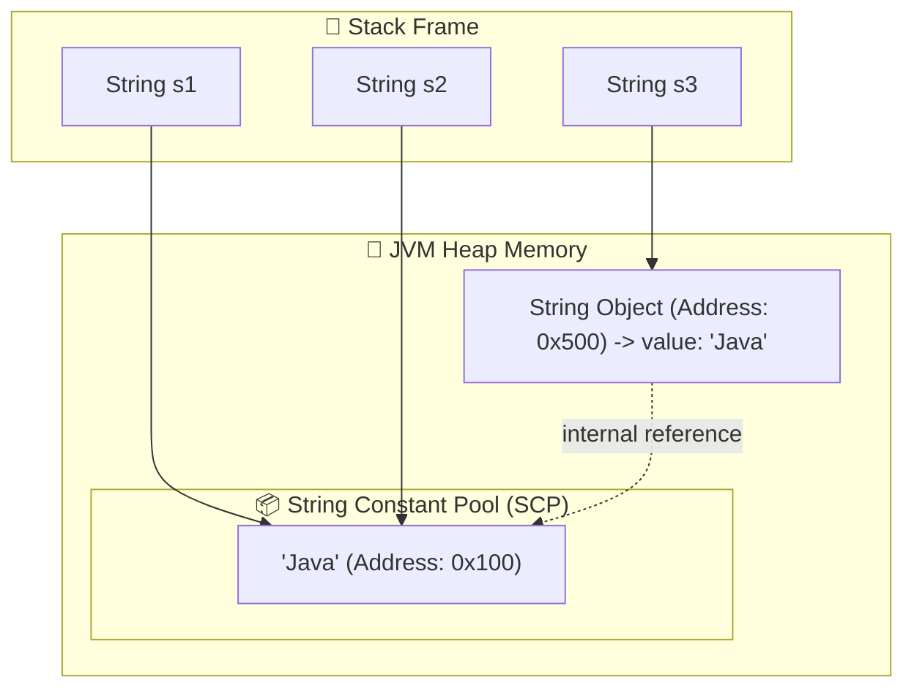
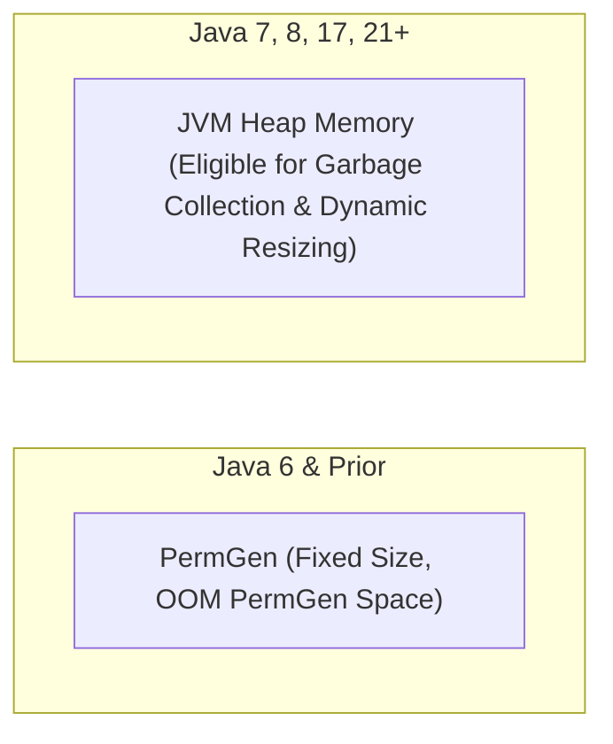

# 🧠 String Memory Management & String Constant Pool (SCP)

---

## 📌 1. What is the String Constant Pool (SCP)?

The **String Constant Pool (SCP)**, also known as the **String Intern Pool**, is a dedicated memory region inside the **JVM Heap memory** designed specifically to optimize memory usage by caching unique String literal instances.



---

## ⚡ 2. How Java Allocates Strings in Memory

### Scenario A: String Literals (`String s = "Hello"`)
1. The JVM checks the SCP hashtable (`StringTable`) for `"Hello"`.
2. **If present**: The JVM returns the memory address of the existing SCP object.
3. **If absent**: The JVM creates a new String object inside the SCP and stores its reference.
4. **Result**: Maximum memory reuse. 1000 variables holding `"Hello"` point to a **single object** in memory.

---

### Scenario B: The `new` Keyword (`String s = new String("Hello")`)
1. The `new` operator **forces** the JVM to create a brand new `String` object in normal **Heap RAM** (outside SCP).
2. The literal parameter `"Hello"` ensures an object also exists inside the **SCP**.
3. **Total Objects Created**: **2 objects** (1 in Heap, 1 in SCP if not previously created).

---

## 🔍 3. The `intern()` Method

The `public native String intern()` method in `java.lang.String` allows manual pooling of Heap strings:
- When invoked on a String object, if the SCP already contains a string equal to this `String` object (determined by `.equals()`), the reference from the pool is returned.
- Otherwise, this `String` object is added to the pool and a reference to this `String` object is returned.

```java
String nonPool = new String("Spring"); // Heap object (e.g. 0x888)
String pooled = nonPool.intern();      // Fetches SCP reference (e.g. 0x111)

String literal = "Spring";             // Already in SCP (0x111)

System.out.println(nonPool == literal); // false (Heap vs SCP)
System.out.println(pooled == literal);  // true (Both point to 0x111 in SCP!)
```

---

## 📜 4. Evolution of SCP in JVM Architecture



1. **Java 6 and earlier**: SCP was located in **PermGen (Permanent Generation)** memory. PermGen had a fixed default size and was prone to `java.lang.OutOfMemoryError: PermGen space`.
2. **Java 7 to Java 21+**: Oracle moved the SCP directly into the **Main Heap Memory**.
   - **Advantage**: Strings in SCP can now be cleaned up by the **Garbage Collector (GC)** when no longer referenced, completely eliminating PermGen OOM errors!

---

## 💡 5. Best Practice Rule

> [!TIP]
> **Always prefer String Literals over `new String()`**
> `String s = "text";` saves memory by utilizing the String Constant Pool. `String s = new String("text");` creates unnecessary duplicate objects on the Heap.
