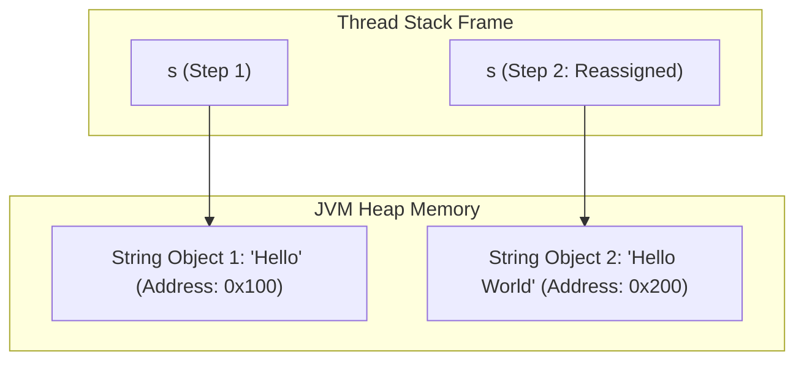
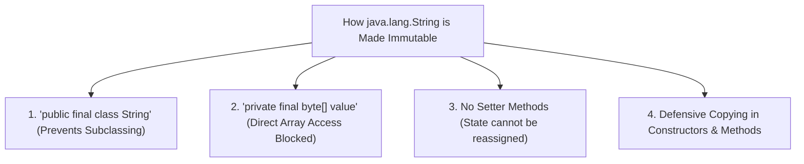

# Immutable Strings in Java

---

## 1. What Does "Immutability" Mean?

In object-oriented programming, an object is defined as **immutable** if its state (the internal data stored inside its fields) **cannot be modified** after the object has been created and initialized.

In Java, the `java.lang.String` class is **strictly immutable**. When you invoke any method that appears to modify a `String` (such as `.concat()`, `.toUpperCase()`, `.replace()`, or `.trim()`), the original `String` object in memory remains 100% untouched. Instead, the JVM creates and returns a **brand new `String` object** containing the modified character sequence.

```java
public class ImmutabilityTest {
    public static void main(String[] args) {
        String s = "Hello";
        s.concat(" World"); // Modifying without reassigning reference

        System.out.println(s); // Output: "Hello" (Original is unchanged!)

        // To capture the new data, you must explicitly store the returned reference:
        s = s.concat(" World");
        System.out.println(s); // Output: "Hello World" (s now points to the new object)
    }
}
```



---

## 2. How Java Internally Implements Immutability

How does the Java runtime enforce that no programmer, library, or subclass can ever mutate a `String`? The JVM uses four core language-level mechanisms:



### 1. `final` Class Declaration
```java
public final class String implements java.io.Serializable, Comparable<String>, CharSequence { ... }
```
The `final` keyword prevents any other class from extending `String`. If inheritance were allowed, a malicious subclass could override methods like `charAt()` or `length()` or add mutable state to subvert security.

### 2. `private final` Internal Buffer
```java
private final byte[] value; // In Java 9+ (Compact Strings)
private final byte coder;   // 0 for Latin-1 (1 byte/char), 1 for UTF-16 (2 bytes/char)
```
The internal data array `value` is marked `private` (inaccessible from outside the class) and `final` (the array reference cannot be reassigned once set by the constructor).

### 3. Absolute Absence of Setter Methods
`String` provides dozens of inspection methods (`length()`, `charAt()`, `indexOf()`, `codePointAt()`), but **zero setter methods** (such as `setCharAt()` or `setValue()`).

### 4. Defensive Copying
Whenever a constructor receives an array or a method returns an array (such as `.toCharArray()`), a **defensive clone** of the array is created. This ensures the caller cannot modify the internal character buffer by mutating the passed array reference.

---

## 3. The 4 Fundamental Reasons Why Strings Are Immutable in Java

Why did James Gosling and the Java language designers make `String` immutable? There are four major architectural reasons:

---

### Reason 1: String Constant Pool (SCP) Efficiency
The String Constant Pool (SCP) allows multiple reference variables across your application to share the exact same literal instance in Heap memory:

```java
String user1City = "New York";
String user2City = "New York"; // Reuses the exact same 0xSCP object
```

**What would happen if Strings were mutable?**
If `user1City` changed its value to `"Los Angeles"`, `user2City` (which points to the same object) would silently and unpredictably change to `"Los Angeles"` as well! 

Immutability ensures that sharing references is completely safe and free from accidental side effects.

---

### Reason 2: System Security and Integrity
Strings are universally used to hold critical system parameters:
- Database Connection URLs, usernames, and passwords (`jdbc:mysql://localhost:3306/prod_db`).
- Network socket hostnames, port numbers, and authentication tokens.
- File system paths and security policy descriptors.
- ClassLoader bytecode names (`java.lang.Object`).

**Preventing Time-of-Check to Time-of-Use (TOCTOU) Exploits:**
Consider a security check method:
```java
public void openSecureFile(String path) {
    if (securityManager.isAccessAllowed(path)) {
        // If path were mutable, an attacker in another thread could modify 'path'
        // right here (between verification and file opening) to access '/etc/passwd'!
        fileSystem.open(path);
    }
}
```
Because `String` is immutable, the verified `path` cannot be altered between the check and the use.

---

### Reason 3: 100% Thread Safety (Concurrency without Synchronization)
In multi-threaded and distributed systems, concurrent access to mutable objects requires expensive locking (`synchronized` blocks, `ReentrantLock`, or atomic wrappers) to prevent race conditions and dirty reads.

Because `String` objects can never change their internal state:
- Multiple threads can read and share String instances simultaneously with zero synchronization overhead.
- Eliminates race conditions, data races, and deadlocks when passing strings across thread pools.

---

### Reason 4: HashCode Caching for High-Performance Collections
`String` is the most popular key type for `HashMap`, `HashSet`, and `Hashtable`.

```java
public final class String {
    private int hash; // Cached hash code (defaults to 0)

    public int hashCode() {
        int h = hash;
        if (h == 0 && !isEmpty()) {
            h = isLatin1() ? StringLatin1.hashCode(value)
                           : StringUTF16.hashCode(value);
            hash = h; // Cache for all future calls!
        }
        return h;
    }
}
```

- When `hashCode()` is called for the first time, Java computes the 32-bit hash value and stores it in the `private int hash;` instance field.
- For all subsequent calls, `hashCode()` immediately returns the cached `hash` field without recalculating it ($O(1)$ constant time).
- If strings were mutable, altering the characters would change the hash code, causing the string key to get lost in a `HashMap` bucket and making retrieval impossible.

---

## 4. How to Create a Custom Immutable Class in Java

Enterprise interviewers frequently ask how to create your own custom immutable class following the exact patterns used by `java.lang.String`.

### The 5 Golden Rules of Immutability:

1. **Declare the class as `final`** so it cannot be subclassed.
2. **Make all fields `private` and `final`** so they cannot be accessed or reassigned directly.
3. **Do not provide any setter methods** or state-mutating methods.
4. **Initialize all fields via the constructor** performing deep/defensive copies of any mutable arguments.
5. **Return defensive copies in getter methods** if any internal field is a mutable object (e.g. `java.util.Date`, `List`, or `int[]`).

```java
import java.util.Collections;
import java.util.List;
import java.util.ArrayList;

public final class ImmutableEmployee {
    private final int id;
    private final String name;
    private final List<String> skills;

    public ImmutableEmployee(int id, String name, List<String> skills) {
        this.id = id;
        this.name = name;
        // Defensive copy of incoming mutable list:
        this.skills = new ArrayList<>(skills);
    }

    public int getId() {
        return id;
    }

    public String getName() {
        return name;
    }

    public List<String> getSkills() {
        // Return unmodifiable wrapper or defensive copy:
        return Collections.unmodifiableList(skills);
    }
}
```

---

## 5. Summary Table

| Aspect | Mutable Objects (`StringBuilder`, `Date`, etc.) | Immutable Objects (`String`, `Integer`, `LocalDate`) |
| :--- | :--- | :--- |
| **Modification Mechanism** | Alters internal buffer in-place | Creates and returns a new object |
| **Thread Safety** | Requires explicit synchronization | **100% thread-safe by default** |
| **Memory Pooling** | Cannot be safely pooled | **Safely shared in String Constant Pool (SCP)** |
| **HashMap Key Safety** | Risky (hash code changes if state changes) | **Ideal (hash code is permanent and cached)** |
| **Security Risk** | Vulnerable to TOCTOU attacks | **Completely immune to state alteration attacks** |
