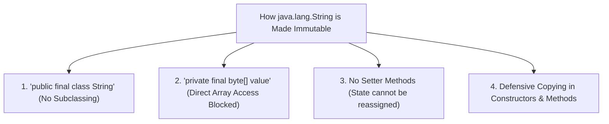

# 🛡️ Immutable Strings in Java

---

## 📌 1. What Does "Immutability" Mean?

In Java, an object is **immutable** if its internal state **cannot be modified** after it is created and initialized in Heap memory.

When you perform an operation that appears to alter a `String` (e.g. `.concat()`, `.toUpperCase()`, or `.replace()`), the JVM **never alters the existing String object**. Instead, it creates and returns a **brand new `String` object** containing the transformed data.

```java
String s = "Hello";
s.concat(" World");

System.out.println(s); // Prints "Hello" (NOT "Hello World"!)
```

---

## 🔒 2. How Java Achieves String Immutability



1. **`final` Class**: The class cannot be extended, preventing subclasses from overriding methods to introduce mutable behavior.
2. **`private final` Data Field**: The internal buffer (`private final byte[] value`) is marked `final` and `private`, blocking direct modification.
3. **No Setter Methods**: `String` provides getters like `.charAt()` and `.length()`, but zero setter methods.
4. **Defensive Copying**: Methods that return character arrays or transform text return cloned copies rather than exposing the internal reference.

---

## 🎯 3. Top 4 Reasons Why Strings Are Immutable in Java

### 1️⃣ String Constant Pool (SCP) Requirement
If strings were mutable, modifying a string through one reference would silently corrupt all other variables pointing to that same pool object!

```java
String user1City = "New York";
String user2City = "New York"; // Shares same SCP object

// If String were mutable:
// user1City.setValue("Los Angeles");
// user2City would unexpectedly change to "Los Angeles"!
```

---

### 2️⃣ Security in System Architecture
Strings are universally used to hold critical system parameters:
- Database Connection URLs and passwords (`jdbc:mysql://...`).
- Network Socket Hostnames and Port numbers.
- File system paths and security access tokens.
- ClassLoader bytecode targets.

If strings were mutable, an attacker could pass a valid file path to a security check method and then alter the string reference before the file is opened (Time-of-Check to Time-of-Use exploit).

---

### 3️⃣ 100% Thread Safety (Concurrency)
Because String objects can never change their state:
- Multiple threads can read and share String references simultaneously without requiring any synchronization locks (`synchronized` blocks or `ReentrantLock`).
- Eliminates race conditions, deadlocks, and dirty reads when passing strings between thread pools.

---

### 4️⃣ HashCode Caching for Super-Fast Collections
`String` is the most popular key type for `HashMap` and `HashSet`.
- `String` caches its computed `hashCode` in a `private int hash;` instance field.
- Because the characters can never change, the `hashCode` is calculated **only once** on first invocation and reused forever.
- This guarantees blazing-fast, deterministic $O(1)$ lookups in HashMaps!
