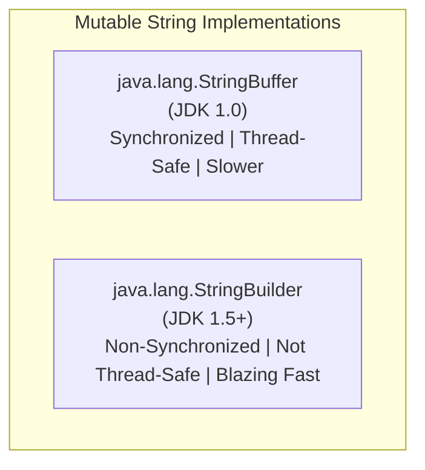

# StringBuilder Class in Java (`java.lang.StringBuilder`)

---

## 1. What is `StringBuilder`?

`java.lang.StringBuilder` is a **mutable**, **non-synchronized** (non-thread-safe) sequence of characters introduced in **Java 5 (JDK 1.5)**.

It provides an exact drop-in replacement for `StringBuffer` with the identical API (`append()`, `insert()`, `replace()`, `delete()`, `reverse()`), but **removes all `synchronized` method locks**.

Because it omits thread synchronization overhead, `StringBuilder` is **2x to 3x faster than `StringBuffer`** and is the industry-standard choice for text manipulation in single-threaded contexts (local methods, loops, stream operations).



---

## 2. Why Was `StringBuilder` Introduced in Java 5?

In real-world software development, **over 95% of string manipulation occurs locally within a single thread** (e.g. inside a single method execution frame).

In Java 1.0 through 1.4, developers were forced to use `StringBuffer` for all mutable string needs. Because every method in `StringBuffer` was `synchronized`, every single `append()` call wasted CPU cycles acquiring and releasing thread monitor locks that were never actually needed.

Java 5 introduced `StringBuilder` to eliminate this synchronization penalty entirely, maximizing single-threaded execution performance.

---

## 3. How the Java Compiler (`javac`) Uses `StringBuilder` Behind the Scenes

Whenever you use the `+` operator to concatenate strings in Java (from Java 5 to Java 8), the Java compiler automatically translates that code into a `StringBuilder` under the hood!

### Source Code:
```java
String firstName = "Deepak";
String lastName = "Panwar";
String fullName = "Mr. " + firstName + " " + lastName;
```

### Compiler Bytecode Translation:
```java
// Equivalent bytecode generated by javac:
String fullName = new StringBuilder()
                        .append("Mr. ")
                        .append(firstName)
                        .append(" ")
                        .append(lastName)
                        .toString();
```

---

### The Loop Trap: Why Manual `StringBuilder` is Still Essential!

While `javac` automatically optimizes simple single-line concatenations, it **cannot optimize loops**:

```java
// SEVERE PERFORMANCE ANTI-PATTERN:
String result = "";
for (int i = 0; i < 10000; i++) {
    result += i; // A brand new StringBuilder AND String object is allocated on EVERY iteration!
}
```

In the anti-pattern above, the loop creates **10,000 separate `StringBuilder` instances and 10,000 intermediate `String` instances**, generating massive Heap garbage and tanking performance.

### The Correct Enterprise Solution:
```java
// HIGH-PERFORMANCE SOLUTION:
StringBuilder sb = new StringBuilder(50000); // Pre-allocate estimated capacity
for (int i = 0; i < 10000; i++) {
    sb.append(i); // In-place append in the exact same buffer!
}
String result = sb.toString(); // Exactly 1 final String object created!
```

---

## 4. Constructors and Initial Capacities

| Constructor | Initial Capacity | Description |
| :--- | :--- | :--- |
| `new StringBuilder()` | **16 characters** | Default empty buffer with 16 capacity. |
| `new StringBuilder(int capacity)` | **Custom `capacity`** | Pre-allocates buffer of specified size to eliminate resizing. |
| `new StringBuilder(String str)` | **`str.length() + 16`** | Allocates input string length + 16 extra buffer slots. |
| `new StringBuilder(CharSequence seq)` | **`seq.length() + 16`** | Allocates sequence length + 16 extra slots. |

---

## 5. Capacity Growth Formula

Just like `StringBuffer`, when the buffer capacity is exceeded, `StringBuilder` expands automatically:

$$\text{New Capacity} = (\text{Old Capacity} \times 2) + 2$$

---

## 6. Comprehensive Method Catalog

| Method | Description | Code Example |
| :--- | :--- | :--- |
| `append(data)` | Appends any data type to the end | `sb.append(" Java");` |
| `insert(offset, data)` | Inserts data at specified 0-based index | `sb.insert(0, "Prefix: ");` |
| `replace(start, end, str)` | Replaces characters in range `[start, end)` | `sb.replace(0, 4, "Core");` |
| `delete(start, end)` | Deletes characters in range `[start, end)` | `sb.delete(5, 10);` |
| `deleteCharAt(index)` | Deletes single character at index | `sb.deleteCharAt(0);` |
| `reverse()` | Reverses the character sequence in-place | `sb.reverse();` |
| `charAt(index)` | Returns character at index | `char ch = sb.charAt(2);` |
| `setCharAt(index, ch)` | Updates character at index in-place | `sb.setCharAt(0, 'K');` |
| `substring(start, end)` | Extracts substring without mutating buffer | `String sub = sb.substring(0, 5);` |
| `capacity()` | Returns total allocated buffer size | `int cap = sb.capacity();` |
| `length()` | Returns current number of characters | `int len = sb.length();` |
| `trimToSize()` | Trims unused buffer capacity to match length | `sb.trimToSize();` |
| `toString()` | Converts to immutable `java.lang.String` | `String s = sb.toString();` |

---

## 7. Performance Benchmark Summary

Below is an indicative performance benchmark comparing the creation of 100,000 appends:

| Strategy | Execution Time | Heap Objects Created | Thread-Safe? |
| :--- | :--- | :--- | :--- |
| `String` with `+=` in loop | ~4,500 ms (Very Slow) | 100,000+ objects | Yes (Immutable) |
| `StringBuffer` in loop | ~12 ms (Fast) | 1 buffer object | Yes (Synchronized) |
| `StringBuilder` in loop | **~4 ms (Blazing Fast)** | **1 buffer object** | No (Single-threaded only) |
