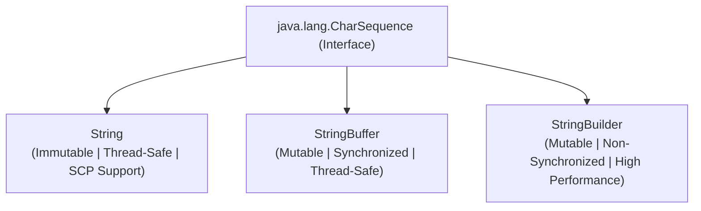
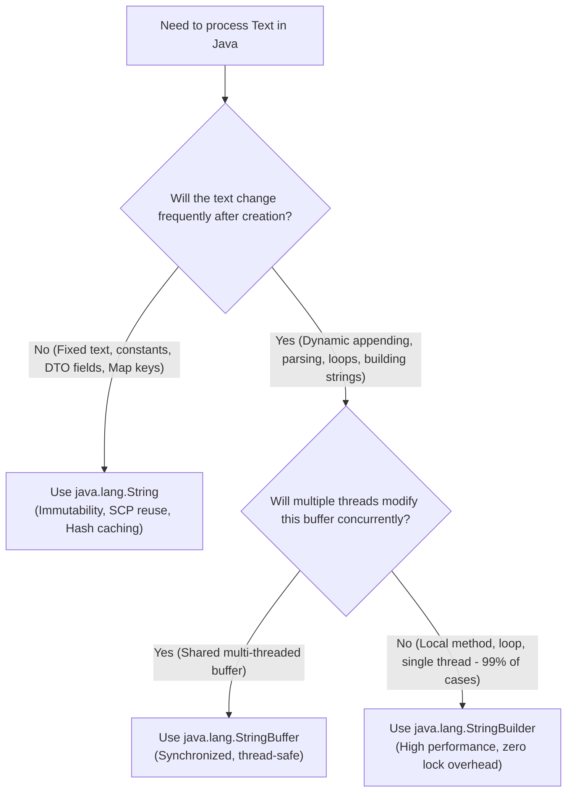

# String vs StringBuffer vs StringBuilder

---

## 1. Executive Summary & Architectural Overview

In Java, text processing is handled through three primary classes belonging to the `java.lang` package:
1. **`java.lang.String`** (Introduced in JDK 1.0)
2. **`java.lang.StringBuffer`** (Introduced in JDK 1.0)
3. **`java.lang.StringBuilder`** (Introduced in JDK 1.5)

While all three implement the common **`CharSequence`** interface, their internal memory layout, synchronization mechanics, and mutability guarantees differ fundamentally.



---

## 2. Comprehensive 10-Point Comparison Matrix

| Feature / Metric | `String` | `StringBuffer` | `StringBuilder` |
| :--- | :--- | :--- | :--- |
| **JDK Version Introduced** | JDK 1.0 (1996) | JDK 1.0 (1996) | JDK 1.5 (2004) |
| **Mutability** | **Strictly Immutable** (Cannot be modified after creation) | **Mutable** (Modifications occur in-place) | **Mutable** (Modifications occur in-place) |
| **Thread Safety** | **100% Thread-Safe** (Read-only data cannot cause race conditions) | **Thread-Safe** (All mutating methods are `synchronized`) | **Not Thread-Safe** (No synchronization locks) |
| **Execution Speed** | Moderate for reads; Slow for iterative concatenation (`+=`) | Moderate (Overhead of acquiring/releasing locks) | **Fastest** (Zero locking overhead, ~2x–3x faster than StringBuffer) |
| **Storage Location** | String Constant Pool (SCP) or Heap | Heap Memory (Outside SCP) | Heap Memory (Outside SCP) |
| **`equals()` Method Behavior** | Overridden to compare **character content** | Inherits `Object.equals()` (Compares **memory addresses**) | Inherits `Object.equals()` (Compares **memory addresses**) |
| **`hashCode()` Caching** | Cached in `private int hash;` field ($O(1)$) | Not cached | Not cached |
| **HashMap Key Suitability** | **Ideal key** (Deterministic, permanent hash) | **Dangerous** (Hash changes upon mutation) | **Dangerous** (Hash changes upon mutation) |
| **Memory Efficiency** | High for literals (SCP reuse); Poor for loops | High (Single expandable buffer) | High (Single expandable buffer) |
| **Primary Use Case** | Constants, entity fields, keys, configs, APIs | Multi-threaded shared text buffers (rare) | Local text formatting, loops, SQL builders |

---

## 3. The `equals()` Method Trap

A very common interview pitfall is comparing `StringBuffer` or `StringBuilder` instances using `.equals()`:

```java
public class EqualsComparisonTrap {
    public static void main(String[] args) {
        // String overrides equals() for content comparison:
        String s1 = new String("Java");
        String s2 = new String("Java");
        System.out.println(s1.equals(s2)); // TRUE (Compares character sequences)

        // StringBuffer does NOT override equals()!
        StringBuffer sb1 = new StringBuffer("Java");
        StringBuffer sb2 = new StringBuffer("Java");
        System.out.println(sb1.equals(sb2)); // FALSE! (Compares reference addresses: sb1 == sb2)

        // StringBuilder also does NOT override equals()!
        StringBuilder sbd1 = new StringBuilder("Java");
        StringBuilder sbd2 = new StringBuilder("Java");
        System.out.println(sbd1.equals(sbd2)); // FALSE! (Compares reference addresses: sbd1 == sbd2)

        // Correct way to compare content in StringBuffer/StringBuilder:
        System.out.println(sb1.toString().equals(sb2.toString())); // TRUE
        System.out.println(sb1.compareTo(sb2) == 0);               // TRUE (Java 11+)
    }
}
```

---

## 4. Architectural Decision Flowchart: Which One Should You Use?



---

## 5. Summary Rules for Clean Code

1. **Default to `String`** for standard variables, method parameters, return types, model attributes, and Map keys.
2. **Use `StringBuilder`** inside methods, loops, algorithm implementations, and dynamic SQL/JSON generators.
3. **Use `StringBuffer`** only when a single buffer is passed across multiple concurrent worker threads that mutate it without external synchronization.
