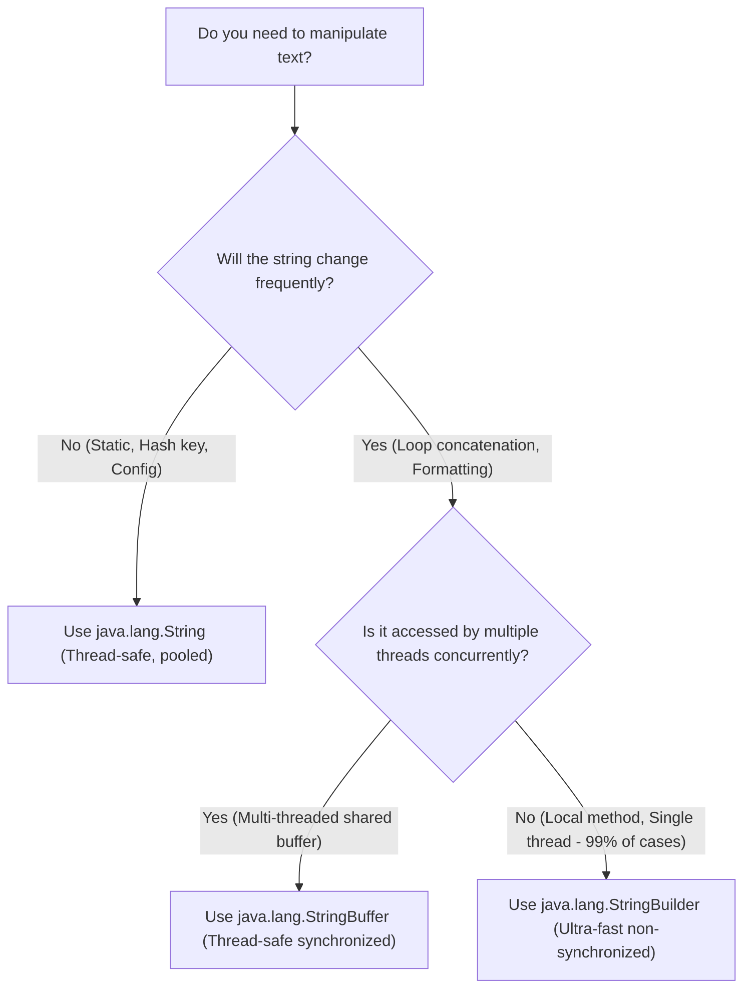

# ⚔️ String VS StringBuffer VS StringBuilder

---

## 📊 1. Master Architectural Comparison Matrix

| Feature | `java.lang.String` | `java.lang.StringBuffer` | `java.lang.StringBuilder` |
| :--- | :--- | :--- | :--- |
| **Introduced In** | Java 1.0 | Java 1.0 | Java 5.0 |
| **Mutability** | **Immutable** (Cannot be changed) | **Mutable** (In-place modification) | **Mutable** (In-place modification) |
| **Thread Safety** | **100% Thread-Safe** (Shared safely) | **Thread-Safe** (Synchronized methods) | **Not Thread-Safe** (Non-synchronized) |
| **Performance / Speed** | Slow for frequent modifications ($O(N^2)$ GC churn) | Moderate (Lock acquisition overhead) | **Fastest** (Zero synchronization lock overhead) |
| **Memory Storage** | String Constant Pool (SCP) or Heap | JVM Heap RAM only | JVM Heap RAM only |
| **Capacity Growth** | Fixed length (`length()`) | Dynamic `(old * 2) + 2` | Dynamic `(old * 2) + 2` |
| **`.equals()` Behavior** | Compares **content** (Overridden) | Compares **reference address** (`Object.equals`) | Compares **reference address** (`Object.equals`) |

---

## 🏎️ 2. Execution Speed & Benchmark Analysis

```mermaid
gantt
    title Relative Execution Time for 100,000 Appends (Lower is Better)
    dateFormat X
    axisFormat %s ms

    section StringBuilder
    3 ms : 0, 3

    section StringBuffer
    8 ms : 0, 8

    section String (+)
    4500 ms : 0, 4500
```

1. **`StringBuilder` (Fastest)**: Uses raw array buffer writes without acquiring thread locks.
2. **`StringBuffer` (Moderate)**: Incurs a ~2x overhead due to acquiring and releasing object monitor locks on every method call.
3. **`String` with `+` (Slowest in loops)**: Allocates thousands of intermediate objects on Heap, triggering heavy Garbage Collection stalls.

---

## 🎯 3. Production Architectural Decision Tree

