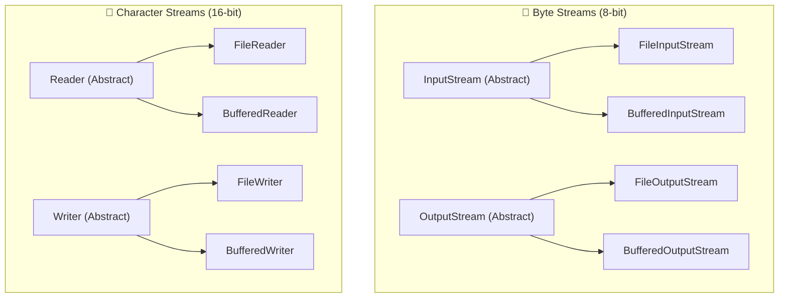

# 💾 Java I/O: Byte Streams vs Character Streams

---

## 📖 1. The Core I/O Stream Hierarchy

Java divides all Input/Output operations into two major families:
1. **Byte Streams (`InputStream` / `OutputStream`)**: Operates on raw 8-bit bytes. Best for binary data (images, PDFs, audio, videos, network packets).
2. **Character Streams (`Reader` / `Writer`)**: Operates on 16-bit Unicode characters. Automatically converts bytes to human-readable characters according to character encoding (UTF-8, ASCII).

---

## ⚖️ 2. Comparison Table

| Feature | Byte Streams | Character Streams |
| :--- | :--- | :--- |
| **Unit of Transfer** | 8-bit Byte | 16-bit Unicode Character |
| **Abstract Superclasses** | `InputStream` & `OutputStream` | `Reader` & `Writer` |
| **Primary Use Case** | Binary files (images, audio, videos, compiled `.class` files) | Text files (`.txt`, `.json`, `.csv`, `.xml`) |
| **Encoding Support** | Raw bytes (no charset translation) | Automatic character set decoding (UTF-8, UTF-16) |

---

## 🚀 3. Why `BufferedReader` is Crucial for Performance

Reading from disk one byte at a time requires an expensive OS system call per byte. `BufferedReader` reads a large 8KB chunk into an internal buffer in memory, reducing OS system calls by over 99%!
