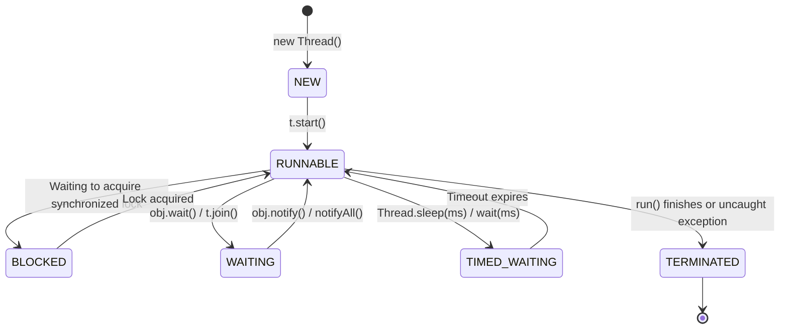

# ⚡ Multithreading: Thread Creation & Lifecycle States

---

## 📖 1. The 6 Thread Lifecycle States in Java

Every thread in the JVM transitions through the states defined in **`Thread.State`**:

---

## 🏗️ 2. Thread vs Runnable vs Callable

| Approach | Inheritance Tradeoff | Returns Result? | Throws Checked Exception? |
| :--- | :--- | :--- | :--- |
| **`extends Thread`** | ❌ Wastes single inheritance | ❌ No (`void run()`) | ❌ No |
| **`implements Runnable`** | ✅ Class can still extend others | ❌ No (`void run()`) | ❌ No |
| **`implements Callable<V>`** | ✅ Class can still extend others | ✅ **Yes (`V call()`)** | ✅ **Yes** |
