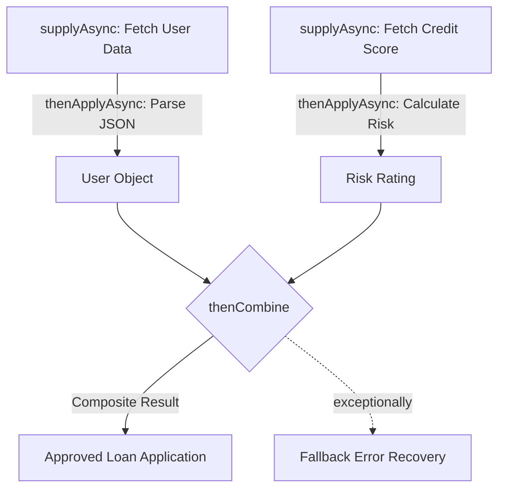

# CompletableFuture & Asynchronous Reactive Pipelines

---

## 1. Why CompletableFuture Over Legacy `Future<T>`?

In Java 5, `Future<T>` was introduced, but it had severe limitations:
- **Blocking**: The only way to retrieve a result was `future.get()`, which blocks the calling thread until completion.
- **No Manual Completion**: You could not manually complete a future from an external event or callback.
- **No Chaining/Composition**: You could not easily trigger step B when step A finished without writing custom polling or thread management.
- **No Exception Pipelines**: Combining multiple futures with graceful fallback error recovery was cumbersome.

Java 8 introduced **`CompletableFuture<T>`**, implementing both `Future<T>` and `CompletionStage<T>`.



---

## 2. Core CompletableFuture Factory & Transformation Methods

| Method | Behavior | Execution Thread |
| :--- | :--- | :--- |
| **`supplyAsync(Supplier<U>, [Executor])`** | Initiates async supplier task returning value | `ForkJoinPool.commonPool()` or Custom Executor |
| **`runAsync(Runnable, [Executor])`** | Initiates async runnable task returning `Void` | `ForkJoinPool.commonPool()` or Custom Executor |
| **`thenApply(Function<T, U>)`** | Transforms result synchronously on completion thread | Same thread that completed previous stage |
| **`thenApplyAsync(Function<T, U>, [Exec])`** | Transforms result asynchronously in pool | Thread from executor pool |
| **`thenAccept(Consumer<T>)`** | Consumes result, returns `CompletableFuture<Void>` | Completing thread |
| **`thenRun(Runnable)`** | Executes action upon completion without input | Completing thread |

---

## 3. Composing & Combining Multiple Futures

### A. `thenCompose()` — Monadic FlatMap (Dependent Chaining)
Used when the output of future A is used to trigger future B which also returns a `CompletableFuture`:

```java
CompletableFuture<User> userFuture = getUserById("usr-101");

// thenCompose prevents CompletableFuture<CompletableFuture<Orders>>
CompletableFuture<List<Order>> ordersFuture = userFuture.thenCompose(user -> getOrdersForUser(user.getId()));
```

### B. `thenCombine()` — Parallel Aggregation (Independent Futures)
Used when two futures run concurrently in parallel and their independent results must be merged:

```java
CompletableFuture<Double> priceFuture = fetchStockPrice("GOOGL");
CompletableFuture<Double> exchangeRateFuture = fetchFxRate("USD", "INR");

CompletableFuture<Double> convertedPrice = priceFuture.thenCombine(
    exchangeRateFuture, 
    (price, rate) -> price * rate
);
```

### C. `CompletableFuture.allOf()` & `anyOf()`
- **`allOf(f1, f2, f3...)`**: Returns a future that completes when **all** input futures finish.
- **`anyOf(f1, f2, f3...)`**: Returns a future that completes when **the fastest** input future finishes (useful for hedged requests / latency reduction).

```java
CompletableFuture<Void> allTasks = CompletableFuture.allOf(f1, f2, f3);

// Extract all results after allOf completes
CompletableFuture<List<String>> results = allTasks.thenApply(v -> 
    Stream.of(f1, f2, f3).map(CompletableFuture::join).toList()
);
```

---

## 4. Robust Error Handling & Java 9+ Timeouts

```java
CompletableFuture<String> resilientPipeline = CompletableFuture.supplyAsync(() -> remoteMicroserviceCall())
    // Complete with fallback if call exceeds 800ms (Java 9+)
    .completeOnTimeout("DEFAULT_CACHED_PAYLOAD", 800, TimeUnit.MILLISECONDS)
    // Handle exceptions with fallback recovery
    .exceptionally(ex -> {
        System.err.println("Remote service failed: " + ex.getMessage());
        return "DEGRADED_MODE_PAYLOAD";
    });
```

---

## 5. Summary Cheat Sheet

1. **Always supply custom thread pools** (`supplyAsync(task, myThreadPool)`) in production to avoid exhausting the shared `ForkJoinPool.commonPool()`.
2. Use **`thenCompose`** for serial dependent async operations and **`thenCombine`** for parallel independent merges.
3. Use **`join()`** instead of `get()` because `join()` throws unchecked `CompletionException`, making lambda expressions cleaner.
4. Add **`orTimeout()`** or **`completeOnTimeout()`** to prevent hanging threads when upstream microservices stall.
