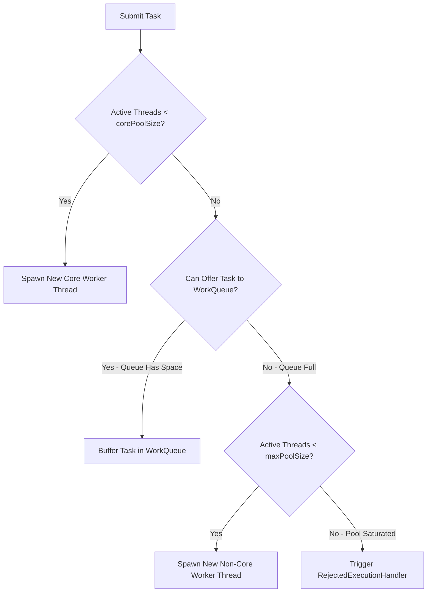

# ThreadPoolExecutor Architecture & Work Queues

---

## 1. Why `Executors.newFixedThreadPool()` is Dangerous in Production

Many developers casually use the convenience methods in `Executors`:
- `Executors.newFixedThreadPool(10)`
- `Executors.newCachedThreadPool()`

### The Hidden Trap:
- **`newFixedThreadPool`** uses an **unbounded `LinkedBlockingQueue`** (`Integer.MAX_VALUE`). If producers send tasks faster than workers consume them, the queue grows indefinitely until the JVM crashes with **`java.lang.OutOfMemoryError: Java heap space`**.
- **`newCachedThreadPool`** uses `SynchronousQueue` with **`maxPoolSize = Integer.MAX_VALUE`**. Under sudden traffic spikes, it spawns thousands of OS threads, exhausting OS thread limits and causing **`OutOfMemoryError: unable to create new native thread`**.

> [!IMPORTANT]
> **Production Rule:** Always instantiate `new ThreadPoolExecutor(...)` directly with a **bounded queue** (`ArrayBlockingQueue`) and an explicit **`RejectedExecutionHandler`**.

---

## 2. Task Submission Decision Flowchart

When `executor.execute(task)` is invoked, the executor follows a strict sequence:



---

## 3. The 4 Standard RejectedExecutionHandler Policies

| Policy | Behavior | Best Use Case |
| :--- | :--- | :--- |
| **`AbortPolicy`** *(Default)* | Throws `RejectedExecutionException` | Strict systems that must immediately alert on overload. |
| **`CallerRunsPolicy`** | Executes the task directly on the **calling thread** that invoked `execute()` | Natural backpressure: slows down the producer thread when the pool is overwhelmed. |
| **`DiscardPolicy`** | Silently drops the rejected task without error | Non-critical background telemetry, metrics sampling, or heartbeats. |
| **`DiscardOldestPolicy`** | Drops the oldest unhandled task in the queue and retries `execute(task)` | Real-time stock ticker / IoT sensor streams where freshest data matters most. |

---

## 4. Sizing Thread Pools (Amdahl's Law & Little's Law)

To determine the optimal `corePoolSize`:

### For CPU-Bound Tasks (Encryption, JSON parsing, algorithms):
$$\text{Pool Size} = N_{\text{cpu}} + 1$$
*(The extra $+1$ prevents CPU pipeline stalls during OS page faults).*

### For I/O-Bound Tasks (DB queries, REST HTTP calls, file I/O):
$$\text{Pool Size} = N_{\text{cpu}} \times \left(1 + \frac{\text{Wait Time}}{\text{Compute Time}}\right)$$
*Example:* If a DB query waits $90\text{ms}$ for I/O and takes $10\text{ms}$ of CPU processing on an 8-core CPU:
$$\text{Pool Size} = 8 \times \left(1 + \frac{90}{10}\right) = 8 \times 10 = 80 \text{ threads}$$

---

## 5. Graceful 2-Step Shutdown Pattern

```java
public void shutdownGracefully(ExecutorService pool, long timeoutSeconds) {
    pool.shutdown(); // Stop accepting new tasks
    try {
        // Wait for currently running tasks to finish
        if (!pool.awaitTermination(timeoutSeconds, TimeUnit.SECONDS)) {
            pool.shutdownNow(); // Cancel executing tasks via interrupt()
            // Wait again for tasks to respond to interruption
            if (!pool.awaitTermination(timeoutSeconds, TimeUnit.SECONDS)) {
                System.err.println("Pool did not terminate completely.");
            }
        }
    } catch (InterruptedException ie) {
        pool.shutdownNow();
        Thread.currentThread().interrupt();
    }
}
```
