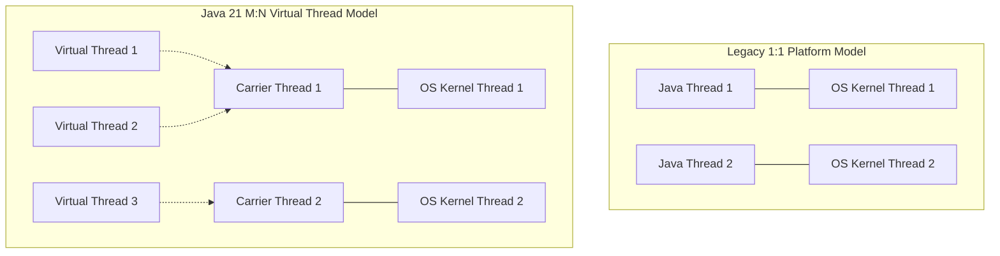

# Virtual Threads Deep Dive: Project Loom & High-Throughput IO

---

## 1. Platform Threads vs Virtual Threads

Prior to Java 21, every `java.lang.Thread` was a **Platform Thread** wrapping a 1:1 underlying Operating System kernel thread.



### Architectural Comparison:

| Metric | Platform Threads (OS 1:1) | Virtual Threads (JVM M:N) |
| :--- | :--- | :--- |
| **Memory Footprint** | ~1 MB Stack reserved | **~few hundred bytes** on Heap |
| **Creation Cost** | Expensive OS system call (`clone()`) | Cheap JVM object allocation |
| **Max Capacity per JVM** | ~2,000–5,000 threads max | **Millions of concurrent threads** |
| **Blocking I/O Behavior** | Blocks the underlying OS kernel thread | **Unmounts** from carrier thread; carrier picks up other work |
| **Pooling Rule** | Pool with `ThreadPoolExecutor` | **Never pool virtual threads!** Create per task. |

---

## 2. How Unmounting & Continuations Work

When a Virtual Thread calls a blocking operation (e.g., `Socket.read()`, `Thread.sleep()`, JDBC query):
1. The JVM intercepts the blocking call at the runtime boundary.
2. The Virtual Thread's call stack is copied to the JVM heap memory (using JVM **Continuation**).
3. The Virtual Thread is **unmounted** from its underlying OS **Carrier Thread** (`ForkJoinPool`).
4. The Carrier Thread is immediately free to run other virtual threads.
5. When the OS I/O event finishes (via Linux `epoll` / macOS `kqueue` / Windows `IOCP`), the JVM remounts the virtual thread on any available carrier thread and resumes execution seamlessly!

---

## 3. The Thread Pinning Danger

A Virtual Thread is said to be **pinned** to its carrier thread when it cannot be unmounted during a blocking operation. When pinned, the carrier OS thread remains blocked, degrading overall throughput.

### What Causes Thread Pinning?
1. **Executing inside a `synchronized` block/method** that performs blocking I/O.
2. **Calling native methods or foreign functions (JNI/FFM)**.

```java
// ❌ ANTI-PATTERN: Causes Thread Pinning!
public synchronized String fetchFromDatabase() {
    return jdbcClient.query(); // Carrier thread is pinned and blocked!
}

// ✅ BEST PRACTICE: Use ReentrantLock instead of synchronized
private final ReentrantLock lock = new ReentrantLock();

public String fetchFromDatabaseSafely() {
    lock.lock();
    try {
        return jdbcClient.query(); // Virtual thread safely unmounts!
    } finally {
        lock.unlock();
    }
}
```

---

## 4. Structured Concurrency (Java 21 Preview)

Structured Concurrency treats multiple tasks running in different threads as a single unit of work:

```java
try (var scope = new StructuredTaskScope.ShutdownOnFailure()) {
    Supplier<String> user = scope.fork(() -> fetchUser());
    Supplier<Double> balance = scope.fork(() -> fetchBalance());

    scope.join(); // Wait for both
    scope.throwIfFailed(); // Propagate exception if any task failed

    System.out.println(user.get() + " has balance: " + balance.get());
}
```
