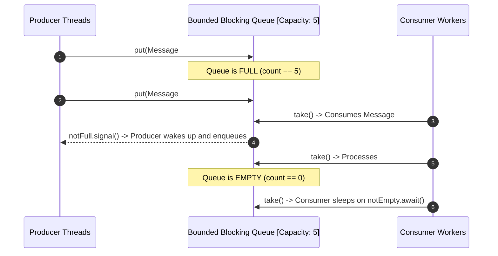

# Producer-Consumer Pattern & Bounded Blocking Queues

---

## 1. Why Producer-Consumer is Fundamental to Distributed Systems

In real-world software engineering, systems rarely produce and consume data at identical velocities:
- **Traffic Spikes**: Web servers receive bursts of 10,000 HTTP requests/sec during flash sales.
- **Slow Downstream**: Database writes or payment gateway calls take 150ms per transaction.

Without a decoupled bounded queue buffer, the system either crashes from memory exhaustion or drops incoming traffic.



---

## 2. Why `while` Loops are Mandatory (Spurious Wakeups)

When waiting on a condition (`obj.wait()` or `condition.await()`), you **MUST ALWAYS** check the condition inside a `while` loop, never an `if` statement:

```java
// ❌ WRONG: Vulnerable to Spurious Wakeup & Race Conditions
if (count == items.length) {
    notFull.await();
}

// ✅ CORRECT: Re-checks condition immediately upon waking
while (count == items.length) {
    notFull.await();
}
```

### Reasons:
1. **Spurious Wakeup**: Operating systems can wake waiting threads without any `signal()` or `notify()` call.
2. **Stolen Signal**: In a multi-consumer setup, `signal()` might wake Thread A, but Thread B swoops in first and takes the item, leaving the queue empty again when Thread A finally acquires the lock.

---

## 3. Graceful Poison Pill Termination

How does a producer tell consumers to finish processing and shut down cleanly?
Use a sentinel **Poison Pill** object:

```java
public class PoisonPillConsumerService {
    private static final String POISON_PILL = "STOP_CONSUMING_IMMEDIATELY_SENTINEL";
    private final BlockingQueue<String> queue = new ArrayBlockingQueue<>(100);

    public void start() {
        Runnable consumer = () -> {
            try {
                while (true) {
                    String task = queue.take();
                    if (task == POISON_PILL) {
                        System.out.println("🛑 Received Poison Pill. Shutting down consumer worker gracefully.");
                        break;
                    }
                    processTask(task);
                }
            } catch (InterruptedException e) {
                Thread.currentThread().interrupt();
            }
        };

        new Thread(consumer).start();
    }

    public void stop(int numWorkers) {
        // Enqueue one poison pill per worker thread
        for (int i = 0; i < numWorkers; i++) {
            queue.offer(POISON_PILL);
        }
    }

    private void processTask(String task) {
        System.out.println("Processing: " + task);
    }
}
```
