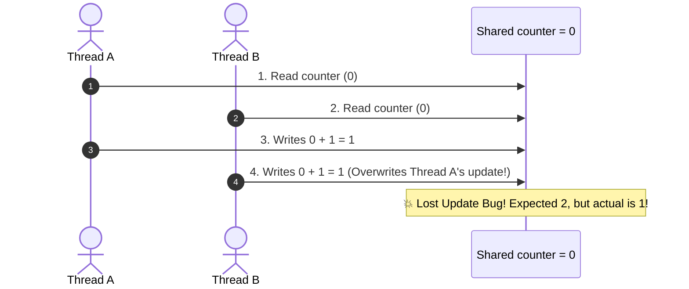

# 🔒 Race Conditions & synchronized Keyword

---

## 📖 1. What is a Race Condition?

A **race condition** occurs when two or more threads attempt to read and write **shared mutable state** concurrently, and the final outcome depends on the non-deterministic order of thread scheduling.



---

## 🔑 2. Synchronized Methods vs Synchronized Blocks

```java
// 1. Synchronized Method (Locks on 'this' instance)
public synchronized void withdraw(int amount) {
    this.balance -= amount;
}

// 2. Synchronized Block (Finer granularity - Recommended!)
public void transfer(int amount) {
    // Non-critical operations (logging, validation) happen without lock
    validateInput(amount);

    synchronized(this) {
        this.balance -= amount;
    }
}

// 3. Static Synchronized Method (Locks on Class token: BankAccount.class)
public static synchronized void printTotalAccounts() {
    System.out.println(totalAccounts);
}
```
