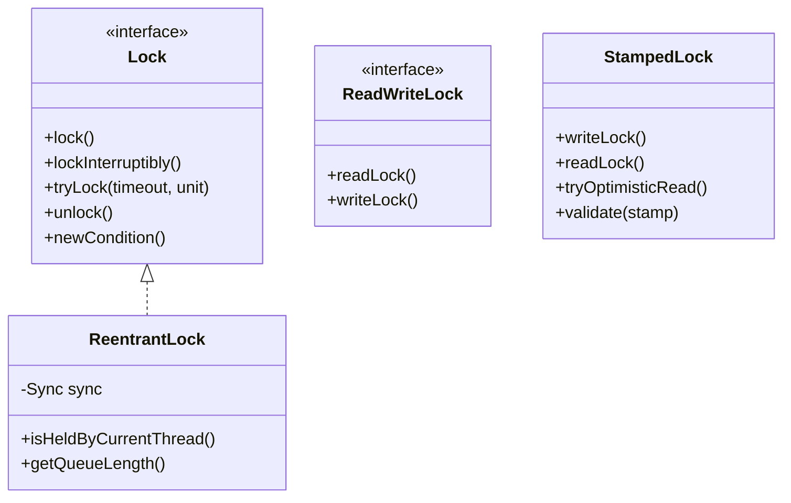

# Explicit Locks: ReentrantLock, ReadWriteLock & StampedLock

---

## 1. `synchronized` vs `ReentrantLock`

While `synchronized` is built into the JVM language level, `java.util.concurrent.locks.ReentrantLock` provides powerful programmatic features:



| Feature | `synchronized` Keyword | `ReentrantLock` |
| :--- | :--- | :--- |
| **Acquisition** | Implicit upon entering block | Explicit `lock.lock()` |
| **Release** | Automatic when exiting block/exception | Explicit `lock.unlock()` inside **`finally`** block |
| **Fairness Guarantee** | ❌ No (always unfair) | ✅ Optional (`new ReentrantLock(true)`) |
| **Timed Try-Lock** | ❌ Cannot abort waiting | ✅ `lock.tryLock(500, TimeUnit.MILLISECONDS)` |
| **Interruptibility** | ❌ Thread cannot be interrupted | ✅ `lock.lockInterruptibly()` |
| **Condition Variables** | Single wait-set (`wait()`, `notify()`) | Multiple condition queues (`notFull`, `notEmpty`) |

---

## 2. Preventing Deadlocks with `tryLock()`

```java
public boolean transferMoney(Account from, Account to, double amount, long timeoutMs) 
        throws InterruptedException {
    long stopTime = System.currentTimeMillis() + timeoutMs;

    while (System.currentTimeMillis() < stopTime) {
        if (from.getLock().tryLock(50, TimeUnit.MILLISECONDS)) {
            try {
                if (to.getLock().tryLock(50, TimeUnit.MILLISECONDS)) {
                    try {
                        from.debit(amount);
                        to.credit(amount);
                        return true;
                    } finally {
                        to.getLock().unlock();
                    }
                }
            } finally {
                from.getLock().unlock();
            }
        }
        // Random backoff before retrying to prevent live-lock
        Thread.sleep((long) (Math.random() * 20));
    }
    return false; // Timed out safely without creating a deadlock
}
```

---

## 3. `ReentrantReadWriteLock` (Read-Heavy Systems)

When data is read by hundreds of threads concurrently and modified rarely (e.g., product catalog or session cache):
- Multiple readers can acquire `readLock()` simultaneously.
- Only one writer can acquire `writeLock()`, excluding all readers and other writers.

```java
private final ReentrantReadWriteLock rwLock = new ReentrantReadWriteLock(true);
private final Lock rLock = rwLock.readLock();
private final Lock wLock = rwLock.writeLock();

public String readData(String key) {
    rLock.lock();
    try {
        return dataMap.get(key);
    } finally {
        rLock.unlock();
    }
}
```

> [!WARNING]
> **Reader Starvation Trap:** Under extreme read throughput, continuous new readers holding `readLock()` can indefinitely block write requests.

---

## 4. `StampedLock` (Java 8 Optimistic Reading)

To solve reader starvation and eliminate the synchronization overhead of `ReadWriteLock`, Java 8 introduced **`StampedLock`**.

### The 3 Modes of StampedLock:
1. **Writing**: Exclusive write lock (`writeLock()`) returning a stamp.
2. **Pessimistic Reading**: Shared read lock (`readLock()`).
3. **Optimistic Reading**: Non-blocking `tryOptimisticRead()`. It returns a non-zero stamp without acquiring a CPU memory fence or CAS lock. The reader reads data, then calls `lock.validate(stamp)` to check if a writer modified the state in between. If valid, the read is complete with zero lock overhead!

---

## 5. Summary Lock Selection Matrix

- **Default Choice:** Use standard `synchronized` for simple critical sections (JVM heavily optimizes with biased/lightweight locking).
- **Timeouts & Fairness Needed:** Use `ReentrantLock`.
- **Read-to-Write Ratio > 10:1:** Use `ReentrantReadWriteLock`.
- **Ultra-High Throughput Reads with Rare Writes:** Use `StampedLock` with `tryOptimisticRead()`. Note: `StampedLock` is **non-reentrant**.
