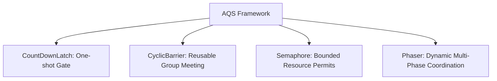

# Concurrency Synchronizers: CountDownLatch, CyclicBarrier, Semaphore & Phaser

---

## 1. The Synchronizer Landscape at a Glance

Java provides four primary synchronizers built on AbstractQueuedSynchronizer (AQS):



---

## 2. CountDownLatch vs CyclicBarrier

| Dimension | `CountDownLatch` | `CyclicBarrier` |
| :--- | :--- | :--- |
| **Reusability** | ❌ **One-Shot Only** (Cannot be reset) | ✅ **Reusable** (Resets automatically after trip) |
| **Who Waits?** | Usually 1 master thread waits for $N$ worker events | All $N$ threads wait for each other at the barrier |
| **Decremented By** | `latch.countDown()` (Can be called by non-threads) | `barrier.await()` (Decrements and waits simultaneously) |
| **Barrier Action** | ❌ None | ✅ Optional runnable action executed when barrier trips |
| **Primary Use Case** | Application startup, waiting for initializations | Multi-threaded simulation rounds, parallel matrix multiply |

---

## 3. CyclicBarrier In Action (Multi-Phase Simulation)

```java
public class MultiplayerGameServer {
    public static void main(String[] args) {
        int players = 4;
        
        // CyclicBarrier triggers a barrier action whenever 4 players check in
        CyclicBarrier roundBarrier = new CyclicBarrier(players, () -> {
            System.out.println("🎮 All players ready! Starting next game round...\n");
        });

        for (int i = 1; i <= players; i++) {
            final int playerId = i;
            new Thread(() -> {
                try {
                    for (int round = 1; round <= 3; round++) {
                        System.out.println("Player #" + playerId + " calculating moves for Round " + round);
                        Thread.sleep((long) (Math.random() * 500));
                        
                        // Wait for all teammates before next round begins
                        roundBarrier.await();
                    }
                } catch (Exception e) {
                    Thread.currentThread().interrupt();
                }
            }).start();
        }
    }
}
```

---

## 4. `Semaphore` (Permit Allocation & Rate Limiting)

A `Semaphore` maintains a set of permits:
- `acquire()` takes a permit, blocking if none are available.
- `release()` returns a permit to the pool.

### Use Cases:
1. **Connection Pooling**: Restricting concurrent JDBC connections to max pool size.
2. **API Rate Limiting**: Capping simultaneous outbound downstream HTTP calls.
3. **Bounded Semaphore as Mutex**: `new Semaphore(1)` acts as a binary mutual exclusion lock.

---

## 5. `Phaser` (Advanced Dynamic Generation Coordination)

`Phaser` is a flexible alternative to `CyclicBarrier` and `CountDownLatch`:
- **Dynamic Party Registration**: Threads can register (`register()`) or deregister (`arriveAndDeregister()`) at runtime.
- **Hierarchical Phasers**: Can form trees to reduce contention on massive thread counts.
- **Phase Tracking**: Tracks current phase number with `getPhase()`.
