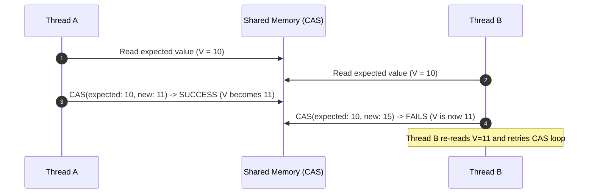

# Lock-Free Concurrency: CAS, Atomic Variables & LongAdder

---

## 1. What is Lock-Free Programming?

Traditional locks (`synchronized`, `ReentrantLock`) are **blocking**:
- If a thread holding a lock is preempted by the OS scheduler or stalls on I/O, other threads are suspended and context-switched.
- Context switches incur CPU cache thrashing (~2,000–5,000 CPU cycles).

**Lock-Free programming** guarantees that **at least one thread makes progress** in a finite number of steps, using optimistic CPU hardware instructions.



---

## 2. Java `java.util.concurrent.atomic` Primitives

- **`AtomicBoolean`**, **`AtomicInteger`**, **`AtomicLong`**: Atomic arithmetic operations (`incrementAndGet()`, `addAndGet()`, `compareAndSet()`).
- **`AtomicReference<V>`**: Atomically updates arbitrary object references.
- **`AtomicIntegerArray`** / **`AtomicReferenceArray`**: Atomic array element updates.
- **`AtomicIntegerFieldUpdater`**: Reflection-based volatile field updater saving wrapper object allocation overhead.

---

## 3. The ABA Problem & `AtomicStampedReference`

### What is the ABA Problem?
1. Thread 1 reads value `A` from a shared variable.
2. Thread 2 preempts, changes `A` $\rightarrow$ `B`, and then changes `B` $\rightarrow$ `A`.
3. Thread 1 resumes, checks the value: it is still `A`!
4. Thread 1's CAS succeeds, unaware that intermediate mutations and side-effects occurred (critical in memory-reclamation / pointer freelists).

### The Solution: `AtomicStampedReference<V>`
Pairs the object reference with an integer version/stamp:

```java
import java.util.concurrent.atomic.AtomicStampedReference;

public class AbaSolutionDemo {
    public static void main(String[] args) {
        String initialRef = "State-A";
        int initialStamp = 1;
        
        AtomicStampedReference<String> state = 
            new AtomicStampedReference<>(initialRef, initialStamp);

        int[] stampHolder = new int[1];
        String currentRef = state.get(stampHolder); // ref="State-A", stamp=1

        // Another thread modifies state A -> B -> A with updated stamps (stamp becomes 3)
        state.compareAndSet("State-A", "State-B", 1, 2);
        state.compareAndSet("State-B", "State-A", 2, 3);

        // Thread 1 attempts update with old stamp 1: FAILS SAFELY!
        boolean success = state.compareAndSet(
            "State-A", "State-C", 
            stampHolder[0], stampHolder[0] + 1
        );

        System.out.println("CAS Success with old stamp: " + success); // false
        System.out.println("Current Stamp in Memory: " + state.getStamp()); // 3
    }
}
```

---

## 4. `LongAdder` vs `AtomicLong` (High Contention Scaling)

Under heavy multithreaded contention (hundreds of threads calling `incrementAndGet()`), `AtomicLong` suffers from **CAS retry storms** because all threads contend on a single cache line.

Java 8 introduced **`LongAdder`**:
- Instead of a single value, it maintains an array of striped internal **`Cell`** objects.
- Each thread hashes to a distinct `Cell` to increment without contention.
- `longAdder.sum()` aggregates all cells when the final tally is queried.

> [!TIP]
> **Performance Rule:** Use `AtomicLong` when you need exact sequential atomic reads (`compareAndSet`). Use `LongAdder` for write-heavy counters, metrics, and high-throughput statistics.
