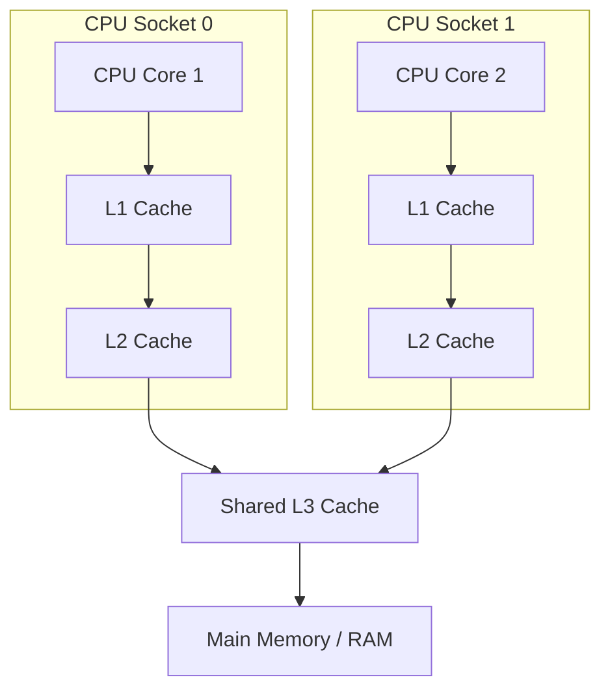

# Java Memory Model (JMM), Happens-Before & Volatile

---

## 1. The Hardware Concurrency Problem

Modern CPUs execute billions of instructions per second and use multi-level hardware caches:

### The Three Fundamental Hazards:
1. **Visibility Problem:** Changes written to Core 1's L1 cache might not be flushed to RAM before Core 2 reads RAM.
2. **Instruction Reordering:** Compilers and Out-of-Order CPUs reorder independent bytecode instructions to optimize CPU pipelining.
3. **Atomicity Problem:** 64-bit primitive operations (`long`, `double`) can be split into two 32-bit operations on older 32-bit hardware.

---

## 2. What `volatile` Actually Guarantees

In Java, declaring a field `volatile` provides two critical guarantees:
1. **Visibility Guarantee:** Any write to a `volatile` variable is immediately flushed to main memory. Any read of a `volatile` variable is always fetched from main memory, bypassing stale CPU caches.
2. **Ordering Guarantee (Memory Barriers):** The compiler and CPU are forbidden from reordering instructions across volatile read/write boundaries by inserting hardware memory barriers:
   - **StoreStore & StoreLoad Barrier** before and after volatile write.
   - **LoadLoad & LoadStore Barrier** after volatile read.

> [!CAUTION]
> **`volatile` does NOT guarantee atomicity!**
> Operations like `count++` consist of 3 distinct bytecode operations: `getfield`, `iadd`, `putfield`. Two threads calling `count++` on a volatile integer will still experience lost updates. Use `AtomicInteger` for atomicity.

---

## 3. The 8 Happens-Before Rules in JMM

If action $A$ **Happens-Before** action $B$ ($A \xrightarrow{hb} B$), then memory changes performed by $A$ are guaranteed to be visible to $B$, and $A$ is ordered before $B$.

1. **Program Order Rule:** Each action in a single thread happens-before every subsequent action in that same thread.
2. **Monitor Lock Rule:** An `unlock()` on a monitor/lock happens-before every subsequent `lock()` on the same monitor.
3. **Volatile Variable Rule:** A write to a `volatile` field happens-before every subsequent read of that same `volatile` field.
4. **Thread Start Rule:** A call to `Thread.start()` happens-before any action in the started thread.
5. **Thread Termination Rule:** Any action in a thread happens-before any other thread detects that thread has terminated (via `t.join()` or `t.isAlive() == false`).
6. **Interruption Rule:** A thread calling `interrupt()` on another thread happens-before the interrupted thread discovers the interruption (via `Thread.interrupted()`).
7. **Finalizer Rule:** The end of an object's constructor happens-before the start of its finalizer.
8. **Transitivity Rule:** If $A \xrightarrow{hb} B$ and $B \xrightarrow{hb} C$, then $A \xrightarrow{hb} C$.

---

## 4. Why Without `volatile`, Double-Checked Locking is Broken

When executing `instance = new Singleton()`:
1. Allocate heap memory for object.
2. Run constructor to initialize fields.
3. Assign memory address to `instance` variable.

Under CPU instruction reordering, step 3 can execute **before** step 2!
Another thread executing the 1st check (`if (instance != null)`) sees a non-null instance and consumes **half-initialized garbage memory**, crashing the application. Declaring `volatile instance` creates a memory fence preventing step 3 from reordering before step 2.
