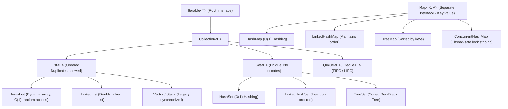

# 📚 Java Collections Framework Architecture & Hierarchy

---

## 🗺️ 1. Complete Collection Framework Hierarchy

---

## 📊 2. Time Complexity Quick-Reference Table

| Collection Class | Interface | Underlying Structure | `add()` / `put()` | `get()` / `contains()` | `remove()` |
| :--- | :--- | :--- | :--- | :--- | :--- |
| **`ArrayList`** | `List` | Dynamic Resizeable Array | $O(1)$ amortized | $O(1)$ by index | $O(n)$ shifting |
| **`LinkedList`** | `List` / `Deque` | Doubly-Linked List | $O(1)$ ends | $O(n)$ search | $O(1)$ known node |
| **`HashSet`** | `Set` | `HashMap` Instance | $O(1)$ average | $O(1)$ average | $O(1)$ average |
| **`TreeSet`** | `NavigableSet` | Red-Black Balanced BST | $O(\log n)$ | $O(\log n)$ | $O(\log n)$ |
| **`HashMap`** | `Map` | Array of Buckets (List/Tree) | $O(1)$ average | $O(1)$ average | $O(1)$ average |
| **`TreeMap`** | `NavigableMap` | Red-Black Balanced BST | $O(\log n)$ | $O(\log n)$ | $O(\log n)$ |
