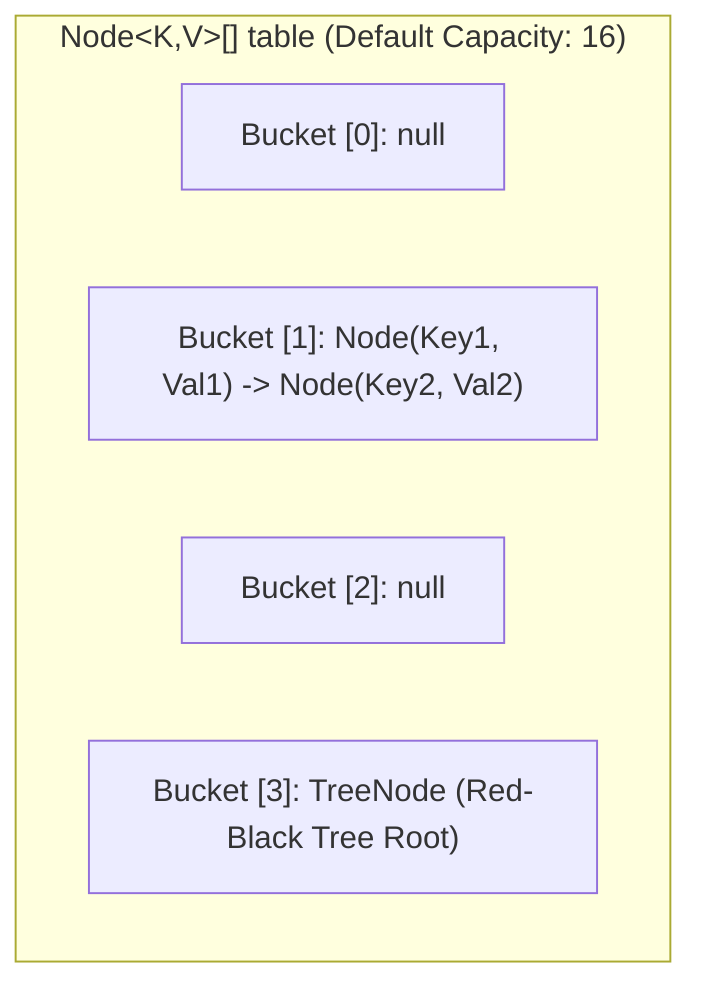

# 🧠 HashMap Internals, Bucket Collisions & Treeification

---

## 📖 1. The Core Architecture of `HashMap`

A `HashMap` in Java is an array of buckets (`Node<K,V>[] table`), where each bucket stores key-value pairs.

### 📐 The Mathematical Index Formula:
When you call `map.put(key, value)`:
1. `hash = hash(key.hashCode())` (Applies bit-mixing to distribute bits evenly)
2. `index = (n - 1) & hash` (Computes bucket index, where $n$ is the array power-of-two capacity, default 16)

---

## 🌳 2. The Java 8+ Treeification Thresholds

In Java 7, collisions formed a linear `LinkedList`, degrading lookup to $O(n)$ under adversarial hash collisions (Denial of Service risk).

In **Java 8+**:
- **Treeification Rule**: When a single bucket's linked list reaches **8 nodes (`TREEIFY_THRESHOLD = 8`)** AND total table capacity is at least **64 (`MIN_TREEIFY_CAPACITY = 64`)**, Java converts the bucket into a **Red-Black Balanced Binary Search Tree (`TreeNode<K,V>`)**.
- **Performance Impact**: Worst-case lookup time improves from $O(n)$ to **$O(\log n)$**.
- **Untreeify Rule**: If removals drop the node count in a bucket down to **6 (`UNTREEIFY_THRESHOLD = 6`)**, it converts back into a simple linked list.

---

## ⚖️ 3. Default Capacity & Load Factor (0.75)

- **Default Initial Capacity**: `16`
- **Default Load Factor**: `0.75`
- **Threshold for Resizing**: $\text{Capacity} \times \text{LoadFactor} = 16 \times 0.75 = 12$.
- When the 13th unique key is added, the bucket array **doubles in size** (16 $\rightarrow$ 32 $\rightarrow$ 64 $\rightarrow$ 128), and all elements are re-hashed/re-indexed.
