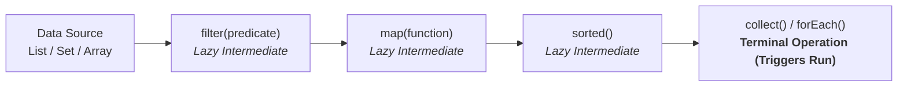

# 🌊 Stream API: Pipelines, Intermediate & Terminal Operations

---

## 📖 1. The Stream Lifecycle & Lazy Evaluation

A Java Stream is **NOT a data structure** (it does not store data). It is a pipeline of computational steps executed lazily.

---

## 📊 2. Intermediate vs Terminal Operations

| Category | Execution Nature | Return Type | Examples |
| :--- | :--- | :--- | :--- |
| **Intermediate Operations** | **Lazy** (Queued until terminal op is called) | Returns a new `Stream<T>` | `filter()`, `map()`, `flatMap()`, `distinct()`, `sorted()`, `limit()`, `skip()` |
| **Terminal Operations** | **Eager** (Triggers pipeline execution & closes stream) | Non-Stream (e.g. `List`, `long`, `Optional`, `void`) | `collect()`, `forEach()`, `reduce()`, `count()`, `findFirst()`, `anyMatch()`, `toList()` |
