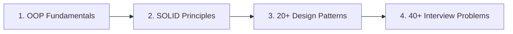

# 🚀 Master Low-Level Design (LLD) From Scratch

Welcome to an **interactive, hands-on, and battle-tested** curriculum designed to help you master Low-Level Design (LLD), Object-Oriented Architecture, and Ace FAANG/Tier-1 Machine Coding & Design Interviews.

---

### 🌐 Supported Programming Languages
Learn and implement design patterns and machine coding in your language of choice:
- ☕ **Java (Primary & Production Standard)**
- 🐍 **Python**
- ⚡ **C++**
- 🔷 **C#**
- 🐹 **Go**
- 🟦 **TypeScript**

---

### 📚 Essential Additional Resources
Accelerate your preparation with these curated companion tools:
- 💻 **[Original HTML Lesson Source](http://localhost:8080/system-design/01.%20low%20level%20design/01_Welcome/01_Course_Introduction.html)**: Standalone offline HTML course view.
- 📄 **[LLD Masterclass Notes & PDF (Google Drive)](file:///D:/ThreadSpeak/SystemDesign/01.%20low%20level%20design/01_Welcome/01_Course_Introduction.html)**: Complete handwritten study notes, diagrams, and cheat sheets.
- 🌟 **[LLD GitHub Repository (awesome-low-level-design)](https://github.com/ashishps1/awesome-low-level-design)**: Over **25k+ stars** on GitHub with open-source reference implementations.
- 📋 **[LLD Revision Sheet](https://algomaster.io/learn/lld)**: Track your progress, star key questions for fast revision, and take structured notes.
- 🤖 **[LLD AI Mock Interview Practice](https://algomaster.io/interview/low-level-design)**: Practice real-time Low-Level Design interview problems with an AI interviewer giving instant architectural feedback.

---

# 🗺️ What's Inside This Course: The 4 Core Pillars



---

## 1. A Structured Roadmap
You never need to guess what to learn next. This curriculum follows a step-by-step progression:

### 🧩 1.1 Object-Oriented Programming (OOP) Foundation
- **Classes & Objects**: State encapsulation and identity.
- **Interfaces & Abstract Classes**: Contract-driven development.
- **The 4 Pillars**: Encapsulation, Abstraction, Inheritance, and Polymorphism.
- **UML Class Relationships**: *Association*, *Aggregation* (has-a weak), *Composition* (part-of strong), and *Dependency* (uses-a).

### 🛡️ 1.2 SOLID Principles
Learn the 5 golden rules for creating adaptable, decoupled, and maintainable software:
1. **S - Single Responsibility Principle (SRP)**: A class should have one, and only one, reason to change.
2. **O - Open/Closed Principle (OCP)**: Open for extension, closed for modification.
3. **L - Liskov Substitution Principle (LSP)**: Subtypes must be substitutable for their base types without breaking behavior.
4. **I - Interface Segregation Principle (ISP)**: Clients should not be forced to depend upon interfaces they do not use.
5. **D - Dependency Inversion Principle (DIP)**: Depend on abstractions, not on concrete implementations.

### 🎨 1.3 20+ Gang of Four (GoF) Design Patterns
| Pattern Group | Core Patterns Included |
| :--- | :--- |
| **Creational** | Singleton, Factory Method, Abstract Factory, Builder, Prototype |
| **Structural** | Adapter, Decorator, Facade, Composite, Proxy, Bridge, Flyweight |
| **Behavioral** | Strategy, Observer, Command, Iterator, State, Template Method, Chain of Responsibility, Mediator, Memento, Visitor |

---

### 🏆 1.4 40+ Real-World Machine Coding Interview Problems
Apply your design skills to end-to-end production systems:
- 🎮 **Games & Puzzles**: Tic-Tac-Toe, Snake and Ladder, Chess Game, Minesweeper.
- 🚗 **Management Systems**: Parking Lot, Elevator System, Hotel Management, Library System.
- 💳 **Fintech & Booking**: ATM System, Splitwise Expense Sharing, Movie Ticket Booking (BookMyShow), Payment Gateway.
- ⚡ **Infrastructure & Concurrency**: LRU Cache, Distributed Rate Limiter, Thread-Safe Logging Framework, Notification Service, Vending Machine.

Each problem walks through:
1. Requirements Clarification & Scope
2. Identifying Core Entities & Enums
3. Class Diagram & Relationship Modeling
4. Applying Patterns & SOLID Principles
5. Thread-Safety, Concurrency & Locking
6. Extensible Production Java Code

---

## 2. Class and Sequence Diagrams

### 📐 Static Class Diagrams
Understand class hierarchies, inheritance, and dependency injection before writing code:

```text
┌──────────────────────────────────────┐
│          PlayerController            │
├──────────────────────────────────────┤
│ - player: MediaPlayer                │
├──────────────────────────────────────┤
│ + PlayerController(player: MediaPlayer)
│ + startPlayback()                    │
│ + pausePlayback()                    │
│ + stopPlayback()                     │
└──────────────────┬───────────────────┘
                   │ uses (Dependency)
                   ▼
┌──────────────────────────────────────┐
│       <<abstract>> MediaPlayer       │
├──────────────────────────────────────┤
│ # playerName: String                 │
├──────────────────────────────────────┤
│ + play()                             │
│ + pause()                            │
│ + stop()                             │
│ + displayStatus()                    │
│ + logAction(action: String)          │
└──────────────▲─────────▲─────────────┘
               │         │
       ┌───────┴───┐ ┌───┴──────────┐
       │AudioPlayer│ │VideoPlayer   │
       └───────────┘ └──────────────┘
```

### ⚡ Runtime Sequence Diagrams
Sequence diagrams trace object lifecycles and runtime execution steps:

```text
Client 1                   Client 2                    Singleton
   │                          │                            │
   │─── getInstance() ────────┼───────────────────────────>│ [Checks: instance == null]
   │                          │                            │ [Creates new Singleton()]
   │<── returns instance ─────┼────────────────────────────│
   │                          │                            │
   │                          │─── getInstance() ─────────>│ [Checks: instance != null]
   │                          │<── returns same instance ──│ (Both clients share instance!)
```

---

## 3. Hands-On Design Exercise: Bank Account Class

### 📝 Problem Description
Design a thread-safe `BankAccount` class that manages deposit, withdrawal, and balance checking operations with strict validation.

### 📋 Requirements:
1. **Fields**: `accountNumber` (String), `ownerName` (String), `balance` (double).
2. **Constructor**: Initializes account with `accountNumber` and `ownerName`. Balance starts at `0.0`.
3. **`deposit(double amount)`**: Adds money to balance (only accepts strictly positive amounts).
4. **`withdraw(double amount)`**: Deducts money if sufficient balance exists; returns `true` on success, `false` otherwise.
5. **`getBalance()`**: Returns current balance.

```java
public class BankAccount {
    private final String accountNumber;
    private final String ownerName;
    private double balance;

    public BankAccount(String accountNumber, String ownerName) {
        if (accountNumber == null || accountNumber.isBlank()) {
            throw new IllegalArgumentException("Account number cannot be empty");
        }
        if (ownerName == null || ownerName.isBlank()) {
            throw new IllegalArgumentException("Owner name cannot be empty");
        }
        this.accountNumber = accountNumber;
        this.ownerName = ownerName;
        this.balance = 0.0;
    }

    public synchronized void deposit(double amount) {
        if (amount <= 0) {
            throw new IllegalArgumentException("Deposit amount must be positive");
        }
        this.balance += amount;
    }

    public synchronized boolean withdraw(double amount) {
        if (amount <= 0 || amount > this.balance) {
            return false;
        }
        this.balance -= amount;
        return true;
    }

    public synchronized double getBalance() {
        return this.balance;
    }

    public String getAccountNumber() { return accountNumber; }
    public String getOwnerName() { return ownerName; }
}
```

---

## 4. Interactive Try-It-Yourself: Tic-Tac-Toe Game Engine

```java
// Modular Game Engine Architecture
public class TicTacToeDemo {
    public static void main(String[] args) {
        Player alice = new Player("Alice", Symbol.X);
        Player bob = new Player("Bob", Symbol.O);

        Game game = new Game(alice, bob, 3);
        System.out.println("========== TIC TAC TOE ==========");

        // Alice (X) completes the top row and wins
        game.makeMove(0, 0); // X at (0,0)
        game.makeMove(1, 0); // O at (1,0)
        game.makeMove(0, 1); // X at (0,1)
        game.makeMove(1, 1); // O at (1,1)
        game.makeMove(0, 2); // X at (0,2) - Alice wins!

        game.printBoard();
        System.out.println("Result: " + game.getStatus());
        if (game.getWinner() != null) {
            System.out.println("Winner: " + game.getWinner().getName() + " (" + game.getWinner().getSymbol() + ")");
        }
    }
}
```

