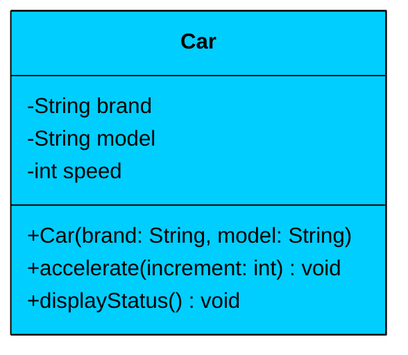
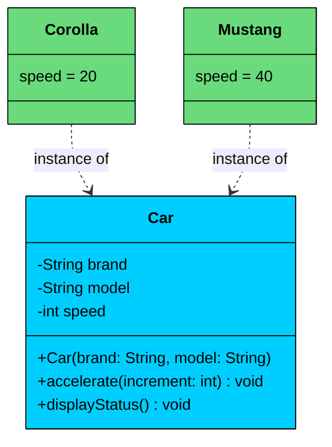

Every object-oriented system starts with one fundamental question: How do I represent real-world entities in code"

**Classes and Objects** are the answer. Together, they form the foundation on which every OOP-based language is built. 

Java, Python, C++, C#, Go, and TypeScript all use this concept to organize and structure code around real-world entities.

---

# 1. What is a Class"

A **class** is a *blueprint*, *template*, or *recipe* for creating objects. It defines **what an object will contain** (its data) and **what it will be able to do** (its behavior).

A class is not an object itself, it’s a template used to create many objects with similar structure but independent state.

> 💡 **Key Insight:**

> **Real-World Analogy**
>
> Think of a class like a **recipe for a cake**:
>
> - The ingredients represent **fields or attributes** (flour, sugar, eggs → variables).
> - The instructions represent **methods or functions** (mix, bake, decorate → operations).
>
> The recipe itself doesn’t produce a cake, it just defines how to make one. When you follow the recipe and bake a cake, you’ve just created an **object**.
>
> In code terms: the recipe is your class definition, and each cake you bake is an object with its own flavor, frosting, and size.

#### Key Characteristics of a Class:

- It groups related data (attributes) and actions (methods) together.
- Defines **attributes** to represent the state or data of an object.
- Defines **methods** (functions inside a class) to represent the **behavior** or actions the object can perform.

### Example: Class Blueprint

Let’s define a simple `Car` class with essential attributes and methods that any `Car` object will have.

The following diagram and code show the blueprint for a `Car`:



#### Code:

```java
public class Car {
    // Attributes
    private String brand;
    private String model;
    private int speed;

    // Constructor
    public Car(String brand, String model) {
        this.brand = brand;
        this.model = model;
        this.speed = 0;
    }

    // Method to accelerate
    public void accelerate(int increment) {
        speed += increment;
    }

    // Method to display info
    public void displayStatus() {
        System.out.println(brand + " is running at " + speed + " km/h.");
    }
}
```

This `Car` class defines what every car object should look like (brand, model, speed) and what it can do (accelerate, display status). But a class on its own is just a definition sitting in your source code. To actually do anything useful, you need to create objects from it.

---

# 2. What is an Object"

An **object** is an instance of a class.  It's the actual thing you can interact with, store data in, and invoke methods on.

When you create an object, you’re essentially saying:

> “Take this blueprint (class) and build one actual thing (object) out of it.”

Each object gets its own copy of the data defined in the class, shares the same structure and behavior, and operates independently of every other object created from that same class.

### Creating Objects

Let’s now create a few car objects using our `Car` class.



#### Code

```java
public class Main {
    public static void main(String[] args) {
        // Creating objects of the Car class
        Car corolla = new Car("Toyota", "Corolla");
        Car mustang = new Car("Ford", "Mustang");

        corolla.accelerate(20);
        mustang.accelerate(40);

        // Displaying status of each car
        corolla.displayStatus();
        System.out.println("-----------------");
        mustang.displayStatus();
    }
}
```

#### Output

```shell
Toyota Corolla is running at 20 km/h.
-----------------
Ford Mustang is running at 40 km/h.
```

Notice how `corolla` and `mustang` are both `Car` objects, but they maintain completely independent state. When we called `corolla.accelerate(20)`, only the Corolla's speed changed. The Mustang stayed at 0 until we explicitly accelerated it to 40.

---

# 3. Practical Example: Online Food Order

Let's apply classes and objects to a real-world problem: building an order management system for a food delivery platform.

### The Scenario

A food delivery app needs to manage orders.

Each order belongs to a customer, contains a list of food items with prices, and tracks whether it has been placed. Customers build their order by adding items one at a time, and once they're satisfied, they place the order. After that, no more items can be added. 

Without classes, you'd have separate arrays for order IDs, customer names, item lists, and totals with no clean way to enforce rules like "don't add items after placing."

With classes, the **Order** owns its data and enforces invariants: `addItem()` works only before `place()`, so invalid states are prevented by design.

### Code

```java
$6d
```

#### Why This Design Works

- **Encapsulates order state:** Items, total, and placement status live together. No need to track these in separate data structures.
- **Enforces business rules:** The `addItem()` method prevents modifications after placement. The object protects its own invariants.
- **Reusable across the platform:** One class handles every customer order allowing you to create thousands of order objects from the same blueprint.
- **Easy to extend:** Need to add delivery addresses, payment methods, or order tracking later" Add new fields and methods without restructuring your entire codebase.
