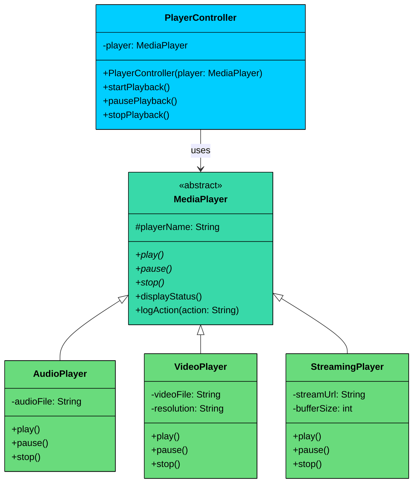

**Abstraction** is the process of hiding complex internal implementation details and exposing only the relevant, high-level functionality to the outside world. It allows developers to **focus on what an object does**, rather than **how it does it**.

In short:

> **Abstraction = Hiding Complexity + Showing Essentials**

By separating the **what** from the **how**, abstraction:

- Reduces cognitive load
- Improves modularity
- Leads to cleaner, more intuitive APIs

> **“Abstraction is about creating a simplified view of a system that highlights the essential features while suppressing the irrelevant details.”**

---

> 💡 **Key Insight:**

> **Real-World Analogy: Driving a Car**
>
> Think about how you drive a car:
>
> You turn the **steering wheel**, press the **accelerator**, and shift the **gears**.
>
> But you **don’t need to know**:
>
> - How the transmission works
> - How the fuel is injected
> - How torque or combustion is calculated
>
> All of that mechanical complexity is abstracted away behind a **simple interface:** the steering wheel, pedals, and gear lever.
>
> That’s exactly what **abstraction** does in software. It lets you use complex systems through simple, high-level interactions.

---

# 1. Why Abstraction Matters

To understand why abstraction matters, consider what happens without it. You have a `LoggingService` that directly creates and manages each type of logger:

```java
class LoggingService {
    void log(String destination, String message) {
        if (destination.equals("console")) {
            System.out.println("[LOG] " + message);
        } else if (destination.equals("file")) {
            // Open file, write message, close file
        } else if (destination.equals("remote")) {
            // Create HTTP connection, send payload, handle response
        }
    }
}
```

Every new destination means adding another branch. The service is coupled to every logging mechanism. Testing console logging requires the full class. Changing the file format risks breaking the remote logging code. It's a single class trying to do everything.

Abstraction fixes this by separating the *what* from the *how*. Here are four concrete benefits, tied to the logging example:

#### **1. Swap Implementations Without Changing Callers**

Your application works with any `Logger`. Switch from console to file logging by changing one line where you create the object. The `Application` class stays untouched. This is the same flexibility you saw with interfaces, but abstract classes add the ability to share common logic across implementations.

#### **2. Reduce Complexity for Consumers**

The application calls `logger.log("Server started")`. It doesn't see the file handles, HTTP connections, or buffering strategies happening inside the concrete classes. The abstraction shields the caller from details they don't need.

#### **3. Extend Without Modifying**

Need database logging" Create a `DatabaseLogger` that extends `Logger`. The `Application`, `ConsoleLogger`, `FileLogger`, and all existing code remain unchanged. The system is open for extension, closed for modification.

#### **4. Share Common Logic Once**

Every logger needs to format messages the same way: prepend a timestamp and log level. With abstraction, you write `formatMessage()` once in the abstract `Logger`, and every subclass inherits it. Without abstraction, you'd duplicate that formatting logic in each conditional branch or in each standalone class.

---

# 2. How Abstraction Is Achieved

In object-oriented programming, abstraction is primarily achieved through three mechanisms: abstract classes, interfaces, and clean public APIs. Each serves a different purpose and fits different situations.

## 1. **Abstract Classes**

An abstract class defines a common blueprint for a family of related classes. It can contain both abstract methods (declared but not implemented) and concrete methods (fully implemented). Subclasses must implement the abstract methods but inherit the concrete ones for free.

This is what makes abstract classes different from interfaces: they let you share *behavior*, not just a contract.

Let's build the logging system from the opening scenario. The abstract `Logger` class has a `level` field, an abstract `log()` method that each subclass must implement, and a concrete `formatMessage()` method that adds a timestamp and log level prefix. Every logger formats messages the same way, but each one delivers the formatted message differently.

```java
$81
```

Notice the division of labor. The abstract `Logger` handles *what every logger has in common*: a log level and a formatting method. The concrete subclasses handle *what's different*: where the formatted message actually goes. `ConsoleLogger` prints to stdout, `FileLogger` writes to disk. But both call `formatMessage()` without reimplementing it.

That's the real value of abstract classes over interfaces: shared behavior, not just a shared contract.

---

## 2. Interfaces as Abstraction

We covered interfaces in depth a [previous chapter](/learn/lld/interfaces), so we won't repeat the full explanation here. But it's worth seeing how interfaces serve as a different kind of abstraction.

While abstract classes abstract *a family of related classes* that share behavior, interfaces abstract *a capability* that unrelated classes can share. Consider data export: you might need to export user data as CSV, order data as JSON, or analytics data as XML. These classes have nothing in common structurally, but they all share the capability of exporting data.

```java
public interface Exportable {
    String export();
}

public class CSVExporter implements Exportable {
    public String export() {
        return "name,email,age\nAlice,alice@example.com,30";
    }
}

public class JSONExporter implements Exportable {
    public String export() {
        return "{\"name\": \"Alice\", \"email\": \"alice@example.com\"}";
    }
}
```

The `Exportable` interface doesn't share any behavior between exporters. There's no common formatting logic, no shared fields. It purely defines the contract: "anything that claims to be exportable must have an `export()` method." Any code that needs to export data depends on the `Exportable` interface, not on `CSVExporter` or `JSONExporter` directly.

---

## 3. Public APIs as Abstraction

You don't always need abstract classes or interfaces to achieve abstraction. Sometimes a well-designed public API on a regular class is enough. When a class hides its internal complexity behind a few clean public methods, that's abstraction in action.

Consider a `DatabaseClient`. The caller sees `connect()` and `query()`. Behind the scenes, the class manages connection pooling, socket lifecycle, authentication handshakes, query parsing, and retry logic. None of that is the caller's concern.

```java
$85
```

From the caller's perspective, using this class is just few lines:

```java
DatabaseClient db = new DatabaseClient(10, 3);
db.connect("localhost", 5432);
String result = db.query("SELECT * FROM users");
```

They don't see connection pooling, retry logic, or query parsing. They don't need to. The public API is the abstraction, and the private methods are the hidden implementation. This is the same principle behind abstract classes and interfaces, just applied without inheritance.

---

# 3. Abstraction vs Encapsulation

Although often discussed together, abstraction and encapsulation are distinct concepts.

**Abstraction** focuses on hiding complexity. It's about simplifying what the user sees. Think of the `accelerate()` pedal in a car. You press it and the car speeds up. You don't need to know about fuel injection, throttle body mechanics, or engine control unit signals. The pedal is the abstraction.

**Encapsulation** focuses on hiding data. It's about bundling data and methods together to protect an object's internal state. Think of the engine itself as a self-contained unit. Its internal components (pistons, valves, sensors) are sealed inside a housing. You can't reach in and manually adjust the fuel mixture. The engine protects its own internals.

Think of it this way: **Abstraction is the external view of an object, while Encapsulation is the internal view.**

| Aspect | Encapsulation | Abstraction |
|--------|---------------|-------------|
| Focus | Protecting data within a class | Hiding implementation complexity |
| Goal | Restrict access to internal state | Simplify usage and expose only essentials |
| Level | Implementation-level | Design-level |
| Example | Private `balance` field in `BankAccount` | Exposing only `deposit()` and `withdraw()` without showing how they work |

Together, they make systems **secure**, **modular**, and **easy to reason about.** Encapsulation *protects*, abstraction *simplifies*.

---

# 4. Practical Example: Media Player

Let's apply abstraction to a different domain. Imagine you're building a media application that needs to play different types of content: audio files, video files, and streaming content. Each type has a completely different playback mechanism, but they all share certain behaviors: displaying the current status and logging user actions.

Here's the class diagram:



The abstract `MediaPlayer` defines three abstract methods (`play()`, `pause()`, `stop()`) that each subclass must implement, plus two concrete methods (`displayStatus()` and `logAction()`) that all players inherit. 

The `PlayerController` depends only on the abstract `MediaPlayer`, so it works with any player type without modification.

```java
$8d
```

#### Why This Design Works

- **The controller is player-agnostic.** `PlayerController` doesn't import `AudioPlayer`, `VideoPlayer`, or `StreamingPlayer`. It only knows about `MediaPlayer`. Adding a new player type (say, `PodcastPlayer`) requires zero changes to the controller.
- **Shared behavior is written once.** `displayStatus()` and `logAction()` live in the abstract class. All three concrete players inherit them without reimplementing a single line. If you want to change the status format, you change one method in one place.
- **Each player encapsulates its own complexity.** `StreamingPlayer` manages buffering, `VideoPlayer` handles resolution. The controller doesn't know or care about any of these details. It just calls `play()`.
