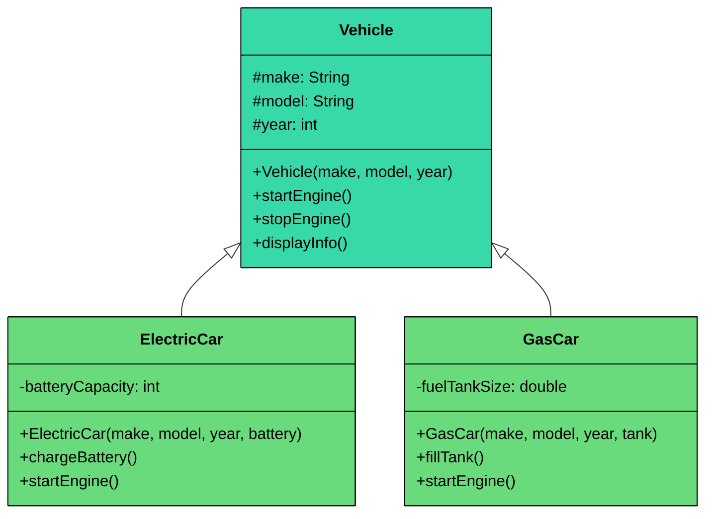
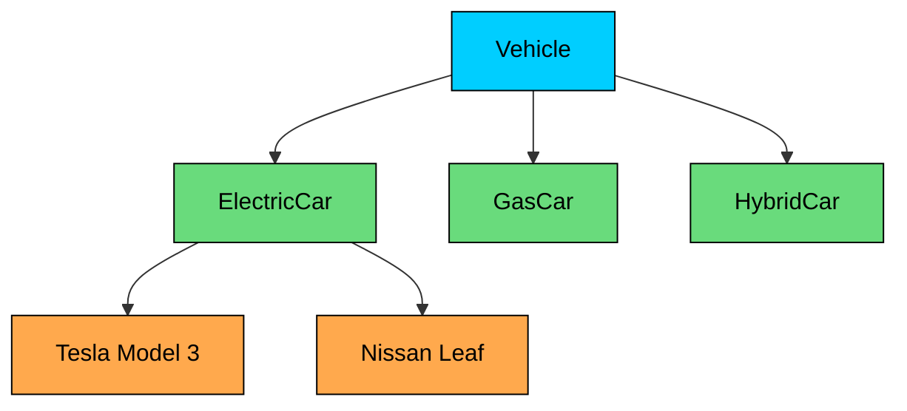

Inheritance allows one class (called the **subclass** or **child class**) to **inherit the properties and behaviors** of another class (called the **superclass** or **parent class**).

In simpler terms:

> Inheritance enables 
>
> **code reuse**
>
>  by letting you define common logic once in a base class and then 
>
> **extend or specialize**
>
>  it in multiple derived classes.

This leads to cleaner, modular, and more maintainable software.

---

> 💡 **Key Insight:**

> **Real-World Analogy**
>
> Think of a **User** system in a web application:
>
> 
> ```mermaid
> classDiagram
>      class User {
>          -username: String
>          -email: String
>          +login() void
>          +logout() void
>      }
>
>      class Admin {
>          +deleteUser() void
>      }
>
>      class Customer {
>          +browseProducts() void
>      }
>
>      class Vendor {
>          +addProduct() void
>      }
>
>      User <|-- Admin
>      User <|-- Customer
>      User <|-- Vendor
>
>      style User fill:#38d9a9,stroke:#000,color:#000
>      style Admin fill:#00ceff,stroke:#000,color:#000
>      style Customer fill:#00ceff,stroke:#000,color:#000
>      style Vendor fill:#00ceff,stroke:#000,color:#000
> ```
> 

>
> - The base `User` class holds common attributes like `username`, `email`, and methods like `login()` or `logout()`.
> - Specialized roles like `Admin`, `Customer`, and `Vendor` inherit from `User` but add role-specific behavior.
>
> All specialized user types **inherit** common data and behaviors from the `User` class, but can **extend** functionality to suit their roles.

---

# 1. Why Inheritance Matters

Inheritance offers several benefits that make it a powerful design tool in OOP.

#### 1. **Code Reusability**

It embodies the **DRY (Don't Repeat Yourself)** principle. Common logic is written once in the parent class and shared across all subclasses reducing redundancy.

#### 2. **Logical Hierarchy**

It creates a clear and intuitive hierarchy that model real-world *“is-a”* relationships like `ElectricCar` *is a* `Car` or `Admin` *is a* `User`.

#### 3. **Ease of Maintenance**

If a bug is found or a change is needed in the shared logic, you only need to fix it in one place, the superclass. All subclasses automatically inherit the fix.

#### 4. Polymorphism

Inheritance is a prerequisite for polymorphism, allowing objects of different subclasses to be treated as objects of the superclass.

---

# 2. How Inheritance Works

When a class inherits from another:

- The subclass **inherits all non-private fields and methods** of the superclass.
- The subclass can **override** inherited methods to provide a different implementation.
- The subclass can also **extend** the superclass by adding new fields and methods.

This allows for both **reuse** and **customization**.

### Example

The most basic form of inheritance is a child class that extends a parent class and adds new behavior on top of the inherited fields and methods. Here's the vehicle hierarchy built with inheritance.



```java
class Vehicle {
    protected String make;
    protected String model;
    protected int year;

    public Vehicle(String make, String model, int year) {
        this.make = make;
        this.model = model;
        this.year = year;
    }

    public void startEngine() {
        System.out.println("Engine started");
    }

    public void stopEngine() {
        System.out.println("Engine stopped");
    }

    public void displayInfo() {
        System.out.println(year + " " + make + " " + model);
    }
}
```

This `Vehicle` class defines basic attributes and common behaviors shared by all cars.

Now you can create specialized types of vehicles:

```java
class ElectricCar extends Vehicle {
    private int batteryCapacity;

    public ElectricCar(String make, String model, int year, int batteryCapacity) {
        super(make, model, year);
        this.batteryCapacity = batteryCapacity;
    }

    public void chargeBattery() {
        System.out.println("Charging " + batteryCapacity + "kWh battery");
    }
}

class GasCar extends Vehicle {
    private double fuelTankSize;

    public GasCar(String make, String model, int year, double fuelTankSize) {
        super(make, model, year);
        this.fuelTankSize = fuelTankSize;
    }

    public void fillTank() {
        System.out.println("Filling " + fuelTankSize + "L fuel tank");
    }
}
```

In this example:

- Both `ElectricCar` and `GasCar` **inherit** the `make`, `model`, `startEngine()`, and `stopEngine()` methods from the `Vehicle` class.
- Each subclass adds behavior specific to its type.
- This structure mirrors the real-world relationship: an electric car **is a** vehicle, and so is a gas car.

---

# 3. Types of Inheritance

Not all inheritance hierarchies look the same. There are several common patterns, each with its own structure and trade-offs.

**Single Inheritance** is the simplest form: one child class extends one parent class. The `ElectricCar extends Vehicle` relationship is single inheritance. This is the most common pattern and the one supported by all major languages.

**Multi-level Inheritance** is when a child class itself becomes a parent. For example, `Vehicle` -> `Car` -> `ElectricCar`. Each level adds more specialization. This is fine in moderation, but deep chains (5+ levels) become fragile and hard to understand.

**Hierarchical Inheritance** is when multiple child classes extend the same parent. Our vehicle example, where both `ElectricCar` and `GasCar` extend `Vehicle`, is hierarchical inheritance. This is extremely common and perfectly natural.



**Multiple Inheritance** is when a child class extends more than one parent. This is where things get complicated. Only C++ and Python support multiple inheritance directly. Java, C#, and TypeScript do not. The reason" The **diamond problem**.

Imagine `ElectricCar` extends both `Vehicle` and `Machine`. Both `Vehicle` and `Machine` have a `start()` method. When you call `electricCar.start()`, which version runs" The one from `Vehicle`" The one from `Machine`" Both"

C++ handles this with **virtual inheritance**, which is complex and error-prone. Python handles it with the **Method Resolution Order (MRO)**, a well-defined algorithm (C3 linearization) that determines which parent's method takes priority. Java and C# sidestep the problem entirely by only allowing single class inheritance, you can implement multiple interfaces, but extend only one class.

---

# 4. When to Use Inheritance

Inheritance is powerful, but it should be used intentionally, only when it truly models a real-world relationship. Getting this decision wrong early in your design leads to code that's hard to change, hard to test, and hard to reason about. 

Here's a practical checklist.

#### **Use inheritance when:**

- There is a clear "is-a" relationship** **(e.g., `Dog is an Animal`, `Car is a Vehicle`). If you can't say "X is a Y" naturally, inheritance is probably the wrong tool. These relationships belong in composition.
- The parent class defines common behavior or data that children should share. For example, all vehicles have a `startEngine()` method, so putting it in the parent avoids duplicating it across every vehicle type.
- The child class does not violate the behavior expected from the parent. If someone has a `Vehicle` reference pointing to an `ElectricCar`, every `Vehicle` method should still work as expected.
- You want to promote code reuse through shared logic and structure, and the hierarchy is shallow (2-3 levels at most).

#### **Avoid inheritance when:**

- The relationship is "has-a" or "uses-a" rather than "is-a". A `Car` has an `Engine`, it is not an `Engine`. A `Printer` uses a `Logger`, it is not a `Logger`.
- You want to combine behaviors from multiple sources dynamically. Inheritance locks you into a single parent at compile time, while composition lets you mix and match components freely.
- You need runtime flexibility to swap behaviors. With composition, you can inject different implementations (swap a `FileLogger` for a `ConsoleLogger`). With inheritance, the parent relationship is fixed.
- You want to avoid tight coupling between child and parent internals. Changes to a parent class ripple down to every child in the hierarchy, which is risky in large codebases.

When in doubt, start with [composition](/learn/lld/composition). You can always refactor toward inheritance later if a genuine "is-a" hierarchy emerges. Going the other direction, untangling a deep inheritance tree into composition, is much harder.

---

# 5. Practical Example: Notification System

Let's apply inheritance to a completely different domain to show that these patterns aren't limited to vehicles. Imagine you're building a notification system that can send messages through different channels: email, SMS, and push notifications.

All notification types share common properties: a `recipient`, a `message`, and a `timestamp`. They all need a `formatHeader()` method that produces a consistent header format. But the `send()` method works differently for each channel, email needs a subject line, SMS has a character limit, and push notifications have a device token and priority level.

```java
$7d
```

#### Why This Design Works

- **Shared logic is written once.** The `recipient`, `message`, and `timestamp` fields are defined in `Notification`. The `formatHeader()` method is inherited by all three notification types, producing a consistent header format across email, SMS, and push. If you want to change the timestamp format, you change one method.
- **Each child encapsulates channel-specific complexity.** `SMSNotification` handles the 160-character limit. `PushNotification` manages device tokens and priority. `EmailNotification` adds a subject line. None of these details leak into the parent or into each other.
- **Adding a new channel is simple.** Need Slack notifications" Create `SlackNotification extends Notification`, add a `webhookUrl` field, override `send()`. No existing code changes.
